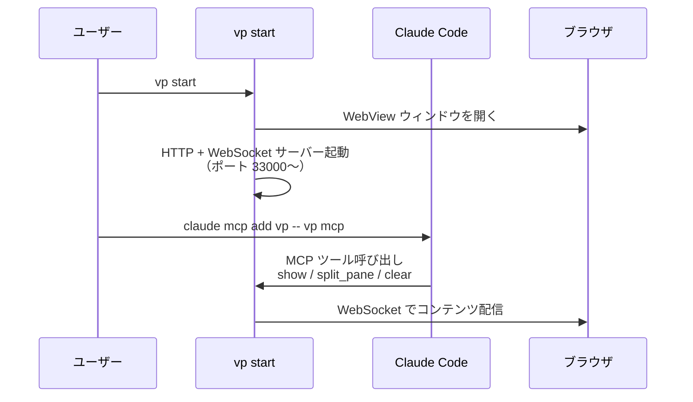

# Vantage Point

Claude Code のためのリッチ表示サーバー。Markdown、HTML、ログをブラウザに表示する。

## インストール・更新

```bash
# インストール
curl -L https://github.com/anycreative-tech/vantage-point/releases/latest/download/vp-aarch64-apple-darwin -o /usr/local/bin/vp
chmod +x /usr/local/bin/vp

# 更新
vp update
```

macOS 13.0 (Ventura) 以降、[Claude CLI](https://docs.anthropic.com/en/docs/build-with-claude/claude-code) が必要。

---

## vp start すると何が起こるか



1. `vp start` で Process（HTTP + WebSocket サーバー）が起動し、WebView ウィンドウが開く
2. Claude Code に MCP サーバーとして登録する
3. Claude Code がセッション中に `show` ツールを呼ぶと、ブラウザにコンテンツが表示される

ターミナルでは表示しきれないもの — Mermaid 図、HTML、長いログ — をブラウザ側に出力できる。

---

## Claude Code に登録する

```bash
claude mcp add vp -- vp mcp
```

登録後、Claude Code のセッション中に以下の MCP ツールが使える:

| ツール | 説明 |
|--------|------|
| `show` | Markdown / HTML / ログをペインに表示 |
| `split_pane` | ペインを水平・垂直に分割 |
| `close_pane` | ペインを閉じる |
| `toggle_pane` | 左右パネルの表示切替 |
| `clear` | ペインをクリア |
| `open_canvas` | Canvas ウィンドウを開く |
| `close_canvas` | Canvas ウィンドウを閉じる |
| `permission` | ツール実行の承認リクエスト |
| `restart` | Process を再起動 |

---

## コマンド

```bash
vp start [N]          # Process を起動（N はプロジェクト番号）
vp start --headless   # WebView なしで起動
vp start --browser    # ネイティブ WebView の代わりにブラウザで開く
vp stop               # Process を停止
vp restart            # 再起動（セッション状態を保持）
vp ps                 # 稼働中 Process の一覧
vp open [N]           # WebUI を開く
vp config             # 設定と登録プロジェクトを表示
vp update             # 最新版に更新
vp mcp                # MCP サーバーとして起動（Claude Code 用）
```

### MIDI

```bash
vp start --midi 0     # MIDI ポート 0 を有効化
```

### 設定ファイル

`~/.config/vantage/config.toml` にプロジェクトを登録する:

```toml
[[projects]]
name = "my-project"
path = "/path/to/your/project"
```

---

## VantagePoint.app（メニューバーアプリ）

Process をメニューバーから操作できる Mac アプリ。

1. [VantagePoint.app.zip](https://github.com/anycreative-tech/vantage-point-mac/releases/latest/download/VantagePoint.app.zip) をダウンロード
2. `/Applications` に移動して起動

```
VantagePoint.app (メニューバー)
    ↓ Conductor Process を管理
vp conductor
    ↓ Project Process を管理
vp start (プロジェクトごと)
```

---

## プロジェクト構成

```
vantage-point/
├── crates/vantage-point/   # CLI + Process (Rust)
│   └── src/
│       ├── process/        # HTTP + WebSocket サーバー
│       ├── mcp.rs          # MCP ツール実装
│       ├── canvas.rs       # Canvas ウィンドウ
│       ├── terminal/       # ネイティブターミナル
│       ├── daemon/         # デーモンプロセス管理
│       └── midi.rs         # MIDI 入力
├── web/                    # WebView HTML/JS
└── docs/                   # 仕様・設計

# 関連リポジトリ
# https://github.com/anycreative-tech/vantage-point-mac (Swift メニューバーアプリ)
```

## 技術スタック

| レイヤー | 技術 |
|---------|------|
| CLI / Process | Rust (Tokio, Axum, Clap) |
| WebView | wry + tao |
| MCP | rmcp (stdio) |
| Menu Bar App | Swift (AppKit) |
| MIDI | midir |

## ライセンス

Private
