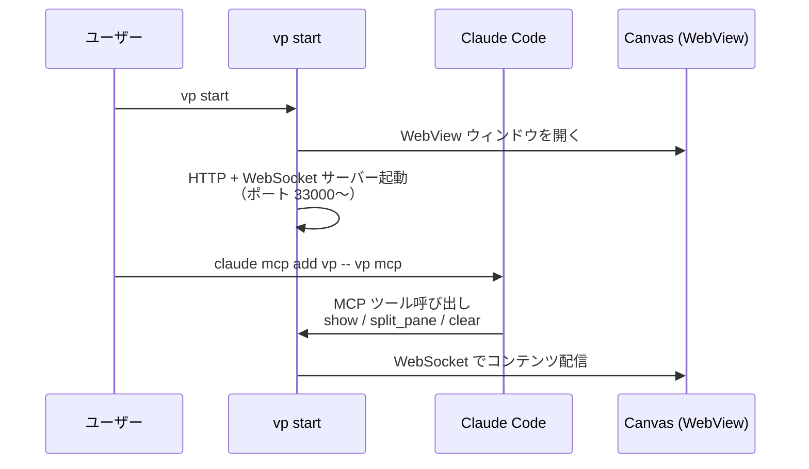

# Vantage Point

**AI ネイティブ開発環境** — Claude CLI をエンジンとして、TUI コンソール・Canvas（WebView）・
外部コントロールを統合した開発体験を提供する Rust 製アプリ。
VP が主、Claude Code はそのエンジン。プロジェクト選択 → TUI コンソール → Claude との対話が
1st ビュー。TUI で操る、Canvas で視る。

OSS（MIT / Apache-2.0 dual ライセンス）として公開。配布は **notarized `.dmg` 直配布
（GitHub Releases）/ Homebrew cask / `cargo install`** の三本柱（現状 macOS arm64 主軸）。

## Status

Private alpha → public OSS 移行中 (2026-04-23)。API・内部構造は活発に変化中。
README は work in progress、詳細は `docs/` 配下。

## Core concepts

- **AI ネイティブ開発環境** — VP が主、Claude Code はそのエンジン
- **プロジェクト起点** — プロジェクト選択 → TUI コンソール → Claude との対話が 1st ビュー
- **Canvas + TUI** — TUI で操る、Canvas で視る。両者が並列に動く
- **セッション永続化** — 前回の続きから再開できる開発環境
- **Lane** — canonical address `echoes.{lane}@{project}` が tmux session、
  Claude agent、wiremsg actor、deterministic port range を一意に束ねる
- **Port Management** — `33000 + slot × 100 + lane × 10 + role` で
  Lane × role port が透過的固定、bookmark 可能

内部 codename は JoJo's Bizarre Adventure のスタンド:
TheWorld 👑 (Process Manager / 常駐デーモン) / Star Platinum ⭐ (Project Core / TUI 統合ビュー) /
Echoes 💬 (Coding Assistant、 旧 Heaven's Door 📖) / Paisley Park 🧭 (Information Navigator) /
Gold Experience 🌿 (Code Runner) / Hermit Purple 🍇 (External Control) 等。
命名定義は `crates/vantage-point/src/stands.rs` に集約。

## インストール

macOS 11.0 (Big Sur) 以降、[Claude CLI](https://docs.anthropic.com/en/docs/build-with-claude/claude-code) が必要。
現状の配布は macOS arm64 主軸。

### 1. Homebrew cask（推奨）

```bash
brew tap chronista-club/tap
brew install --cask vantage-point
```

### 2. `.dmg` 直ダウンロード

[GitHub Releases](https://github.com/chronista-club/vantage-point/releases/latest) から
`VantagePoint-<ver>-arm64.dmg` を取得（Developer ID 署名 + Apple notarization 済）。
マウントして `VantagePoint.app` を `/Applications` にコピーする。

### 3. `cargo install`（開発者向け）

CLI `vp` のみをビルド・インストールする。

```bash
cargo install --path crates/vp-cli
```

> App Store では配布しない（Claude CLI 依存で sandbox 不可のため）。

### 更新

```bash
vp update
```

---

## vp start すると何が起こるか


```mermaid
sequenceDiagram
    participant U as ユーザー
    participant VP as vp start
    participant CC as Claude Code
    participant B as Canvas (WebView)

    U->>VP: vp start
    VP->>B: WebView ウィンドウを開く
    VP->>VP: HTTP + WebSocket サーバー起動<br/>（ポート 33000〜）
    U->>CC: claude mcp add vp -- vp mcp
    CC->>VP: MCP ツール呼び出し<br/>show / split_pane / clear
    VP->>B: WebSocket でコンテンツ配信
```

1. `vp start` で Process（HTTP + WebSocket サーバー）が起動し、Canvas（WebView）が開く
2. Claude Code に MCP サーバーとして登録する
3. Claude Code がセッション中に `show` ツールを呼ぶと、Canvas にコンテンツが表示される

ターミナルでは表示しきれないもの — Mermaid 図、HTML、長いログ — を Canvas 側に出力できる。

---

## Claude Code に登録する

```bash
claude mcp add vp -- vp mcp
```

登録後、Claude Code のセッション中に以下の MCP ツールが使える:

| ツール | 説明 |
|--------|------|
| `show` | Markdown / HTML / ログをペインに表示 |
| `split_pane` | ペインを水平・垂直に分割 |
| `close_pane` | ペインを閉じる |
| `toggle_pane` | 左右パネルの表示切替 |
| `clear` | ペインをクリア |
| `open_canvas` | Canvas ウィンドウを開く |
| `close_canvas` | Canvas ウィンドウを閉じる |
| `permission` | ツール実行の承認リクエスト |
| `restart` | Process を再起動 |

その他、Lane 操作・wiremsg・ポート照会・tmux 連携など多数の MCP ツールを提供する。

---

## コマンド

```bash
# Core
vp start [N]          # プロジェクト N 番の Process を起動
vp stop               # Process を停止
vp restart            # 再起動（セッション状態を保持）
vp ps                 # 稼働中 Process の一覧
vp open [N]           # WebUI を開く
vp config             # 設定と登録プロジェクトを表示
vp update             # 最新版に更新
vp mcp                # MCP サーバーとして起動（Claude Code 用）

# TheWorld（常駐デーモン）
vp daemon             # TheWorld 起動（alias: vp world）
vp daemon start|stop|status

# App（vp-app GUI）
vp app start          # vp-app GUI を起動（spawn + 即 exit、cwd を起点に開く）
vp app stop           # vp-app を停止
vp tray               # システムトレイモード
```

### MIDI

```bash
vp start --midi 0     # MIDI ポート 0 を有効化
vp midi ports         # ポート一覧
vp midi monitor       # 入力監視
```

### 設定ファイル

設定は KDL 形式。config / data / state は XDG Base Directory 準拠の 3 zone に分かれる
（全 OS 統一）:

| zone | 環境変数 | default | 用途 |
|------|----------|---------|------|
| config | `$XDG_CONFIG_HOME` | `~/.config/vp/` | 人が編集（`config.kdl` / `projects.kdl`） |
| data | `$XDG_DATA_HOME` | `~/.local/share/vp/` | 永続 data store（db / discs） |
| state | `$XDG_STATE_HOME` | `~/.local/state/vp/` | runtime state + log |

登録プロジェクトの SSOT は `~/.config/vp/projects.kdl`:

```kdl
project "my-project" path="/path/to/your/project" slot=0
```

---

## vp-app（Mac GUI）

Process をメニューバー / WebView から操作できる Mac アプリ（`crates/vp-app`、Rust wry+tao +
SolidJS + creo-ui）。notarized `.dmg` でインストールする（上記「インストール」参照）。

```
vp-app (GUI: wry+tao)   vp (CLI)
        └────────┬───────┘
                 │ HTTP + QUIC
        TheWorld 👑 :32000          ← Process Manager (常駐 daemon)
                 │ spawn + reconcile
     ┌───────────┼───────────┐
   SP :33000   SP :33001   ...      ← Star Platinum ⭐ (project ごと)
```

---

## プロジェクト構成

```
vantage-point/
├── crates/
│   ├── vantage-point/   # server lib (TheWorld + SP の HTTP/WS server)
│   ├── vp-app/          # Rust GUI (wry + tao + xterm.js + creo-ui) — Mac 主軸
│   │   └── web-bundle/  # SolidJS フロントエンド（vp-app に同梱）
│   ├── vp-cli/          # CLI binary (vp、 lane lib も内包)
│   └── vp-mdast{,-wasm}/ # Markdown AST parser (+ wasm binding)
└── docs/                # 仕様・設計・ガイド
```

## 技術スタック

| レイヤー | 技術 |
|---------|------|
| CLI / Process | Rust (Tokio, Axum, Clap) |
| WebView | wry + tao |
| Frontend | SolidJS + xterm.js + creo-ui (vp-app web-bundle) |
| MCP | rmcp (stdio) |
| MIDI | midir |

## ライセンス

**MIT OR Apache-2.0** dual license.

詳細は [LICENSE-MIT](LICENSE-MIT) / [LICENSE-APACHE](LICENSE-APACHE) を参照。
コントリビュートについては [CONTRIBUTING.md](CONTRIBUTING.md)、セキュリティ報告は [SECURITY.md](SECURITY.md) を参照。
