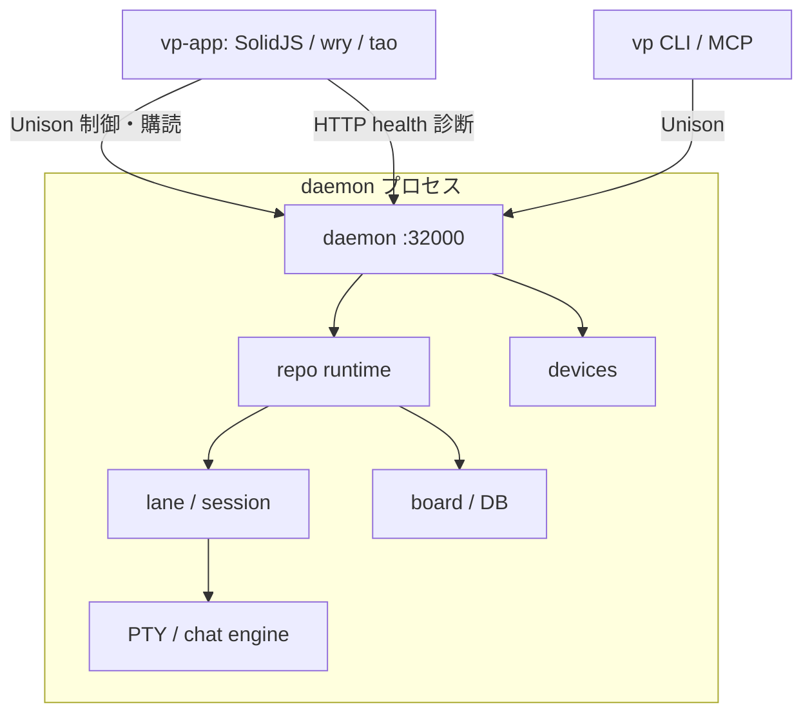

# Vantage Point

Rust 製の AI ネイティブ開発環境。repo ごとに作業を開き、lane（worktree）と session を使って
会話・ターミナル・board を同じウィンドウで扱います。

- **Console**: Claude / Codex / Grok / OpenCode / vpcode と shell。engine と表示モード（TUI / GUI）は別の軸です。
- **Lane / session**: 作業場所を lane で隔離し、各 lane に複数の session を持てます。
- **Board**: Markdown・HTML・図・ログなどをペインに表示します。
- **Wire**: lane 間のメッセージ、依頼、応答を履歴として扱います。
- **Devices**: MIDI 機材との連携（対応 feature を有効にしたビルド）。

macOS を主軸に開発しています。Windows は CI のコンパイル確認と追随開発の対象、Linux は未検証です。
AI を使う場合は、選んだ engine の CLI と認証を別途用意してください。VP は tmux に依存しません。

## インストール

macOS 向け Homebrew cask:

```bash
brew tap chronista-club/tap
brew install --cask vantage-point
```

または [GitHub Releases](https://github.com/chronista-club/vantage-point/releases/latest) の
DMG を開き、`VantagePoint.app` を `/Applications` にコピーします。

ソースから CLI のみインストールする場合:

```bash
git clone https://github.com/chronista-club/vantage-point.git
cd vantage-point
cargo install --path crates/vp-cli --locked
```

GUI の開発ビルドは [セットアップガイド](docs/guide/setup.md) を参照してください。

## 最初の repo を開く

```bash
vp daemon start
vp repos add my-project /path/to/my-project
vp repos start my-project
vp app start
```

GUI では sidebar の CURRENTs にある `+` から既存の repo を登録できます。
repo を選び、lane の console で会話や shell を開きます。repo 行の `+` から Sub lane を作成できます。
作成に失敗した場合はフォームに理由が表示され、入力を修正して再試行できます。

CLI で lane を作成する例（repo の作業ディレクトリで実行）:

```bash
vp lane new topic mako/topic --base origin/nightly
vp lane list
vp lane slots my-project/topic
```

`--base` は対象 repo の開発ブランチを指定します。このリポジトリの開発 trunk は `nightly` です。

## よく使う操作

```bash
vp ps                         # 稼働中 repo
vp config                     # 設定と登録 repo（daemon 不要）
vp repos list                 # 登録 repo
vp repos start my-project     # repo runtime を起動
vp repos stop my-project      # repo runtime を停止
vp repos disable /path/to/my-project   # 次回 daemon 起動でも自動起動しない
vp daemon status              # daemon の状態
vp app start                  # GUI を起動
vp app stop                   # GUI を停止
vp update --check             # 更新の確認
vp mcp                        # MCP サーバー（stdio）
vp wire --help                # lane 間メッセージ
vp pane --help                # board / ペイン操作
```

daemon 内で全 repo runtime が動くため、`vp daemon stop` / `restart` は全 repo とその engine に影響します。
GUI の停止と daemon の停止は別の操作です。詳細な引数は各コマンドの `--help` で確認できます。

MCP クライアントには、コマンド `vp`、引数 `mcp` の stdio サーバーとして登録します。
利用できる操作と宛先は [メッセージング](docs/guide/messaging.md) と
[dev-flow primitives](docs/guide/dev-flow-primitives.md) を参照してください。

## 構成


```mermaid
flowchart TD
    GUI[vp-app: SolidJS / wry / tao] -->|Unison 制御・購読| Daemon
    CLI[vp CLI / MCP] -->|Unison| Daemon
    GUI -->|HTTP health 診断| Daemon
    subgraph Process[daemon プロセス]
      Daemon[daemon :32000] --> Repo[repo runtime]
      Repo --> Lane[lane / session]
      Repo --> Board[board / DB]
      Lane --> Engine[PTY / chat engine]
      Daemon --> Devices[devices]
    end
```

repo runtime は daemon と同一プロセスにあり、repo ごとのサーバーポートは持ちません。
AI CLI 等の engine は子プロセスとして起動します。
[設計 44](docs/design/44-world-one-process.md)・[設計 45](docs/design/45-transport-consolidation.md) が現在の構成の入口です。

| crate | 役割 |
|-------|------|
| `vantage-point` | daemon・repo runtime・lane・会話・board・DB・MCP |
| `vp-cli` | `vp` コマンド入口 |
| `vp-app` | ネイティブ GUI と SolidJS WebView |
| `vp-paths` | config / data / state のパス解決 |
| `midistage-profiles` | MIDI デバイス profile |
| `vp-nexus` | 認証・同期等のサービス |

## 設定と保存先

XDG の各環境変数を未指定の場合:

| 場所 | 内容 |
|------|------|
| `~/.config/vp/` | 環境 `config.kdl`、好み `settings.kdl`、登録 repo `repos.kdl`、GUI `vp-app.toml` |
| `~/.local/share/vp/` | 永続データ |
| `~/.local/state/vp/` | runtime state とログ |

登録 repo は `vp repos`、好みは `vp config get` / `set` または GUI 設定から操作します。
詳細は [設定の設計](docs/design/59-settings-page.md) を参照してください。

## 開発・ライセンス

[ドキュメント索引](docs/README.md) · [環境構築](docs/guide/setup.md) ·
[コントリビュート](CONTRIBUTING.md) · [セキュリティ報告](SECURITY.md)

MIT OR Apache-2.0 dual license。
[LICENSE-MIT](LICENSE-MIT) / [LICENSE-APACHE](LICENSE-APACHE)
