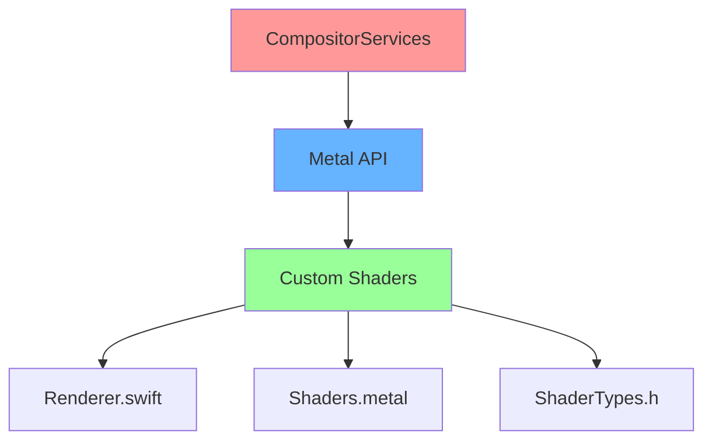
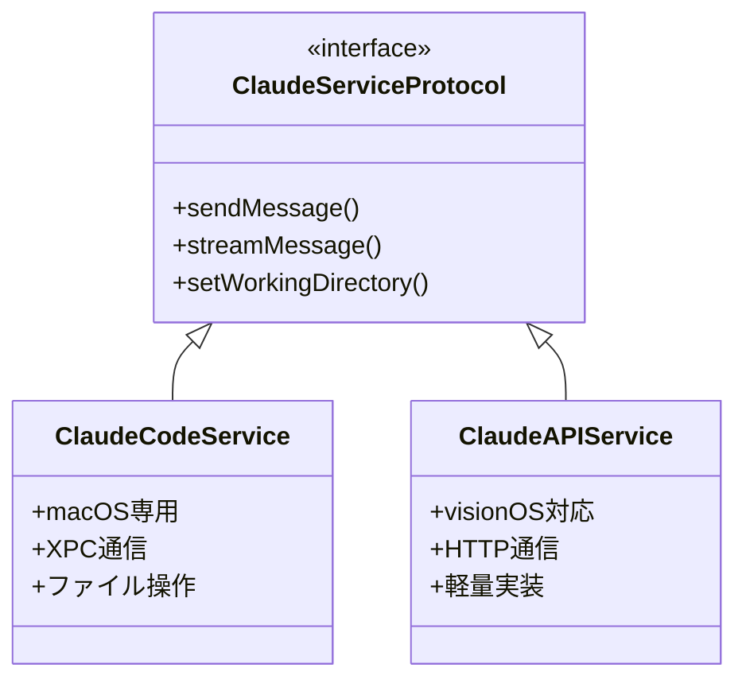
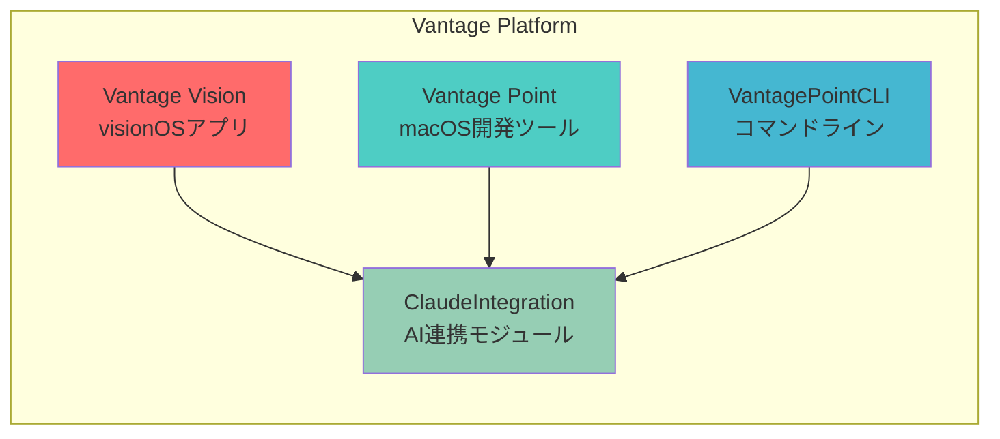
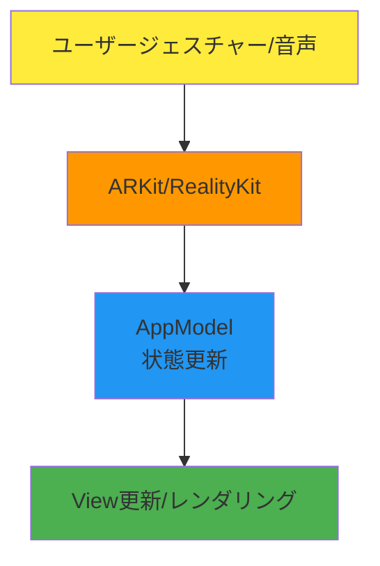
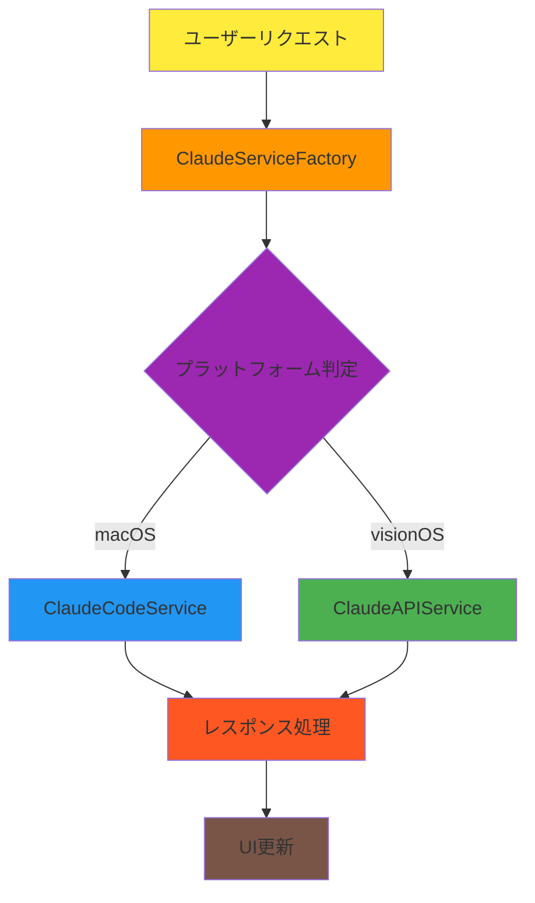

# Vantage アーキテクチャ概要

## システム概要

Vantageは、Apple Vision Pro向けの没入型開発環境として設計されたvisionOSアプリケーションです。空間コンピューティングの利点を活かし、従来の2D画面の制約を超えた新しいコーディング体験を提供します。

## コアコンポーネント

### 1. レンダリングエンジン

**Metal + CompositorServices**を基盤とした高性能レンダリングパイプライン

- **Renderer.swift**: カスタムレンダリングループの実装
- **Shaders.metal**: 頂点・フラグメントシェーダー
- **ShaderTypes.h**: Swift/Metal間の共有型定義

### 2. 空間トラッキング

**ARKit WorldTrackingProvider**による高精度な空間認識

- デバイスの位置・姿勢トラッキング
- ハンドトラッキングによるジェスチャー入力
- 視線トラッキングによる自然なインタラクション

### 3. AI統合レイヤー

プラットフォーム適応型のClaude AI統合

## アプリケーション構造

### エントリーポイント

1. **VantageApp.swift** - アプリケーションのライフサイクル管理
2. **AppModel.swift** - グローバル状態管理（@Observable）
3. **ContentView.swift** - メインUIとナビゲーション

### モジュール構成

## データフロー

### 1. ユーザー入力データフロー

### 2. AI処理フロー

## セキュリティ設計

### APIキー管理
- **Keychain Services**による安全な保存
- プラットフォーム別のアクセス制御
- 環境変数からの読み込みサポート

### サンドボックス
- macOS App Sandboxによる制限付きファイルアクセス
- Security Scoped Bookmarksによる永続的アクセス権

## パフォーマンス最適化

### レンダリング最適化
- Metal Performance Shadersの活用
- フレームレート適応制御（60/90/120 FPS）
- GPU並列処理の最大化

### メモリ管理
- ARC + Swift Concurrencyによる自動管理
- 大規模データのストリーミング処理
- テクスチャ/メッシュの動的ロード/アンロード

## 拡張性

### プラグインシステム（計画中）
- 言語サーバープロトコル（LSP）サポート
- カスタムレンダラーの追加
- サードパーティツール連携

### マルチプラットフォーム展開
- visionOS (ネイティブ)
- macOS (Catalyst/ネイティブ)
- iOS/iPadOS (将来対応)