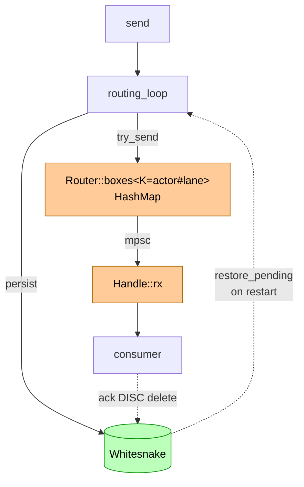
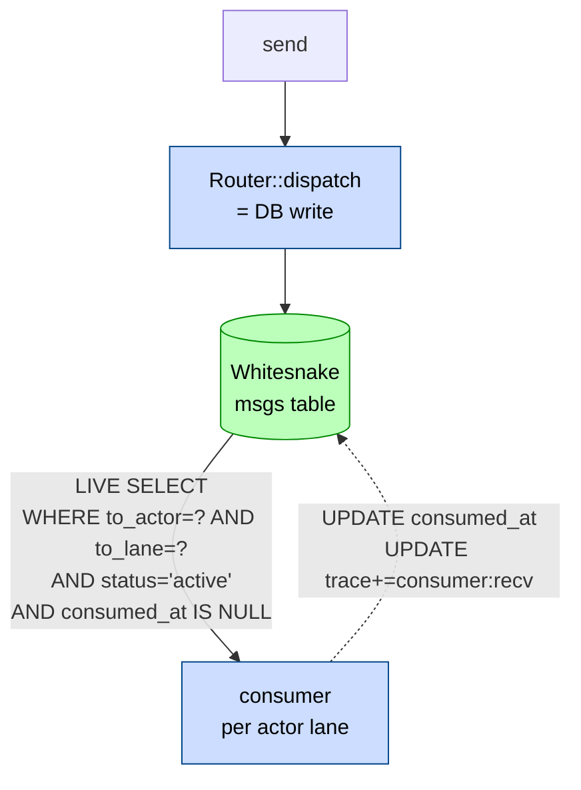
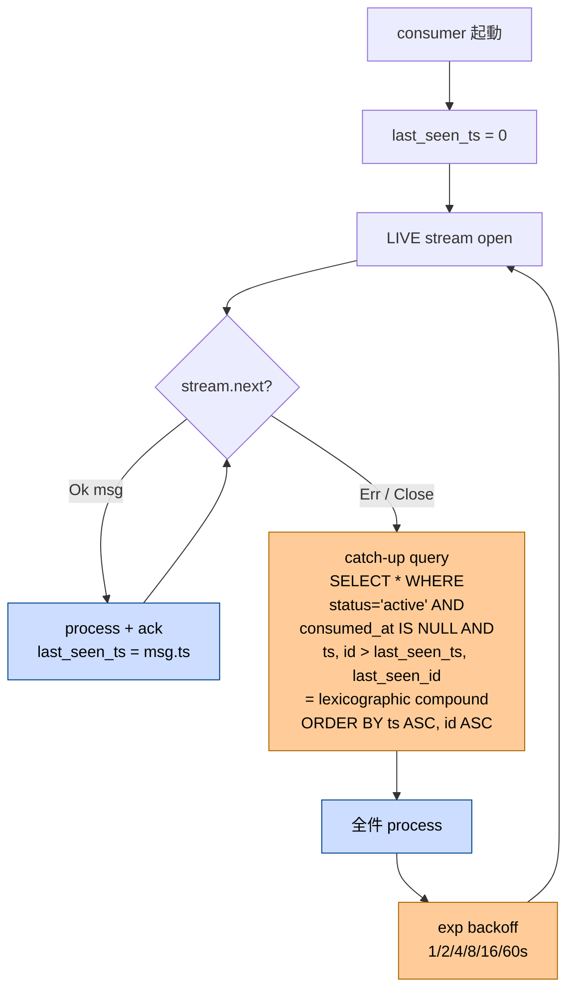
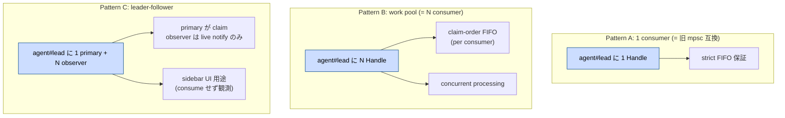
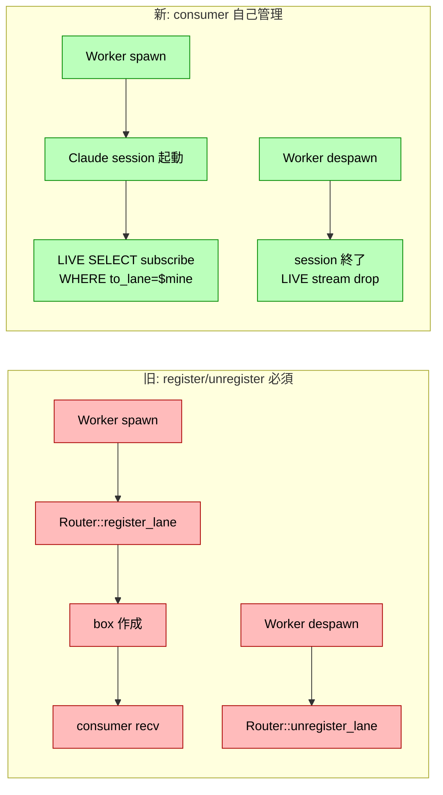
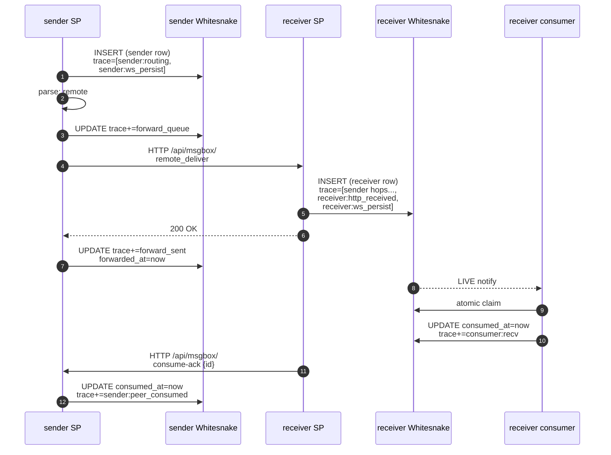
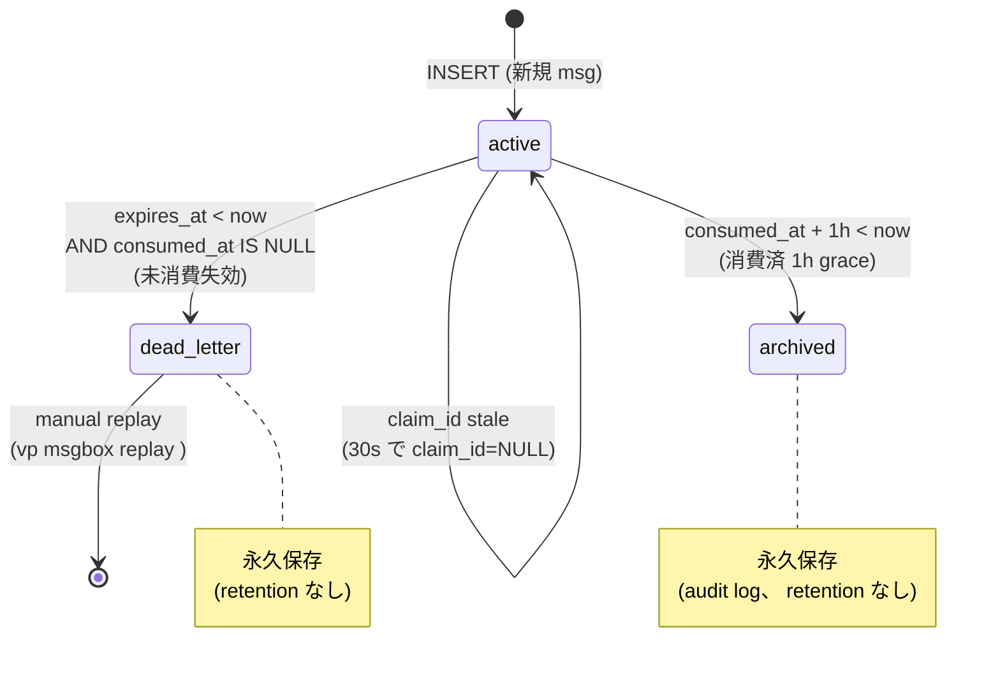
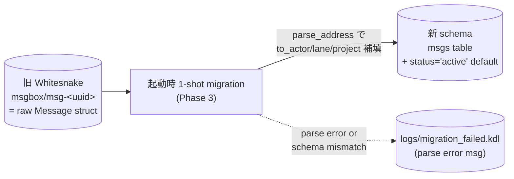
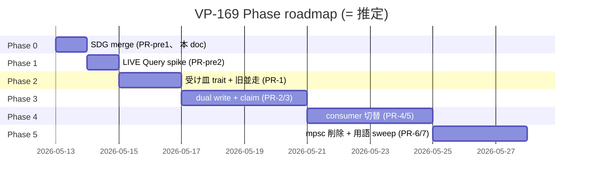

# doc 19: msgbox Whitesnake-primary refactor (mpsc 廃止 + audit moat 強化)

> **改訂 (2026-05-21)**: 本 doc が実装した Whitesnake-primary msgbox (`MsgboxStore` / `WhitesnakeStore` / `msgs` table / cross-process forward / `MsgboxRegistry`) は、 その後の **wiremsg 再設計 (R1〜R6、 PR #406〜#420) で全廃**された。 wiremsg は per-agent 単一 cursor の wire accumulation モデルで、 message は wire に追記され受信側が cursor を進めて未読を取得する (`wire_send` / `wire_recv` / `wire_thread`)。 `msgs` / `msgbox` table、 `msg_*` MCP tool、 `vp mailbox` CLI はいずれも撤去済。 本 doc は VP-169 時点の msgbox 実装の **historical reference** として残置する。 address モデル (`<actor>@<location>`) は wiremsg がそのまま継承 ([doc 14](14-wire-address-v3.md) 参照)。

> **Status**: Superseded by wiremsg 再設計 (2026-05)。 旧: Implemented (Phase 5 完了, commit `445190c` / VP-179 / PR #364)
> **Linear**: [VP-169](https://linear.app/chronista/issue/VP-169) (parent: VP-156)
> **Date**: 2026-05-13 (Drafted) / 2026-05-15 (Phase 5 land)
> **Author**: Mako (= Chronista solo dev)
> **Related**: doc 14 (msgbox-address-v3) / doc 16 (worker-lane-msgbox-recv) / doc 17 (port-stability-and-msgbox-isolation) / doc 18 (msg-lifecycle-state)
> **Supersedes layer**: VP-24 (mailbox core) / VP-156 (routing 統一) の architectural substrate 部分のみ。 DNA (= ECS actor、 1 actor = 1 msgbox、 serial ordered FIFO) は維持。

---

## §1 起点 (= Why)

[VP-158](https://linear.app/chronista/issue/VP-158) (2026-04 全 msg 永続化 default) で「on-memory 概念排除」 を謳ったが、 実装上は **mpsc (in-memory queue) + Whitesnake (DB)** の二重 substrate が残った。 結果として:

- **truth source 2 個** = lifecycle flag 群 (forwarded_at / consumed_at / restore_pending guard 4 種) が必要
- **per-lane 軸が HashMap key** (`agent#lead`) として実体化 → cross-product で box 増殖
- **silent drop pit 4 個**: router_tx 1024 cap 満杯、 FWQ 10000 cap 満杯、 box 256 cap 満杯、 box not found race (VP-147 known limitation)
- **audit trail / time-travel debug が不完全** (= 「DB に居る msg と居ない msg」 の混在)

本 epic で **Whitesnake = primary store** に揃え、 mpsc を完全に廃止する。 VP-158 の design intent (= 「on-memory 概念排除」) を実装 layer まで貫徹する。

### dogfood 体感 (= 2026-05-13 review trigger)

user 体感: 「vp msg がなかなかいい感じで回り始めない、 少し複雑なのかも」。 構造 review (creo memory `mem_1CazPmSsGbiEWdvDgY7VNQ`) で 8 pain point と 8 improvement candidate を抽出、 改善 9 (= 本 epic) が **architectural moat 強化の本丸** として確定。

### 改善 1 (用語統一) との関係

review で挙がった改善 1 (= 用語を `msgbox / mailbox / inbox / box` の 4 系統から 1 つに統一) は **本 epic の同 PR で吸収**。 公式呼称を `msgbox` に統一し、 mailbox / inbox / box は廃止。 詳細 §5。

---

## §2 結論先出し (= What)

```mermaid
graph TB
    Decision["決定: Whitesnake = primary substrate"]
    Decision --> D1["1: mpsc 廃止 (consumer は DB を直接読む)"]
    Decision --> D2["2: 通知は SurrealDB LIVE SELECT (= live query primary、 fallback なし)"]
    Decision --> D3["3: per-lane 軸は DB row field (= HashMap key 廃止)"]
    Decision --> D4["4: concurrent recv first-class (= atomic claim + stale 30s)"]
    Decision --> D5["5: selective receive は WHERE predicate (= Erlang stash 廃止)"]
    Decision --> D6["6: lifecycle は status field (active/dead_letter/archived、 1 table)"]
    Decision --> D7["7: archive/dead_letter は永久保存 (= retention なし、 audit moat 最大化)"]
    Decision --> D8["8: dead_letter replay は manual only (= 重複送信 risk なし)"]
    Decision --> D9["9: cross-process は両 SP DB write + ack-back HTTP"]
    Decision --> D10["10: trace field 追加 (= cross-process audit trail)"]
    Decision --> D11["11: 用語 msgbox 統一 (= 改善 1 を同 PR で吸収)"]

    classDef goal fill:#fc9,stroke:#a60,color:#000,font-weight:bold
    classDef dec fill:#cdf,stroke:#048,color:#000
    class Decision goal
    class D1,D2,D3,D4,D5,D6,D7,D8,D9,D10,D11 dec
```



### 期待する副次効果

- **silent drop 4 pit が全消滅** (= DB に書ければ届く、 consumer 未起動でも DB に残る)
- **`vp msgbox status` / `vp msgbox trace <id>`** が **単一 SQL** で書ける
- **VP の architectural moat** (= self-contained AI dev env + 全通信 DB) が **完全に物理化**
- **[VP-164](https://linear.app/chronista/issue/VP-164) Phase 2** (ack-back) が **tiny 実装** で済む (= consumed_at update 1 行)
- **[VP-165](https://linear.app/chronista/issue/VP-165)** (port-keyed 汚染) が **root 解消** (= row field に project が居るので port key 不要)
- **`Router::register_lane` / `unregister_lane` 完全廃止** (= per-lane 増殖の根源消滅)
- **dead letter queue / time-travel debug / audit replay** が all first-class

---

## §3 現状 vs 提案 (= 構造比較)

### 現状: 2 substrate (= mpsc + Whitesnake)



問題点:
- WS と mpsc に同 msg のコピーが 2 つ (= consistency 保証 logic 群が必要)
- box が `agent#lead` / `agent#chore` で increment、 register/unregister race
- box not found = silent drop (msg は WS にだけ居る、 user は気づかない)
- selective receive のため Handle 内 stash buffer (= 更に 3 substrate)

### 提案: 1 substrate (= Whitesnake primary)



cross-process flow は変わらず (= 既存 HTTP forward 路を維持):

- 送信側 SP が DB write
- 受信側 SP に remote_deliver HTTP forward (= 既存 path、 schema に trace 追加のみ)
- 受信側 SP が自分の DB に write
- 受信側 consumer が live query で取得
- 受信側 → 送信側 ack-back HTTP POST で sender 側 row の consumed_at update

---

## §4 architectural 詳細

### §4.1 Storage schema (= SurrealDB `msgs` table)

#### スキーマ定義

```sql
DEFINE TABLE msgs SCHEMAFULL;

-- identity & lifecycle
DEFINE FIELD id           ON msgs TYPE string;             -- msg uuid (row id)
DEFINE FIELD ts           ON msgs TYPE number;             -- timestamp ms (ordering 主軸)
DEFINE FIELD kind         ON msgs TYPE string;             -- direct/notification/request/response
DEFINE FIELD payload      ON msgs TYPE object FLEXIBLE;    -- JSON object (= FLEXIBLE 必須、 SCHEMAFULL での nested JSON 受入、 VP-170 spike F-B 確定)
DEFINE FIELD reply_to     ON msgs TYPE option<string>;     -- thread 用

-- routing target (= denormalized for indexed query)
DEFINE FIELD to_addr      ON msgs TYPE string;             -- raw form (= 監査用)
DEFINE FIELD to_actor     ON msgs TYPE string;             -- 'agent' / 'protocol' / ...
DEFINE FIELD to_lane      ON msgs TYPE string;             -- 'lead' / '<worker-name>'
DEFINE FIELD to_project   ON msgs TYPE option<string>;     -- None = local self
DEFINE FIELD to_world     ON msgs TYPE option<string>;     -- None = same machine

-- routing source (= 同じく parsed)
DEFINE FIELD from_addr    ON msgs TYPE string;
DEFINE FIELD from_actor   ON msgs TYPE string;
DEFINE FIELD from_lane    ON msgs TYPE string;
DEFINE FIELD from_project ON msgs TYPE option<string>;
DEFINE FIELD from_world   ON msgs TYPE option<string>;

-- lifecycle markers (VP-164 schema 継承)
DEFINE FIELD expires_at   ON msgs TYPE option<number>;     -- TTL 失効時刻 ms
DEFINE FIELD manual_ack   ON msgs TYPE bool DEFAULT false;
DEFINE FIELD forwarded_at ON msgs TYPE option<number>;     -- remote forward 成功時刻
DEFINE FIELD consumed_at  ON msgs TYPE option<number>;     -- recv consume 時刻

-- status field (= §4.8 lifecycle)
DEFINE FIELD status       ON msgs TYPE string DEFAULT 'active';
  -- 'active' / 'dead_letter' / 'archived'
DEFINE FIELD status_at    ON msgs TYPE number;             -- status 変更時刻

-- concurrent recv 用 claim 機構 (= §4.3)
DEFINE FIELD claim_id     ON msgs TYPE option<string>;     -- claiming consumer uuid
DEFINE FIELD claimed_at   ON msgs TYPE option<number>;     -- claim 時刻 (stale 検出用)

-- audit trail (= 改善 8、 §4.10)
DEFINE FIELD trace        ON msgs TYPE array<object>;      -- Vec<TraceHop>

-- 主 query path 用 index
DEFINE INDEX recv_idx ON msgs FIELDS status, to_actor, to_lane, consumed_at;
DEFINE INDEX status_idx ON msgs FIELDS status, expires_at;
```

#### 主要 query

```sql
-- consumer の主 query path (= LIVE で subscribe)
LIVE SELECT * FROM msgs
  WHERE status='active' AND to_actor=$actor AND to_lane=$lane
    AND consumed_at IS NULL AND claim_id IS NULL
  ORDER BY ts ASC, id ASC
  LIMIT 1;

-- atomic claim (= concurrent recv で race-free、 VP-170 spike Q3 で transaction wrap 確定)
-- 注: SurrealDB v3.0.4 では UPDATE statement に ORDER BY / LIMIT が syntax 不可
-- Phase 2 PR-1 で path A (transaction wrap、 default) / B (DEFINE FUNCTION) / C (CAS) を最終確定。
-- 以下は path A example (= spike report doc 20 §4 参照):
BEGIN;
LET $candidates = SELECT * FROM msgs
    WHERE status='active' AND to_actor=$actor AND to_lane=$lane
      AND consumed_at IS NONE
      AND (claim_id IS NONE OR claimed_at + 30000 < $now)
    ORDER BY ts ASC, id ASC LIMIT 1;
LET $target_id = $candidates[0].id;
UPDATE $target_id SET claim_id=$consumer_id, claimed_at=$now;
COMMIT;
RETURN $target_id;

-- consume 完了
UPDATE msgs SET consumed_at=$now WHERE id=$id;

-- selective receive (= Predicate enum to WHERE)
LIVE SELECT * FROM msgs
  WHERE status='active' AND to_actor='agent' AND to_lane='lead'
    AND consumed_at IS NULL
    AND from_project='creo-memories' AND kind='request'
  ORDER BY ts ASC LIMIT 1;

-- vp msgbox status: 自 SP の pending 一覧
SELECT to_actor, to_lane, count() AS pending
  FROM msgs WHERE status='active' AND consumed_at IS NULL
  GROUP BY to_actor, to_lane;
```

#### 設計判断

| # | 論点 | 採用 |
|---|---|---|
| a | `to_addr` / `from_addr` raw 保存 | する (= 監査 / debug 用) |
| b | parse timing | write 時に parse、 row に書く (= read 高速) |
| c | `id` を SurrealDB row id にする | する (`msgs:<uuid>`) |
| d | `kind` は string | YES (enum overkill) |
| e | `payload` は object | YES (= JSON native、 内部 SELECT も可) |
| f | composite index | `recv_idx (status, to_actor, to_lane, consumed_at)` |
| g | ts 衝突 tiebreak | `ORDER BY ts ASC, id ASC` |

> **DB directory 分離 (= VP-182 / PR #367)**: `msgs` table を持つ embedded DB は、 surrealkv の single-writer 制約 (= `try_lock_exclusive`) により World daemon と SP が同一 dir を共有 open できない。 SP は `db/sp_{slug}/`、 World は `db/world/` に物理分離する。 詳細は §6「当初 Open Questions から漏れていた事実」 を参照。

### §4.2 Notification (= SurrealDB LIVE Query primary + reconnect investment)

#### 採用方針

- **LIVE SELECT を唯一の notification path** (= fallback 持たない)
- Phase 1 spike で feasibility 確認、 not working なら epic 撤回 (別 substrate 検討)
- 代わりに **reconnect resilience** に最大投資

#### Reconnect 戦略



#### Reconnect 投資項目

| 項目 | 実装 |
|---|---|
| **last_seen_ts + last_seen_id 保持** | consumer task の local state、 同 ms collision 回避のため `(ts, id)` の **lexicographic 複合 cursor** で保持 (= Purple Haze F10) |
| **catch-up query** | reconnect 後に `WHERE consumed_at IS NULL AND (ts > $last_ts OR (ts = $last_ts AND id > $last_id))` で順序保証付き取得 (= 同 ts collision 取りこぼし防止) |
| **exp backoff** | 1/2/4/8/16/60s 上限 |
| **observability** | `vp msgbox status` に「reconnecting attempt N (last success T)」 を露出、 silent fail 防止 |
| **CI test** | spike PR で SurrealDB connection 強制切断 → catch-up 成功までの integration test |

#### 反対案 (= 廃案)

| 案 | 廃案理由 |
|---|---|
| tokio::sync::Notify + polling (= b 案) | fallback を持つと主 path の脆弱性を許容する設計哲学的問題、 reconnect 投資の方が moat |
| Pure polling (= c 案) | latency 上限、 idle DB load 持続、 moat 効果薄い |
| LIVE + b fallback ハイブリッド | 同上、 fallback 哲学 |

**用語の定義**: 「fallback」 = LIVE が動いている間に並走する **別 path** (= b 案 / c 案のように LIVE と並列稼働する notification 経路) を指す。 一方、 LIVE が一時的に切断された時の **reconnect + catch-up** は fallback ではなく **reconnect resilience の一部** として扱う (= 詳細 「Reconnect 戦略」 + 「Reconnect 投資項目」 表参照)。 §4.6 fail tolerance の「LIVE/catch-up で resume」 もこの reconnect resilience の意味で使用。

#### VP-170 spike Q2 finding: filter 脱落時の secondary signal

spike Q2 で **UPDATE で WHERE 脱落時 LIVE notification 来ない** ことが判明 (= 詳細 [spike report doc 20 §3](20-spike-report.md))。 SurrealDB v3.0.4 の LIVE は **INSERT のみ notify**、 UPDATE で WHERE 外に出た既存 row は何も通知しない。 結果:

- **正の影響**: consumer が claim → consume → `UPDATE consumed_at=now` した時、 他 consumer の LIVE 誤起動なし (= claim race 確率↓)
- **負の影響**: observer pattern (= §4.3 Pattern C、 consume せず watch) で「**消費完了**」 イベントを観測する path が消える

→ observer 用 **secondary signal** として、 SP 内 `tokio::sync::broadcast` (= for "msg consumed" event) を §4.3 Pattern C 実装時に追加。 これは LIVE の **補完 path** であり、 fallback ではなく observer の物理化。 sidebar UI / `vp msgbox watch` で active inbox の lifecycle 観測に使う。

### §4.3 Per-actor consumer model (= mpsc → DB stream + concurrent recv first-class)

#### Handle API (= 完全互換維持)

```rust
pub struct Handle {
    address: String,
    actor: String,
    lane: Vec<String>,
    consumer_id: String,  // ← N consumer 並走時、 各 Handle 一意 (uuid v4)
    whitesnake: Whitesnake,
    live_stream: LiveStream,
    last_seen_ts: AtomicU64,
}

impl Handle {
    pub async fn recv(&self) -> Option<Message> { ... }
    pub async fn recv_matching(&self, pred: Predicate) -> Option<Message> { ... }
    pub async fn send(&self, msg: Message) -> Result<(), Error> { ... }
    pub async fn ack(&self, msg_id: &str) { ... }
    pub async fn address(&self) -> &str { ... }
    // 新規 API
    pub async fn peek_all_unconsumed(&self) -> Vec<Message> { ... }
    pub async fn claim_by_id(&self, msg_id: &str) -> Option<Message> { ... }
}
```

#### concurrent recv first-class

VP の future expansion (= parallel worker / job dispatch / fan-out work pool) に効くよう、 **1 (actor, lane) に N consumer 並走** を first-class でサポート。

##### atomic claim 機構

```rust
// VP-170 spike Q3 finding: UPDATE ... ORDER BY ... LIMIT は v3.0.4 で syntax 不可。
// Phase 2 PR-1 で path A (= transaction wrap、 default) / B (DEFINE FUNCTION) / C (CAS) を確定。
// 以下は path A example、 race-free verification + bench は Phase 2 で。
async fn atomic_claim(&self) -> Option<Message> {
    let sql = r#"
        BEGIN;
        LET $candidates = SELECT * FROM msgs
            WHERE status='active' AND to_actor = $actor AND to_lane = $lane
              AND consumed_at IS NONE
              AND (claim_id IS NONE OR claimed_at + 30000 < $now)
            ORDER BY ts ASC, id ASC LIMIT 1;
        LET $target_id = $candidates[0].id;
        UPDATE $target_id SET claim_id = $consumer_id, claimed_at = $now;
        COMMIT;
        RETURN $target_id;
    "#;
    self.whitesnake.db.query(sql)
        .bind(("consumer_id", &self.consumer_id))
        .bind(("actor", &self.actor))
        .bind(("lane", &self.lane.join("/")))
        .bind(("now", now_ms()))
        .await.ok()?
        .take::<Option<Message>>(0).ok()?
}

pub async fn recv(&self) -> Option<Message> {
    loop {
        if let Some(msg) = self.atomic_claim().await { return Some(msg); }
        self.live_stream.next().await?;  // 他 consumer が取った or msg なし → live で待つ
    }
}
```

##### consumer pattern 3 種



##### observer API (= Pattern C 用)

```rust
let observer = router.observe_lane("agent", &["lead"]).await;
let msg_event = observer.next().await;  // live notify、 claim せず、 ack せず
```

#### 設計判断

| # | 論点 | 採用 |
|---|---|---|
| a | concurrent recv semantics | work pool (= 各 msg を 1 consumer のみ処理)、 broadcast ではない |
| b | ordering | 1 consumer = strict FIFO / N consumer = claim-order FIFO per consumer + global approximate |
| c | stale claim timeout | 30s default、 manual_ack msg は別 timeout 設定可 |
| d | observer pattern | 対応する (`observe_lane()` API) |
| e | consumer_id 生成 | uuid v4 per Handle instance |
| f | claim 後 process 中の crash | stale claim 機構で 30s 後に他 consumer or 再起動した自身が claim 可能 |

### §4.4 Selective receive (= Predicate enum + WHERE clause)

#### 旧 Erlang stash の廃止

stash 機構 = 「rx から取り出した msg を消費せず保留」。 DB primary では「読まずに DB に残す」 = claim しないだけで等価、 stash 機構自体が **不要**。

#### Predicate enum

```rust
#[derive(Clone, Debug)]
pub enum Predicate {
    Any,
    From(String),                     // = "agent@vp/lead"
    FromActor(String),
    FromProject(String),
    Kind(MessageKind),
    ReplyTo(String),
    And(Vec<Predicate>),
    Or(Vec<Predicate>),
}

impl Predicate {
    /// SurrealDB WHERE 句に翻訳
    pub fn to_where_clause(&self) -> (String, Vec<(String, Value)>) { ... }
}
```

#### closure 互換 を捨てる trade-off

| 観点 | closure (旧) | Predicate enum (新) |
|---|---|---|
| 表現力 | 任意 (= payload 内部 inspect 等) | DB WHERE 表現可能な範囲 |
| 性能 | mpsc + stash overhead | DB native、 index 利用 |
| race | stash で吸収 | atomic claim で吸収 |
| cancel safety | tokio lock 配慮要 | DB transaction で自然 |
| 観測性 | predicate 不可視 | WHERE 句として log 可能 |
| 複雑 filter | OK | `peek_all_unconsumed` + caller filter + `claim_by_id` で代替 |

VP コードベースの既存 `recv_matching` use case (= Request-Response の reply_to 一致、 source filter 等) は **Predicate enum で 100% カバー予想**。 確証は Phase 1 spike で grep 全件確認。

#### Request-Response パターン

```rust
// 旧 (closure)
let resp = handle.recv_matching(|m| m.reply_to == Some(req_id.clone())).await?;

// 新 (Predicate)
let resp = handle.recv_matching(Predicate::ReplyTo(req_id.clone())).await?;
```

### §4.5 Per-lane 軸 (= HashMap key 廃止、 DB row field 化)

#### 旧構造の問題

```
Router::boxes: HashMap<String, mpsc::Sender>
  ├── "agent#lead"       ← box 1
  ├── "agent#chore"      ← box 2 (cross product で増殖)
  ├── "agent#worker/x"   ← box 3
  ├── "protocol#lead"    ← box 4
  └── ...
```

- box が `actor × lane` の cross product で増殖
- Worker spawn 時に `register_lane` 呼び忘れ = silent drop (= VP-166 で fix した bug の根源)
- 「lane」 概念が msgbox 層に漏れている (= 本来 LSCM 層の責務)

#### 新構造: lane は DB row の 1 field

```sql
to_actor:    'agent'        -- actor 種類
to_lane:     'lead'         -- どの lane の inbox か
```

`Router::boxes` HashMap **完全廃止**。 msgbox 層は **lane 概念を知らない**。 lane は msg の field 値であり、 query は `WHERE to_actor=$X AND to_lane=$Y` で動く。

#### 副次効果: register/unregister API 完全廃止



- msgbox 層: **lane が register されたか知らない、 知る必要ない**
- consumer 層: 自分の起動時に `LIVE SELECT WHERE to_lane = <自分>` を打つだけ、 終了時に drop
- producer 層: `INSERT msgs (to_lane='chore', ...)` で OK、 consumer 不在でも DB に居る

#### 「box not found silent drop」 消滅

旧:
- Worker spawn race (= `register_lane` 完了前に msg 来る) で silent drop (VP-147 known limitation)
- `register("sp-bootstrap")` のような幽霊 box が残置

新:
- 「box」 概念ゼロ、 msg は常に DB に届く
- consumer が起動した時点で **過去 unread をすべて catch up** (§4.3 で確認済)
- Race window 消滅

#### 残る構造: consumer registry (= 観測用 metadata のみ)

```rust
pub struct Router {
    consumers: Arc<RwLock<HashMap<ConsumerId, ConsumerMeta>>>,
    whitesnake: Whitesnake,
    history: MessageHistory,
    remote: Option<RemoteRoutingClient>,
}

pub struct ConsumerMeta {
    pub consumer_id: String,
    pub actor: String,
    pub lane: Vec<String>,
    pub started_at: u64,
    pub last_recv_at: Option<u64>,
}
```

これは「routing decision のための data」 ではなく **「観測用 metadata」** だけ (= `vp msgbox status` 用)。 unregister 漏れがあっても routing には影響なし。

#### LSCM との関係: **完全 decoupling**

- lane lifecycle は LSCM 層 (= ccws + tmux + Claude session の 3-trigger model、 `mem_1CamLN6CX7ZtT7UWBphkPi`) が一手に責務
- msgbox 層は LSCM から「現在の active lane 一覧」 を query すらしない
- archive 状態の lane の msg は TTL で自然失効 (= dead_letter 移行)
- → architectural decoupling: **msgbox ⟂ LSCM** (= 直交)

### §4.6 Cross-process forward (= 受信側 SP に msg を届ける + ack-back)

#### 新 flow (= 既存 HTTP forward 路を維持 + 両 SP DB write + ack-back)



#### キーポイント

##### 1. sender / receiver の 2 row 維持 (= audit moat)

| 役割 | 表現するもの |
|---|---|
| sender row | 「私がこの msg を send した」 + forward 経路 + 受領完了状態 |
| receiver row | 「私がこの msg を受領した」 + consume 経路 |

両 row が trace 持つ → cross-process audit trail 完成。 storage 2x はコスト見合い、 VP の moat 効果と引き合う。

##### 2. ack-back 新規 HTTP endpoint

```
POST /api/msgbox/consume-ack
Body: { msg_id: string, consumed_at: number }
```

受信側 consumer が `UPDATE consumed_at` した直後、 receiver SP が sender SP にこの POST を送る。 sender SP は自 DB の sender row を `UPDATE consumed_at` + 同 SP 内 broadcast (= §4.2 Q2 finding 用 secondary signal) で観測者 (sidebar 等) に notify。 → VP-164 Phase 2 (`consumed_at` 経路) が **このレベルで自然完結**。

**重要 (= VP-170 spike Q2 finding)**: LIVE 経由の自然伝播は **不可** (= UPDATE で WHERE 脱落時 LIVE event なし)。 cross-process consume 完了の通知は **HTTP POST が唯一の経路**、 ack-back retry queue の resilience が **強制 essential**。 LIVE のみに依存した cross-SP notification 設計は v3.0.4 では成立しない (= 既存設計と整合、 設計矛盾なし)。

##### 3. fail tolerance

| 障害 | 対処 |
|---|---|
| sender → receiver HTTP forward 失敗 | 既存 retry queue (5 retry exp backoff)、 sender row は forwarded_at = null で残る、 sender 再起動時に LIVE/catch-up で resume |
| receiver consumer crash 後 | stale claim 再取得 (= §4.3、 30s timeout) |
| receiver → sender ack-back 失敗 | receiver 側 retry queue (新規、 forward と同じ exp backoff)、 sender 一時不在でも復帰時に catch up |
| sender SP 完全消失 (= project 削除) | receiver 側 ack-back が永続失敗 → 受信側 dead_letter (= 観測可能、 永久保存) |

##### 4. LIVE は cross-process 越境しない

LIVE SELECT は **各 SP の自 DB に対してのみ**。 cross-process notification は **明示的 HTTP POST** で実装 (= remote_deliver + consume-ack)。 これで cross-machine LAN forward (VP-154 PR-4) の path と一貫性。

##### 5. ack-back の retry queue

```rust
// receiver SP 側に新規追加
struct AckBackQueue {
    pending: Vec<(SenderAddress, MsgId, AckPayload)>,
    retry_state: HashMap<MsgId, RetryState>,
}
```

これは consumer task と分離した別 task。 失敗時は exp backoff、 archive まで永久保持 (= retention なし)。

#### 既存仕様との整合

| 既存仕様 | 維持 / 変更 |
|---|---|
| `/api/msgbox/remote_deliver` HTTP endpoint | 維持 (schema に trace field 追加のみ) |
| `Address::Project { world, .. }` parse | 維持 |
| AddressBook cross-machine | 維持 (VP-154 PR-4 path) |
| TheWorld registry HTTP lookup | 維持 (cache 30s も同じ) |
| forwarded_at mark | DB column 化 (= 既存 schema 継承) |

### §4.7 Ack-back & consumed_at (= §4.6 で大筋カバー、 簡潔記述)

VP-164 で `consumed_at` schema は既に追加済 (= doc 18 決定δ)。 本 epic で **経路を実装**:

1. 受信側 consumer が claim + 処理 + `UPDATE consumed_at = now WHERE id = $id`
2. 受信側 SP が `/api/msgbox/consume-ack` を送信側 SP に POST
3. 送信側 SP が `UPDATE consumed_at = now WHERE id = $id` (= 自 DB の sender row)
4. LIVE で sidebar / observer に通知

これで:
- VP-164 Phase 2 (= cross-process consumed_at 経路) が **完結**
- sender 側 sidebar が「受信側で消費されたか」 をリアルタイムで観測可能
- restore_pending で重複再配信が起きない (= status='archived' に GC で移行、 active 範囲から外れる)

### §4.8 GC / TTL (= status field 1 table + 永久保存)

#### lifecycle state machine



#### 各 status の役割

| status | 役割 | retention | replay |
|---|---|---|---|
| **`active`** | 未消費 or 直近消費 1h 以内 | TTL 48h で dead_letter or archived 移行 | (= 通常の recv 経路) |
| **`dead_letter`** | 失効した未消費 msg (= 観測 + manual replay 可) | **永久保存 (retention なし)** | `vp msgbox replay <id>` で manual のみ |
| **`archived`** | 消費済 msg の audit log | **永久保存 (retention なし)** | replay 不要 (= 既に消費済) |

#### GC loop (= UPDATE 群、 シンプル)

```sql
-- 1. active → dead_letter (失効未消費)
UPDATE msgs SET status='dead_letter', status_at=$now
  WHERE status='active' AND expires_at < $now AND consumed_at IS NULL;

-- 2. active → archived (消費済 1h 経過)
UPDATE msgs SET status='archived', status_at=$now
  WHERE status='active' AND consumed_at IS NOT NULL AND consumed_at + 3600000 < $now;

-- 3. stale claim 再取得
UPDATE msgs SET claim_id=NULL, claimed_at=NULL
  WHERE status='active' AND claim_id IS NOT NULL
    AND claimed_at + 30000 < $now AND consumed_at IS NULL;
```

**DELETE は実装しない** (= 永久保存)。 storage 制約が dogfood で発覚したら別 PR で policy 追加。

#### `vp msgbox replay <id>` (= dead_letter からの manual recovery)

```rust
async fn replay(msg_id: &str) -> Result<()> {
    // dead_letter → active 復活、 新 expires_at で TTL リセット
    let sql = r#"
        UPDATE msgs
          SET status='active', status_at=$now,
              expires_at = $now + 172800000,  -- 48h
              claim_id=NULL, claimed_at=NULL
          WHERE id=$id AND status='dead_letter'
    "#;
    ...
}
```

#### 設計判断

| # | 論点 | 採用 |
|---|---|---|
| a | active TTL | 48h 維持 |
| b | GC interval | 5min 維持 |
| c | dead_letter retention | **永久保存** (= retention なし) |
| d | archive retention | **永久保存** (= retention なし) |
| e | grace before archive | consumed 後 1h |
| f | stale claim timeout | 30s |
| g | GC は同 SP の自 DB のみ | YES |
| h | per-msg TTL override | `with_ttl_secs` 既存維持 |
| i | replay policy | manual only (= `vp msgbox replay <id>`)、 auto retry なし |

### §4.9 Ordering 保証

| 構成 | ordering 保証 |
|---|---|
| 1 consumer per (actor, lane) | **strict FIFO** (= mpsc 同等、 旧挙動と完全互換) |
| N consumer per (actor, lane) | **claim-order FIFO per consumer** + global = approximate FIFO |
| same-ts collision | `ORDER BY ts ASC, id ASC` で deterministic tiebreak |

Erlang stash 廃止に伴う変化: mismatch msg を stash 後回し → 「次回再 scan」 の semantics は消滅。 DB query は常に「最も古い未消費 + WHERE 満たす msg」 を atomic claim、 結果として **ordering 一貫性は強化** (= stash の order shuffle なし)。

### §4.10 trace field (= 改善 8、 cross-process audit trail)

#### TraceHop 構造

```rust
#[derive(Serialize, Deserialize)]
pub struct TraceHop {
    /// 通過点 identifier (例 "sender:routing" / "receiver:ws_persist")
    pub at: String,
    /// 時刻 (Unix epoch ms)
    pub ts: u64,
    /// 任意 note (例 retry count、 error reason)
    pub note: Option<String>,
}
```

#### 想定 hop 一覧 (= 各 SP が自分の知る範囲を append)

```
sender side (送信側 SP):
  1. sender:routing          (= router_tx 受領 → routing_loop)
  2. sender:ws_persist       (= Whitesnake write 完了)
  3a. sender:local_dispatch  (= 同 SP 内配送)
  3b. sender:forward_queue   (= remote_forward_loop に投函)
  4b. sender:forward_sent    (= HTTP POST 成功、 forwarded_at と同時)
  4b'. sender:forward_failed (= retry exhausted、 note=reason)
  5. sender:peer_consumed    (= ack-back 受領、 consumed_at と同時)

receiver side (cross-process 受信側 SP):
  R1. receiver:http_received (= remote_deliver HTTP handler 受領)
  R2. receiver:ws_persist    (= 受信側 Whitesnake write)
  R3. receiver:dispatch_seen (= consumer の live query で notified)

consumer side (= lane Claude / Stand / Service):
  C1. consumer:recv          (= msg を read、 consumed_at update)
  C2. consumer:ack           (= manual_ack の場合の明示 ack)
```

各 SP は自分の DB row に **自分が知る hop だけ** append。 cross-process の trace 統合は `vp msgbox trace <id> --all-machines` で **CLI 側で join** (= Phase 2 以降の sub-PR で実装、 schema は今足す)。

#### sample row (= cross-process msg)

```json
{
  "id": "abc-uuid",
  "ts": 1715000000000,
  "from_addr": "agent@vantage-point/lead",
  "to_addr": "agent@creo-memories/lead",
  "to_actor": "agent",
  "to_lane": "lead",
  "to_project": "creo-memories",
  "kind": "direct",
  "payload": {"text": "hello"},
  "forwarded_at": 1715000000050,
  "consumed_at": 1715000005000,
  "status": "archived",
  "status_at": 1715000008600,
  "trace": [
    {"at": "sender:routing", "ts": 1715000000005},
    {"at": "sender:ws_persist", "ts": 1715000000010},
    {"at": "sender:forward_queue", "ts": 1715000000015},
    {"at": "sender:forward_sent", "ts": 1715000000050},
    {"at": "sender:peer_consumed", "ts": 1715000005020}
  ]
}
```

受信側 SP の DB には R1-R3 + C1 の hop が積まれた version の row が居る (= 別 SP の別 DB なので **同 msg の trace が 2 copy 居る**、 これは設計上 OK)。

---

## §5 用語整理 (= 改善 1 吸収)

### 公式呼称: **msgbox**

### sweep policy

| layer | 旧表記 | 新表記 | 例外 |
|---|---|---|---|
| **CLI** | `vp mailbox watch/send` | `vp msgbox watch/send` | `mailbox` を alias で 1 release deprecate (= warn log) |
| **MCP tool 名** | `msg_send` 等 7 個 | **そのまま** | "msg_" prefix = msgbox 由来で整合 |
| **MCP tool description** | "Msgbox" / "mailbox" 混在 | **"msgbox" 統一** | — |
| **HTTP route** | `/api/msgbox/*` | **そのまま** | internal contract |
| **code module** | `capability/msgbox*.rs` | **そのまま** | 既に msgbox |
| **code struct** | `Router` / `Handle` / `Message` | **そのまま** | (= mpsc primary 時代の遺物名だが意味維持) |
| **box key** | `Router::boxes["agent#lead"]` | **完全廃止** (§4.5) | — |
| **docs `mailbox`** | 文中の「mailbox」 表記 | **「msgbox」 に置換** | — |
| **docs `inbox`** | 文中の「inbox」 表記 | **「msgbox」 に置換** | — |
| **docs file** | `docs/spec/14-mailbox-address-v3.md` | `14-msgbox-address-v3.md` に rename | — |

### sweep 対象 docs

- `docs/spec/14-mailbox-address-v3.md` → `14-msgbox-address-v3.md` (rename + 内容 sweep)
- `docs/design/03-mailbox-vs-ccwire.md` (= 命名 sweep、 file rename 検討)
- `docs/design/04-ccwire-redesign.md` (= 命名 sweep)
- `docs/design/16-worker-lane-mailbox-recv.md` → `16-worker-lane-msgbox-recv.md` (rename + sweep)
- `docs/design/17-port-stability-and-mailbox-isolation.md` → `17-port-stability-and-msgbox-isolation.md` (rename + sweep)
- `docs/design/18-msg-lifecycle-state.md` (= sweep)
- `docs/design/19-msgbox-whitesnake-primary.md` (= **本 SDG**)

---

## §6 Open Questions (= Phase 1 spike で答える + user 確定済)

### Phase 1 spike (= 1-2 day) で確認

#### コア破綻 break point (= 不可なら epic 撤回)

| Q | 期待動作 | 不可なら | spike 結果 |
|---|---|---|---|
| **Q1** | SurrealDB v3.0.4 embedded で `LIVE SELECT` が working、 **`$bind` 込み** で WHERE 内 param 解決 (= v3.0+ 公式 fix 済の実機確認) | epic 撤回、 別 substrate (SQLite + LISTEN/NOTIFY 等) | **✅ PASSED** ([VP-170 doc 20 §2](20-spike-report.md)) |
| **Q2** | LIVE filter 脱落 (= UPDATE で WHERE 外れる) の event semantics: DELETE / UPDATE / no event のどれか実機確認 (= Purple Haze F3 known unknown) | DELETE 来る → plan のまま / UPDATE 来る → consumer 側 claim 試行で判別 / no event → polling fallback 復活 (= 「fallback なし」 哲学を spike 結果で reweight) | **⚠️ no event** (= §4.2 secondary signal 追加、 §4.6 ack-back HTTP path 強制、 [doc 20 §3](20-spike-report.md)) |
| **Q3** | atomic claim (`UPDATE ... LIMIT 1 RETURN AFTER`) が race-free、 100 並行 task で同 row 取り合い test (= Purple Haze F4 MVCC write skew 検証) | BEGIN/COMMIT transaction wrap を obligatory に、 latency budget 再計算 | **❌ syntax 不可** (= UPDATE ORDER BY LIMIT が v3.0.4 で不可、 transaction wrap pattern (path A) に SDG §4.1 主 query 修正済、 [doc 20 §4](20-spike-report.md)) |

#### 性能 / index break point (= 値次第で設計微調整)

| Q | 期待動作 | 不可なら | spike 結果 |
|---|---|---|---|
| **Q4** | 100 msg/sec で latency < 50ms 達成 (= cargo bench + criterion で実機 number) | performance tuning (= index 拡充、 batch insert、 GC interval 調整) | **✅ PASSED** (avg 3.2ms / p99 5ms = target を 10x クリア、 [doc 20 §5](20-spike-report.md)) |
| **Q5** | 3 concurrent query (producer + consumer + GC) の lock contention | GC を nightly に shift | **✅ PASSED** (producer/consumer/gc 各 50 件 err=0、 [doc 20 §5](20-spike-report.md)) |
| **Q6** | `recv_idx (status, to_actor, to_lane, consumed_at)` で **active filter** が大量 archived row scan に堕ちないか (= partial index 機能の有無 / 性能、 Purple Haze F6) | partial index 不可なら archived を separate table に分離検討、 もしくは Phase 5 で `msgs_archive` table に move 復活 | **✅ PASSED** (1000 archived + 1 active で latency 5ms、 partial index 不要、 [doc 20 §5](20-spike-report.md)) |
| **Q7** | LIVE stream embedded の **切断 trigger** (= shutdown 以外で `None` が返る条件) と reconnect 挙動 (= Purple Haze F11) | embedded 特化 reconnect 戦略再設計 (= polling fallback の最小限導入余地) | **✅ PASSED** (stream drop + reopen normal operation、 remote LAN drop は Phase 2 integration test、 [doc 20 §5](20-spike-report.md)) |

#### 設計 robustness 補強 (= spike で SDG 追記材料)

| Q | 期待動作 | 不可なら |
|---|---|---|
| **Q8** | ack-back HTTP `consume-ack` の **冪等性** (= 同 msg_id 2 度 POST で sender row が壊れないか、 Purple Haze F12) | sender 側 handler に「`consumed_at` 既 set ならスキップ」 guard 追加 |
| **Q9** | migration **1-shot in-flight** (= migration 中の新規 msg を新 schema に正しく載せられるか、 Purple Haze F7) | dual write 期間中の 3 経路 in-flight handling を Sequence で明示 |
| **Q10** | sender SP 永続消失時の **receiver row 終状態** (= archived 移行と orphan handling、 Purple Haze F5) | §4.6 fail tolerance 表に case 追記、 ack-back retry queue overflow policy 明示 |
| **Q11** | `ConsumerMeta { lane }` の **死せる Lane entry 永続蓄積** (= LSCM ⟂ 主張の observability 漏れ、 Purple Haze F8) | LSCM の Lane lifecycle 通知 hook で TTL 内 cleanup、 もしくは `started_at + 7d < now` で観測除外 |
| **Q12** | `Predicate enum to_where_clause` の **`$bind` 経由のみ** (= SQL injection 防御、 Purple Haze F9) | string concat 禁止 + nested AND/OR の bind 名衝突 test、 `peek_all_unconsumed` の N round trip 性能を bench |

### user 確定済 (= 2026-05-13 hearing)

| Q | 確定 |
|---|---|
| **Q6 migration period** | **1 cycle** (= Phase 3 で旧 msg を 1-shot migrate) |
| **Q7 dead_letter auto replay** | **manual only** (= `vp msgbox replay <id>`、 auto retry なし) |
| **Q8 retention** | **archive / dead_letter 両方永久保存** (= GC は移行のみ、 DELETE なし) |
| **Q9 改善 1 PR 同梱** | **SDG と同 PR で用語 sweep 同梱** (= 本 PR-pre1) |
| **Q10 LIVE QUERY 採用 + topology** | **採用確定、 当面 single-node 運用** (= 公式 single-node 制限を踏まえても LIVE QUERY を使い続ける意思、 cluster 化は VP-future として別 epic、 Purple Haze F1 verify 後の user 確認 2026-05-13) |

### 当初 Open Questions から漏れていた事実 (= VP-182 / PR #367、 implementation 後の dogfood で発覚)

> **decision log**: 本 SDG 起草時には未検知だった embedded DB の **single-writer 制約**。 VP-169 epic 完了後の dogfood で `msgbox_store not initialized` エラーが発生し、 `vp msg send/recv` が全死した。 team-b holistic review で root cause が確定したため、 decision log として明記する。

| 論点 | 確定事項 |
|---|---|
| **embedded DB single-writer 衝突** | surrealkv は **per-directory の OS レベル排他ロック** (`try_lock_exclusive`) を持つ。 World daemon と SP が同一 embedded DB dir (`~/Library/Application Support/vantage/db/`) を open すると衝突し、 先に LOCK を取った World が勝ち、 SP の `connect_embedded` が失敗 → `vpdb = None` → `msgbox_store = None` で msgbox が全死する。 対処として **World は `db/world/`、 SP は `db/sp_{slug}/`** にディレクトリを分離する (VP-182 / PR #367)。 §4.5 の「Whitesnake = primary store」 「LIVE substrate = SurrealDB embedded single-node 限定」 という前提は維持されるが、 **「単一マシン上で World daemon と複数 SP が同居する」 という VP の常駐構成では、 process ごとに DB directory を物理分離しないと embedded DB を共有 open できない** という制約を踏まえる必要がある。 doc 17 (B) `discs/p_{slug}/` の project-keyed 化と同系統の措置だが、 こちらは **World ⟂ SP の process 境界** に対する分離。 関連: doc 17 §決定B / `crates/vantage-point/src/db/mod.rs` (`db_data_dir_for_world` / `db_data_dir_for_project`) |

---

## §7 Migration plan

### 旧 Whitesnake msg の新 schema 化



- 旧 msg 全件を `list_by_prefix("msgbox", "msg/")` で取得
- 各 msg を `parse_address(to)` で parsed field 補填
- **status 決定の条件分岐** (= consumed/forwarded 状態を保ったまま移行、 Moody Blues Issue 5 対応):
  - `consumed_at IS NOT NULL` → `status='archived'` で INSERT (= 既に消費済、 audit log へ直接)
  - `consumed_at IS NULL AND forwarded_at IS NOT NULL` → `status='active'` で INSERT (= cross-process で送信済だが consume 未確認、 restore_pending 相当の再試行を許す)
  - その他 (= 未送信 or local 未消費) → `status='active'` で INSERT
  - `is_expired()` → `status='dead_letter'` で INSERT (= 既に失効、 manual replay 待ち)
- 失敗 msg は warn log + 隔離 (= 別 KDL ファイル、 manual recovery 余地)
- migration 完了後、 旧 DISC 削除

> **TODO** (= Phase 3 PR 作成時に判断): migration 対象 msg 数が **N 件 (例: 10,000) 超** の場合、 起動 1-shot だと cold-start latency が増大する。 background migration task (= 起動後 chunk 単位で並走 migrate) に切替検討。 solo dogfood 規模 (= ~100 msg) では問題にならないが、 multi-user 展開時に再評価。

### dual write 期間 (= Phase 3、 過渡状態の安全弁)

- 新規 msg を **mpsc + 新 DB 両方** に write
- consumer は **mpsc のみ** 読む (= 既存挙動維持)
- 動作確認後 Phase 4 で consumer を DB primary に切替
- **Note**: mpsc は **廃止予定**、 dual write 期間は **behavioral parity 確認のための過渡状態**。 Phase 5 (PR-6/7) で mpsc を完全削除し、 §2 結論先出しの「mpsc 廃止」 を物理的に完遂する (= §8 Phase 5 break point)。

### cross-machine LAN forward 互換

- VP-154 PR-4 path 維持
- remote_deliver POST body に **trace field 追加** (backward compat、 旧 receiver は無視)
- AddressBook (`~/.config/vp/addresses.toml`) も無変更

---

## §8 Phase roadmap



合計 **7-9 PR、 ~2 weeks** 想定 (= dogfood 検証期間込み)。

### Phase 別 break point

- **P0 → P1**: SDG が user 承認、 設計判断確定
- **P1 → P2**: SurrealDB Live Query + atomic claim が working
- **P3 → P4**: dual write で behavioral parity (= mpsc consumer と DB consumer が同 msg を読む) test 通る
- **P4 → P5**: 全 consumer が DB primary に切替済、 dogfood で regression なし
- **P5 完了**: epic close

---

## §9 触らないもの (= DNA preservation)

| 構造 | 理由 |
|---|---|
| **ECS actor DNA** (1 actor = 1 msgbox = serial ordered FIFO per consumer) | `mem_1CatjVq5NUsjn1EHjRcaPG` の DNA 確認、 broadcast / mpmc 化は逆 evolutionary |
| **Whitesnake = primary store** (本 epic で強化) | VP-158 design intent の完全物理化 |
| **LIVE substrate = SurrealDB embedded single-node 限定** | 公式制限 (= [LIVE SELECT docs](https://surrealdb.com/docs/surrealql/statements/live) 「single-node deployments」 明示、 multi-node は active development 中)。 VP の embedded usage では現状問題なし、 将来 cluster 化 path を採る時は本 epic の前提変化を再評価 (= Purple Haze F1) |
| **48h default TTL** | VP-158 で確立、 user expectation 安定 |
| **parse_address / Address enum / v3.1 BNF** | Phase 1 で確立、 alias 共存も validate 済 |
| **TheWorld registry HTTP API** | Phase 3 で安定、 actor discovery の唯一 source |
| **AddressBook (cross-machine)** | VP-154 PR-4 path、 cross-machine LAN forward の foundation |
| **remote_deliver HTTP endpoint** | 既存 path 維持、 schema 拡張 (trace field) のみ |
| **Erlang style selective receive 思想** | 「条件付き受信」 という思想は維持、 実装が WHERE clause に変わるだけ |
| **manual_ack semantics** | at-least-once delivery 用、 受信側 crash resilience |

---

## §10 関連リソース

### Linear

- **VP-169** (本 epic): mpsc 廃止 + Whitesnake-primary msgbox refactor
- VP-156 (parent epic): Mailbox routing 統一 + 永続化 first-class
- VP-164: forwarded_at / consumed_at schema (= doc 18)
- VP-165: port-keyed Whitesnake 汚染 (= doc 17、 本 epic で root 解消)
- VP-166: worker-lane msgbox recv (= doc 16、 box concept 廃止)
- VP-158: 全 msg 永続化 default (= 本 epic の design intent foundation)
- VP-147: per-lane routing (= 本 epic で消滅)
- VP-24: msgbox core (= DNA 起点)

### creo memory

- `mem_1CazPmSsGbiEWdvDgY7VNQ` (VP msg 構造レビュー 8 pain + 8 improvement、 本 epic 起点)
- `mem_1CatjVq5NUsjn1EHjRcaPG` (Mailbox routing 統一設計 2026-05-10)
- `mem_1CapRAtpCpahQGn8nW2fmT` (v3.1 dogfood gap 2026-05-08)
- `mem_1CavxMPigZDjrKTMZLqotQ` (VP-163 fix 日報 2026-05-11)
- `mem_1CZA6PxWEnKSwC5tCbm7bF` (VP-24 mailbox core 完了 2026-03-18)

### code

- `crates/vantage-point/src/capability/msgbox_v2.rs` (= **WhitesnakeStore host**。 `MsgboxStore` trait + `WhitesnakeStore` impl + `MsgboxStats`。 本 epic で確立した DB primary substrate の本体。 Phase 5 で msgbox.rs から旧 `Router`/`Handle` が物理削除された後、 ここが唯一の substrate)
- `crates/vantage-point/src/capability/msgbox.rs` (= 旧 mpsc `Router`/`Handle` は Phase 5 / commit `445190c` で物理削除済、 現在は `Message` struct + helper のみ残置)
- `crates/vantage-point/src/capability/msgbox_remote.rs` (= remote forward、 trace 追加済)
- `crates/vantage-point/src/capability/msgbox_registry.rs` (= parse_address、 触らない)
- `crates/vantage-point/src/capability/whitesnake.rs` (= DB wrapper、 LIVE Query API 追加済)
- `crates/vantage-point/src/commands/mailbox.rs` (= CLI、 用語 sweep 済)
- `crates/vantage-point/src/mcp.rs` (= MCP tool、 description sweep 済)

---

## §11 振り返り (= ultrathink session 2026-05-13)

本 epic は user の dogfood 体感 (「vp msg がなかなかいい感じで回り始めない」) を起点に、 構造 review → 8 改善候補抽出 → user の「mpsc 不要じゃない?」 という根本 insight で **architectural shift** に昇格した path。

「mpsc 廃止 = DB primary」 は VP-158 (全 msg 永続化 default) の design intent の **完全な実装 layer 反映**。 VP の architectural moat (= self-contained AI dev env + 全通信が DB に残る = time-travel debug が default property) を物理化する**集大成的な refactor**。

副次効果として:
- silent drop 4 pit が全消滅
- per-lane register/unregister 機構廃止 (= LSCM ⟂ msgbox)
- VP-164/165 の guard 群が不要に (= root 解消)
- dead letter / audit replay / time-travel debug が first-class
- 用語 4 系統 (改善 1) が同梱で msgbox に統一

の連鎖が起こる。 **「複雑」 と感じた構造が、 substrate を 1 つに揃えることで drastically simplify される**、 という rare な refactor 機会。

Phase 1 spike (= SurrealDB LIVE Query feasibility) が pivot point。 working なら全 Phase 完走、 not working なら別 substrate (SQLite LISTEN/NOTIFY 等) で再考。 spike 結果次第で epic 撤回も有り。
