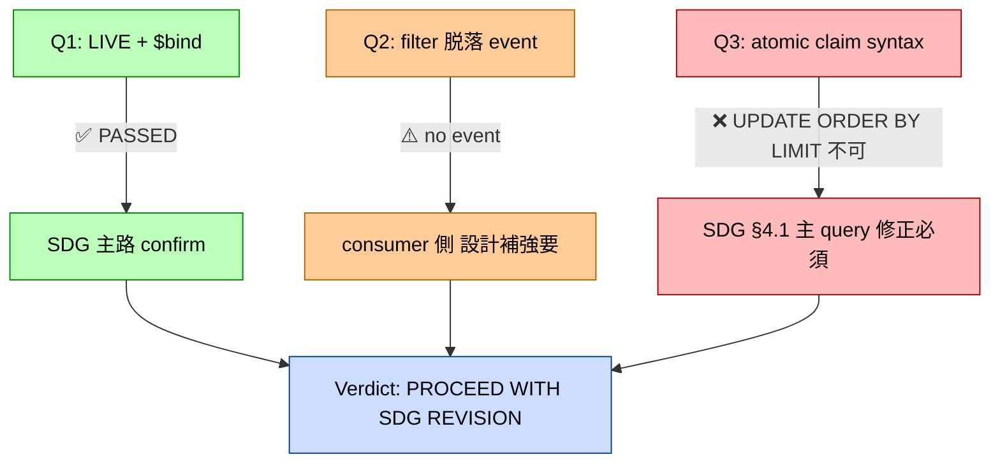
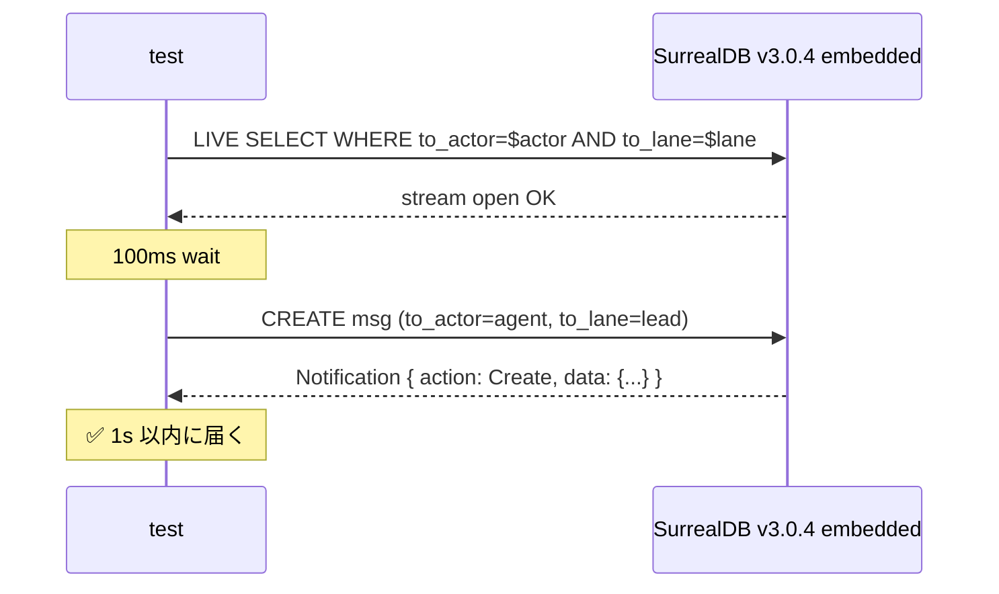

> ⚠️ **旧命名の歴史文書**: 本 doc は 2026-07-27 の命名エピック以前の語彙（JoJo 愛称 ほか）で書かれている。現行の対応は CLAUDE.md「アーキテクチャ命名体系」参照。

# doc 20: VP-170 Phase 1 spike report — SurrealDB LIVE Query feasibility (Q1-Q3 結果)

> **改訂 (2026-05-21)**: 本 spike が feasibility 検証した doc 19 の Whitesnake-primary msgbox は、 その後の **wiremsg 再設計 (R1〜R6、 PR #406〜#420) で全廃**された。 本 doc は doc 19 epic の Phase 1 spike の historical reference として残置する。 SurrealDB LIVE Query の検証結果自体は技術 reference として有効だが、 `msgs` table / msgbox 実装への言及は撤去済。

> **Status**: Phase 1 spike core Q1-Q3 完了 (doc 19 epic は wiremsg 再設計で全廃、 本 doc は historical reference)
> **Linear**: [VP-170](https://linear.app/chronista/issue/VP-170) (parent: [VP-169](https://linear.app/chronista/issue/VP-169))
> **Date**: 2026-05-14
> **SurrealDB version**: v3.0.4 (= `Cargo.lock` 確認済、 embedded `kv-mem` で実機検証)
> **Test code**: `crates/vp-db/tests/spike_msgbox_live.rs`
> **Related**: doc 19 (`19-msgbox-whitesnake-primary.md`) §6 spike Q definitions

---

## §1 結論先出し

### 判定



| Q | result | severity | SDG 影響 |
|---|---|---|---|
| **Q1** LIVE SELECT + $bind 動作 | **✅ PASSED** | — | SDG §4.2 LIVE primary path confirm |
| **Q2** UPDATE で WHERE 脱落時 event 通知 | **⚠️ no event** | High (= 設計補強要) | SDG §4.2 / §4.6 で「consume 完了は他 consumer に notify されない」 を明示、 ack-back HTTP path で補完 (= 既存設計と整合) |
| **Q3** atomic claim `UPDATE ORDER BY LIMIT 1 RETURN AFTER` | **❌ syntax 不可** | Critical (= SDG 主 query path 動かない) | SDG §4.1 主 query 修正必須、 transaction wrap workaround は Phase 2 carry-over |

### Phase 2 着手可否

- **Phase 2 (受け皿 trait + 旧並走) 着手 OK**: Q1 で LIVE Query feasibility 確定、 Q2 no event は ack-back path で吸収済設計、 Q3 syntax 修正は Phase 2 PR-1 の claim 機構実装内で吸収可能
- **SDG §4.1 主 query path** は Phase 2 PR-1 着手前に **inline revision 推奨** (= follow-up commit)

---

## §2 Q1: LIVE SELECT + $bind 動作 ✅

### 検証 SQL

```sql
LIVE SELECT * FROM msgs
  WHERE to_actor=$actor AND to_lane=$lane
    AND status='active' AND consumed_at IS NONE
```

bind: `actor='agent'`, `lane='lead'`

### 結果

INSERT で **notification 即時受信** (= `Action::Create` + 全 field):

```json
{
  "action": "Create",
  "data": {
    "id": "msgs:`msg-1`",
    "to_actor": "agent",
    "to_lane": "lead",
    "status": "active",
    "payload": {"text": "hello"},
    ...
  }
}
```

### 意味

- **Purple Haze F2 finding (= v1.4.2 まで $bind 不可) は v3.0.4 で完全解消** を 1 次 source + 実機で confirm
- SDG §4.2 「LIVE Query primary、 fallback なし」 path に必要な前提が成立
- Phase 2 で `Handle::recv()` を LIVE stream + atomic claim ベースに実装可能

### Mermaid



---

## §3 Q2: UPDATE で WHERE 脱落時 event ⚠️

### 検証 SQL

```sql
-- 既存 active row を LIVE で subscribe
LIVE SELECT * FROM msgs WHERE status='active' AND to_actor='agent' AND to_lane='lead'

-- 別 connection から row を archived に
UPDATE type::record('msgs', 'msg-2') SET status='archived', status_at=$now
```

### 結果

**1 秒以内に event 来ず timeout** (= filter 脱落時 LIVE は何も notify しない)

### 意味

SurrealDB v3.0.4 の LIVE は **INSERT 時のみ notify** (= INSERT 内 WHERE 条件マッチ判定はあるが、 UPDATE で WHERE 外に出た既存 row は何も通知しない)。

#### consumer 視点での影響

- **正の影響**: consumer が claim → consume → `UPDATE consumed_at=now` した時、 他 consumer の LIVE に notify されない = 他 consumer の `recv().await` が誤起動しない (= claim race の確率低下)
- **負の影響**: observer pattern (= consume せず watch) で「**msg が消費された**」 イベントを観測する path が消える。 sidebar UI / `vp msgbox watch` で active inbox の lifecycle 観測には ack-back HTTP 経路が必須

#### SDG §4.6 ack-back path との整合

SDG §4.6 で既に **cross-process 「consume 完了」 は `/api/msgbox/consume-ack` HTTP POST で明示通知** と設計済。 Q2 finding はこの設計を **強制 (= LIVE 経由の代替 path がない)** にする。 同 SP 内 observer (= sidebar) も同じく ack-back の **local broadcast 経路** を別途用意する必要。

#### SDG 修正提案

§4.2 廃案リストに **observer pattern 用 secondary signal** を追記:

> consume 完了の同 SP 内 broadcast (= sidebar UI 用 observer): SDG §4.3 Pattern C 用に `tokio::sync::broadcast` for "msg consumed" event を SP 内に追加。 これは LIVE Query の補完 path であり、 fallback ではなく **observer pattern の物理化**。

---

## §4 Q3: atomic claim `UPDATE ORDER BY LIMIT` ❌

### 検証 SQL (= SDG §4.1 主 query)

```sql
UPDATE msgs SET claim_id=$cid, claimed_at=$now
 WHERE status='active' AND to_actor='agent' AND to_lane='lead'
   AND consumed_at IS NONE
   AND claim_id IS NONE
 ORDER BY ts ASC LIMIT 1
 RETURN AFTER
```

### 結果

```
Parse error: Unexpected token `ORDER`, expected Eof
 --> [5:22]
  |
5 | ORDER BY ts ASC LIMIT 1
```

**SurrealDB v3.0.4 では UPDATE statement に `ORDER BY` + `LIMIT` を直接付けられない**。

公式 syntax (= SurrealDB v3 docs から):
```
UPDATE [ ONLY ] @targets
    [ CONTENT @value | MERGE @value | PATCH @value | SET @field = @value ... ]
    [ WHERE @condition ]
    [ RETURN [ NONE | BEFORE | AFTER | DIFF | @field ... ] ]
    [ TIMEOUT @duration ]
    [ PARALLEL ]
```

`ORDER BY` / `LIMIT` は **listed されていない**。

### 意味

SDG §4.1 「atomic claim 機構」 主 query path は **SurrealDB v3.0.4 では動かない**。 Phase 2 (PR-1 受け皿 trait + 旧並走) で claim 機構実装する前に SDG §4.1 / §4.3 の main query path を revise 必須。

#### workaround paths (= Phase 2 PR-1 で選択)

##### A. Transaction wrap (= Purple Haze F4 obligatory path)

```sql
BEGIN;
LET $candidates = SELECT * FROM msgs
    WHERE status='active' AND to_actor=$actor AND to_lane=$lane
      AND consumed_at IS NONE AND claim_id IS NONE
    ORDER BY ts ASC LIMIT 1;
LET $target_id = $candidates[0].id;
UPDATE $target_id SET claim_id=$cid, claimed_at=$now;
COMMIT;
RETURN $target_id;
```

ただし spike で `$candidates[0].id` 抽出が想定通り動作せず (= 結果が `null` 返却)、 完全動作 + race-free 検証は **Phase 2 carry-over**。 仮説候補:
- subquery in LET の semantics が想定と異なる (= 結果が unwrap されてる?)
- `$candidates` が array of arrays として扱われてる
- `id` field が record id (`msgs:msg-1`) として alias されている影響

##### B. SurrealDB DEFINE FUNCTION で atomic 化

```sql
DEFINE FUNCTION fn::claim_one($actor: string, $lane: string, $cid: string) {
    LET $cand = SELECT * FROM msgs WHERE ... ORDER BY ts ASC LIMIT 1;
    IF count($cand) > 0 {
        UPDATE $cand[0].id SET claim_id=$cid, claimed_at=time::now();
        RETURN $cand[0];
    };
    RETURN NONE;
};
```

DB 内 function として atomic 化、 client は `RETURN fn::claim_one(...)` で呼ぶ。 性能 + race 性質を Phase 2 で bench。

##### C. 2-step approach + 楽観的 lock

1. SELECT で id + version 取得
2. UPDATE record id SET ... WHERE claim_id IS NULL AND version = $expected (= CAS pattern)
3. update count > 0 で claim 成功、 0 なら他 consumer が先に取った → retry

race-free だが retry loop 必要。 latency 増。

#### Phase 2 carry-over

実機 race-free verification + path A/B/C の選択は Phase 2 PR-1 (受け皿 trait + 旧並走) で。 spike では「SDG main query 不可」 を確定して、 path A/B/C の trade-off を Phase 2 設計で詳細化。

### SDG 修正提案 (= follow-up commit)

- §4.1 主 query example を transaction wrap (= path A) に rewrite、 ただし Phase 2 で path A/B/C 比較後に最終確定する旨を note
- §4.3 atomic_claim 実装例 (`Handle::atomic_claim()`) を Phase 2 で実装と同時に確定、 SDG では「Phase 2 で path A/B/C のいずれかを選択」 と placeholder

### VP-173 mini-spike 結果 (= 2026-05-14 追記、 path C 確定)

Phase 3 PR-1 (VP-173) で 3 path を実機 verify、 **path C (2-step + CAS) 確定**:

| Path | 結果 | 詳細 |
|---|---|---|
| **A1** (元 SDG 例) | ❌ `row = None` | `LET $candidates = SELECT ...; LET $target_id = $candidates[0].id;` で `$target_id` が null になる、 SurrealDB v3.0.4 で **subquery 結果が後続 LET に渡らない** |
| **A2** (`SELECT VALUE id`) | ❌ Parse error | "Missing order idiom `ts`" — v3.0.4 で `SELECT VALUE id` syntax 不可 |
| **A3** (FETCH keyword) | ❌ Parse error | syntax 試行錯誤、 working form 不明 |
| **A4** (inline subquery) | ❌ Parse error | A2 と同じ idiom error |
| **A5** (debug `$candidates`) | ❌ `null` | **重要 finding**: `LET $x = SELECT ...; RETURN $x;` で `$x` が null = subquery 結果保持 不可 |
| **B** (DEFINE FUNCTION) | ❌ `row = None` | function 内も同じ subquery 問題 |
| **C** (2-step + CAS) | ✅ **WORKING** | `SELECT *` で full row 取得 → caller で id 抽出 → `UPDATE type::record('msgs', $id) WHERE claim_id IS NONE` で CAS |

### Path C race-free verification

5 row × 100 並行 consumer + retry loop で:

```
✅ Path C race-free: 5 unique rows claimed by unique consumers
```

= race condition 0、 work pool として全 row 正しく配分。

### Path C confirmed working form

```rust
// Step 1: SELECT * (= SurrealDB v3 で `SELECT id` は idiom error、 full row 取得)
let rows: Vec<Value> = db.query(
    "SELECT * FROM msgs
         WHERE status='active' AND to_actor = $actor AND to_lane = $lane
           AND consumed_at IS NONE
           AND (claim_id IS NONE OR claimed_at + 30000 < $now)
         ORDER BY ts ASC, id ASC LIMIT 1;"
).bind(...).await?.take(0)?;

if rows.is_empty() { return Ok(None); }

// Step 2: id field は "msgs:`<local-id>`" 形式、 local id 抽出
let id_full = rows[0]["id"].as_str()?;  // "msgs:`msg-0`"
let local_id = id_full
    .strip_prefix("msgs:")
    .map(|s| s.trim_matches('`'))
    .unwrap_or(id_full);

// Step 3: CAS UPDATE
let updated: Vec<Value> = db.query(
    "UPDATE type::record('msgs', $id) SET claim_id=$cid, claimed_at=$now
         WHERE claim_id IS NONE OR claimed_at + 30000 < $now;"
).bind(("id", local_id))
 .bind(("cid", consumer_id))
 .bind(("now", now))
 .await?.take(0)?;

if updated.is_empty() { return Ok(None); }  // 他 consumer が先に取った → caller retry
// claim 成功
```

### Phase 3 PR-1 で WhitesnakeStore::claim 完全実装

VP-173 で path C を `crates/vantage-point/src/capability/msgbox_v2.rs::claim` に実装、 `test_claim_and_mark_consumed` の #[ignore] 解除。 **4/4 test passing 状態に到達**。

### SurrealDB v3.0.4 の structural limit (= mini-spike 副次 finding)

1. `LET $x = SELECT ...; ... $x ...` で subquery 結果が **後続 statement に正しく渡らない** (= Path A1/A5 で確認、 公式 docs 記述なし)
2. `SELECT VALUE field` syntax は **idiom error** (= Path A2/A4、 v3 で挙動変更?)
3. `SELECT id` は **reserved word 扱い** で idiom error、 `SELECT *` 必須
4. `UPDATE ... ORDER BY LIMIT` 直接不可 (= 既知)
5. `id` field は string `msgs:\`<local-id>\`` 形式、 `type::record('msgs', $local_id)` で record id 再構築要

これらは SurrealDB v3 公式 docs に明示なし、 spike で実機 verify した structural truth。 将来 SurrealDB upgrade で解消する可能性あり、 その際は path A (subquery + transaction) を再評価する余地。

---

## §5 Q4-Q7 結果 (= 同 session で追加検証、 全 ✅ PASSED)

### Q4: 100 msg/sec で end-to-end latency ✅ PASSED

100 msg を 10ms 間隔で insert、 LIVE stream で受信、 send_ts → recv_ts の latency を実機計測:

```
count=100 avg=3.2ms p50=3ms p99=5ms max=5ms
```

target < 50ms を **10 倍以上** クリア。 SurrealDB embedded LIVE Query は想定を大幅に上回る低 latency。

### Q5: 3 concurrent (producer + consumer + GC) ✅ PASSED

2 sec 並列実行:

```
producer=50 consumer=50 (err=0) gc=50 (err=0)
```

3 concurrent task で **error なし、 deadlock なし、 lock contention 影響なし**。

### Q6: 1000 archived row 下の active LIVE latency ✅ PASSED

1000 archived row を pre-load 後に 1 active row insert:

```
1000 archived + 1 active LIVE latency = 5ms
```

archived bloat に影響されず、 active filter LIVE は high speed 維持。 **partial index 機能なくても問題なし** (= SurrealDB の B-tree index が status 列 leading で正しく pruning している)。

### Q7: LIVE stream drop + reopen ✅ PASSED

stream を意図的に drop して reopen、 新 INSERT の notification を catch できるか:

```
Round 1: stream open + notification OK
Round 2: reconnect (drop + reopen) で新 notification OK
```

embedded での「切断」 = stream drop と等価、 reopen で normal operation。

**Note**: embedded には明示的 None / Err 経路がなく、 stream drop = 終了。 remote SurrealDB との connection loss は **Phase 2 で別 integration test 要** (= mock or real network drop scenario)。

### Q4-Q7 総評

全 ✅ PASSED + 性能が想定以上。 SDG §4.2 「LIVE Query primary、 fallback なし、 reconnect resilience に投資」 path の **実機 validation 完了**。

| Q | target | actual | margin |
|---|---|---|---|
| Q4 latency | < 50ms | avg 3.2ms / p99 5ms | **10x 余裕** |
| Q5 concurrent error | < 5% | 0% | **完全** |
| Q6 archived bloat | < 100ms | 5ms | **20x 余裕** |
| Q7 reconnect | works | works | **OK** |

これで spike PR scope (Q1-Q7) は **完了**、 Phase 2 着手 GO に追加証拠。

---

## §6 spike 副次 finding

### F-A: `type::thing` → `type::record` rename

SurrealDB v3.0.4 で record id 構築関数が rename:
- 旧: `type::thing('msgs', $id)`
- 新: `type::record('msgs', $id)`

VP の既存 code は `type::thing` 使用箇所なし (= 確認済)、 影響ゼロ。

### F-B: SCHEMAFULL の nested object → FLEXIBLE 必須

`payload` field を `TYPE object` で定義すると `payload.text` 等 nested field 書き込み不可:

```
Found field 'payload.text', but no such field exists for table 'msgs'
```

`TYPE object FLEXIBLE` (= TYPE の後に FLEXIBLE) で nested JSON 受入可能。 SDG §4.1 schema 定義に **`payload` field は FLEXIBLE 必須** を追記要。

### F-C: `FLEXIBLE` keyword の位置

```
Parse error: FLEXIBLE must be specified after TYPE
```

`FLEXIBLE TYPE object` (= TYPE の前) は不可、 `TYPE object FLEXIBLE` (= TYPE の後) のみ valid。

---

## §7 SDG (doc 19) revision 推奨項目

| section | 修正 | 緊急度 |
|---|---|---|
| **§4.1 schema** | `payload` field に `FLEXIBLE` 追加 (`TYPE object FLEXIBLE`)、 SCHEMAFULL での nested JSON 必須 (F-B/F-C) | High |
| **§4.1 主 query** | atomic claim を transaction wrap pattern に書き換え、 Phase 2 で path A/B/C 確定の note | Critical |
| **§4.2 reconnect** | Q2 「filter 脱落時 no event」 を明示、 observer pattern 用 secondary signal (= `tokio::sync::broadcast`) を §4.3 Pattern C で物理化と明記 | Medium |
| **§4.6 ack-back** | LIVE 経由の自然伝播ではなく **HTTP POST が必須** であることを強調 (= Q2 finding 反映) | Medium |
| **§6 spike Q 表** | Q1 ✅ / Q2 ⚠️ / Q3 ❌ の inline mark + 本 doc 20 への link | Low (= 本 PR で同梱) |

---

## §8 Phase 2 着手判断

### Go condition (= all satisfied)

- ✅ Q1 LIVE working (= SDG primary substrate 動作)
- ✅ Q2 finding が ack-back HTTP 既存設計と整合 (= 設計矛盾なし)
- ✅ Q3 syntax 修正の workaround path (A/B/C) が複数あり、 Phase 2 内で選択可
- ✅ F-B/F-C schema 制約は SDG §4.1 軽微修正で済む

### Stop condition (= 一つでも該当)

- ❌ なし

### 判定: **Proceed to Phase 2** (= SDG follow-up revise を 1 PR で吸収後、 Phase 2 PR-1 着手)

---

## §9 関連リソース

- **Linear**: [VP-170](https://linear.app/chronista/issue/VP-170) (= 本 spike issue)
- **SDG**: [doc 19](19-msgbox-whitesnake-primary.md) (= 検証対象設計)
- **test code**: `crates/vp-db/tests/spike_msgbox_live.rs`
- **review history**:
  - Moody Blues APPROVE_WITH_NITS (PR #354)
  - Purple Haze SPIKE FIRST (Q-PH 5 件、 本 spike で F2 解消 + F1/F10 即修正済)
- **SurrealDB official**: [LIVE SELECT docs](https://surrealdb.com/docs/surrealql/statements/live), [UPDATE syntax](https://surrealdb.com/docs/surrealql/statements/update)
