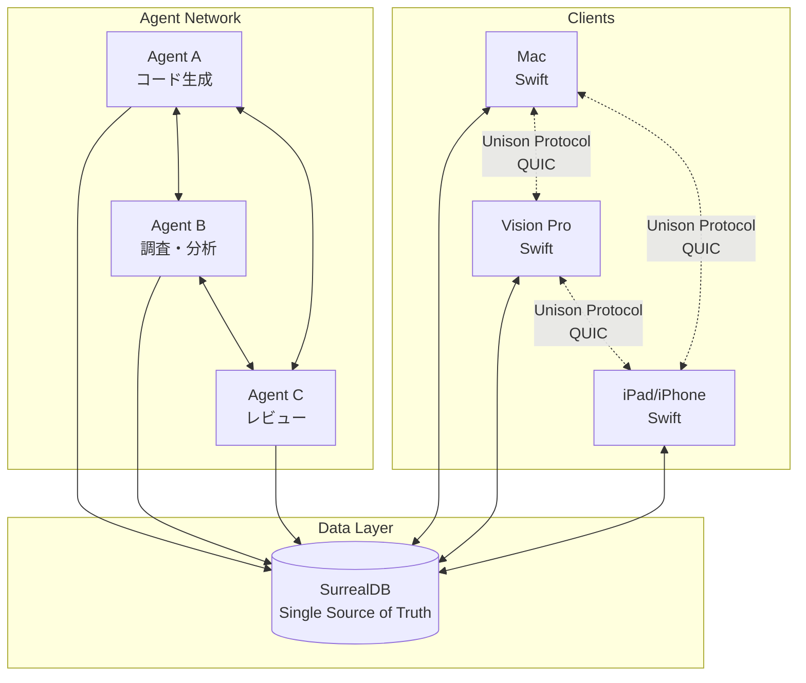
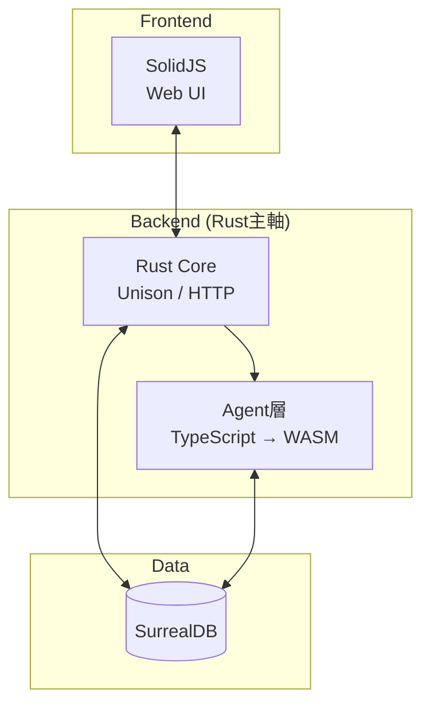
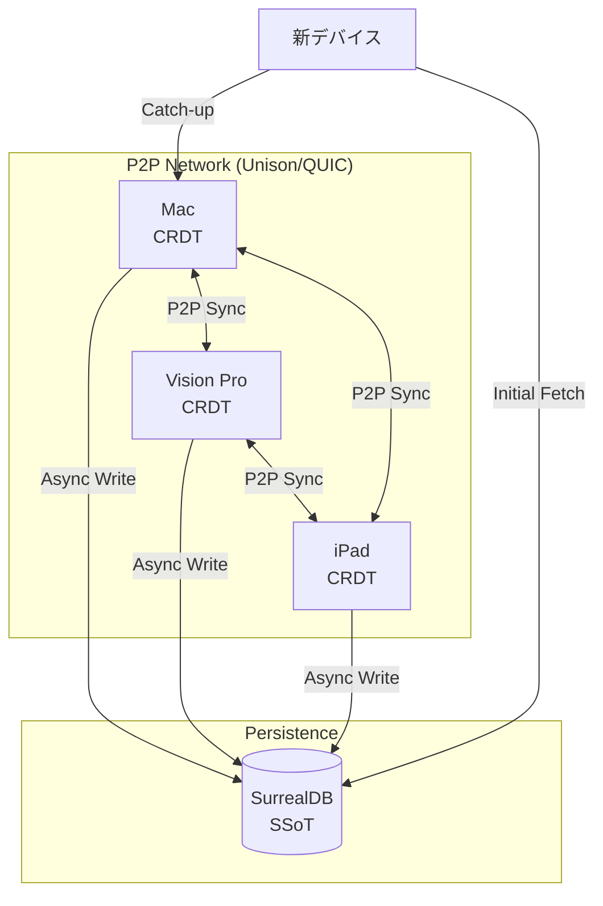
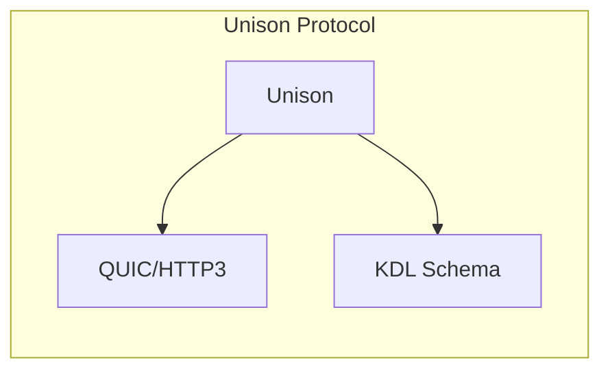
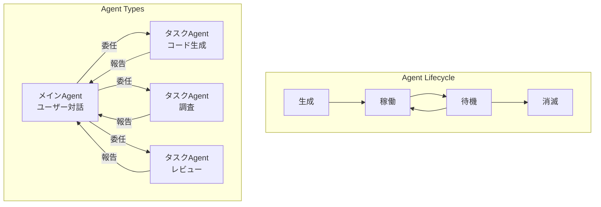
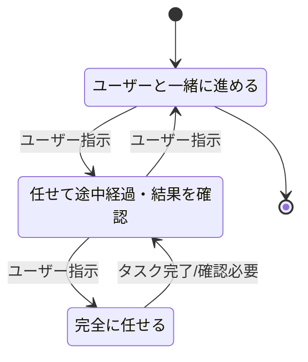
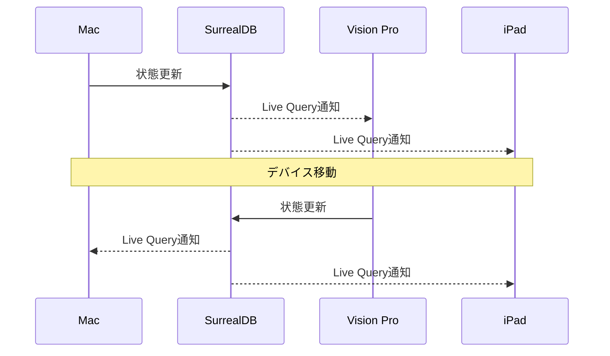
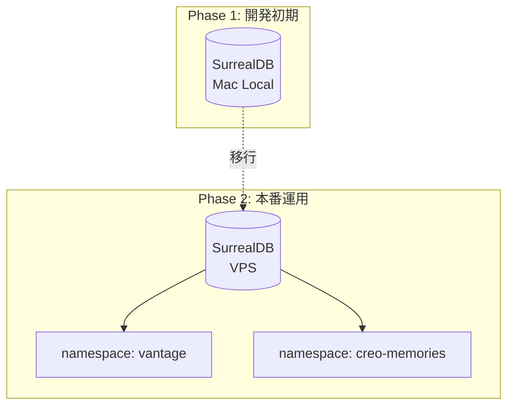
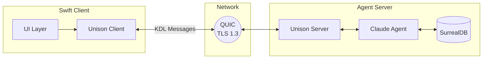
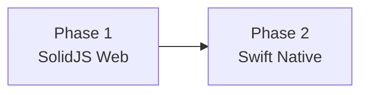

# Vantage Point - アーキテクチャ設計

## 概要

自律的なAgentネットワークによる分散アーキテクチャ。
SurrealDBをSingle Source of Truthとし、各デバイス・Agentが協調動作する。

## システム全体図

## 技術スタック

### レイヤー別技術選定

| レイヤー | 技術 | 役割 |
|---------|------|------|
| **Frontend (Web)** | SolidJS | 全プラットフォーム向けWeb UI |
| **Frontend (Native)** | Swift | Vision Pro最適化（Phase 2） |
| **Backend (Core)** | Rust | Unison Protocol, 通信層, 高性能処理 |
| **Backend (Agent)** | TypeScript → WASM | Agent SDK, MCP連携（Rustにインプロセス実行） |
| **Data** | SurrealDB | Single Source of Truth |

### アーキテクチャの特徴

**Rust主軸 + Agent層WASM**
- TypeScriptでAgentロジックを記述
- WASMにコンパイルしてRust内でインプロセス実行
- デプロイが単一バイナリでシンプル
- Rust↔Agent間通信が高速（プロセス間通信不要）

**P2Pデバイス同期 (CRDT)**
- どのデバイスもサーバー/クライアント両方になれる
- リーダーなし、全員対等
- CRDTで競合なく同期
- SurrealDBは永続化・初期同期用（SSoT）

### P2P同期アーキテクチャ

### CRDT選定

| ライブラリ | 採用理由 |
|-----------|---------|
| **Loro** | Rust + Swift + WASMバインディング、高性能、最新 |

**同期フロー**:
1. ローカル操作 → CRDT更新
2. P2Pでオペレーション送信（Unison Protocol）
3. 定期的にSurrealDBへスナップショット保存
4. 新デバイス参加時はDBから初期化 → P2Pで最新に追従

### 通信プロトコル

## Agent構成

## 協調モード

## デバイス間同期

## データ配置戦略

## 通信フロー

## 技術選定理由

| 技術 | 選定理由 |
|------|---------|
| **Unison Protocol (Rust)** | 型安全、低レイテンシ、自前でカスタマイズ可能 |
| **Swift Native** | Vision Pro最適化、ネイティブ体験 |
| **SolidJS** | 軽量、高性能、creo-memoriesと同構成 |
| **TypeScript** | Claude Agent SDK公式対応、MCP親和性 |
| **Claude Agent SDK** | MCP対応、自律Agent構築に最適 |
| **SurrealDB** | リアルタイム同期（Live Query）、柔軟なスキーマ |

## 開発フェーズ

| Phase | Frontend | 対象 | 目的 |
|-------|----------|------|------|
| **Phase 1** | SolidJS (Web) | 全プラットフォーム | コア機能・対話スタイル確立 |
| **Phase 2** | Swift Native | Vision Pro | 空間体験の最適化 |

**方針**: まずWebで全プラットフォーム対応 → 体験が固まったらVision ProをNative化

## creo-memoriesとの関係

本プロジェクトはcreo-memoriesと同じ技術構成を採用:

| 共通点 | 内容 |
|--------|------|
| Frontend (Web) | SolidJS |
| Backend | Rust + TypeScript |
| Data | SurrealDB |
| 通信 | Unison Protocol |

**差異点**:
- Phase 2でVision Pro向けSwift Nativeクライアント追加
- Agent SDK活用による自律Agent機能

---

*作成日: 2025-12-16*
*ステータス: Draft*
