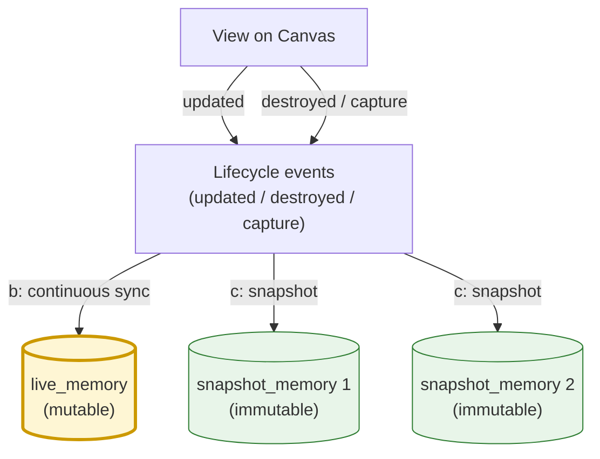

# CreoUI schema draft (VP-73 R0) — 2026-04-21

> **Status**: Draft (VP 側起案、creo-memories 側で review / finalize 予定)
> **Strategy**: D-12 = C (Co-design)
> **Linear**: [VP-73](https://linear.app/chronista/issue/VP-73) (parent: [VP-72](https://linear.app/chronista/issue/VP-72))
> **Predecessor**: `docs/design/05-pane-content-lane-smart-canvas.md`
> **Upstream handoff**: creo-memories `mem_1CaFLjx1ATHBeDDkW9sY8B` (nexus → VP)
> **Related memos**: Core `mem_1CaGtbmxgE7UKcQNCyauTT`, Stand Ensemble `mem_1CaGvxreWpPRsMrfmddMai`, Decision Batch #2 `mem_1CaGxg5mZNY5YQDPLPWQuG`, Final Summary `mem_1CaGxnzEsjyyvnqaaVSFBH`

---

## 0. Executive Summary

Requiem Architecture の土台となる **Event schema** と、その payload となる **CreoContent / CreoFormat / CreoUI** の draft。
VP Canvas は CreoUI の **render client** に格下げ (D-1)、schema の source of truth は creo-memories 側。
本 draft は VP 側で「実装上こうあると嬉しい」形を先出しし、creo-memories 側が最終確定する co-design。

### 主要決定 (本 draft で確定済)
- **CreoUI 粒度 = C (Component 単位)** 【2026-04-22 確定、§4.1】
  — CreoContent 1 つに対して CreoUI 1 つ。Pane / Canvas 全体の layout は将来の `ContainerUI` に分離。

### 3 層の役割 (nexus 決定を継承)

| 層 | 役割 | 日本語ラベル |
|----|------|-------------|
| `CreoFormat` | データ種別 (12 enum) | `<形式:CreoFormat>` |
| `CreoContent` | 内容の envelope (format + body) | `<内容:CreoContent>` |
| `CreoUI` | 見せ方 hint (layout / emphasis / placement) | `<見せ方:CreoUI>` |

### Event との関係

```
Event {
    id, topic, source, timestamp, causation,
    payload: CreoContent,   // ← 3 層のうち内容が流れる
    ui: Option<CreoUI>,     // ← 任意で見せ方も同梱
}
```

Event stream の中身が CreoContent なので、「描画すべき何か」が流れてくる世界観になる。

---

## 1. Scope & Non-goals

### In scope (VP-73 R0)
- `Event` struct (VP 側、Rust)
- Topic namespace 仕様 (canonical 4-part + alias + wildcard)
- `CreoFormat` / `CreoContent` / `CreoUI` 型 draft (Rust + KDL)
- `live_memory` / `snapshot_memory` schema の VP 側たたき台
- Reserved fields (multi-user 将来対応)

### Out of scope (後続 issue)
- Event bus 実装 → **VP-74 (R1)**
- Whitesnake event log 永続化 → **VP-74 (R1)**
- StandActor runtime → **VP-75 (R2)**
- Smart Canvas 新 Stand 実装 → **VP-76 (R3)**
- `show` / `capture_canvas` の書き換え → VP 側 Round 2
- Auto-embed の MCP tool 層実装 → creo-memories 側 Round 2

---

## 2. CreoFormat (12 members)

`Memory.contentType` と同一集合に揃える (nexus 決定 #2)。

```rust
#[derive(Debug, Clone, Copy, Serialize, Deserialize, PartialEq, Eq, Hash)]
#[serde(rename_all = "snake_case")]
pub enum CreoFormat {
    Mermaid,
    Markdown,
    Text,
    Image,
    Table,
    Chart,
    Code,
    Json,
    Video,
    Audio,
    Embed,   // URL / iframe 埋め込み
    Custom,  // 拡張枠 (body schema は caller 責務)
}
```

### body schema 対応表 (初期案)

| format | body shape |
|--------|-----------|
| `markdown` / `text` | `{ "text": string }` |
| `mermaid` | `{ "source": string, "theme"?: string }` |
| `image` | `{ "url": string, "alt"?: string, "w"?: int, "h"?: int }` |
| `table` | `{ "columns": string[], "rows": unknown[][] }` |
| `chart` | `{ "kind": "line"\|"bar"\|..., "data": unknown, "options"?: unknown }` |
| `code` | `{ "lang": string, "source": string, "highlight"?: [int] }` |
| `json` | `{ "value": unknown }` (pretty render) |
| `video` / `audio` | `{ "url": string, "mime"?: string, "duration"?: number }` |
| `embed` | `{ "url": string, "kind"?: "iframe"\|"link-preview" }` |
| `custom` | caller 定義 (`custom_kind: string` 推奨) |

render client は `format` で dispatch、未知 kind は graceful fallback (text rendering of body)。

---

## 3. CreoContent (envelope)

nexus 決定 #3 を骨格に、provenance fields を追加。

```rust
#[derive(Debug, Clone, Serialize, Deserialize)]
pub struct CreoContent {
    pub format: CreoFormat,
    pub body: serde_json::Value,

    /// provenance (auto-embed 時も埋める)
    #[serde(skip_serializing_if = "Option::is_none")]
    pub source: Option<CreoSource>,

    /// 外部 memory を直接指す場合
    #[serde(skip_serializing_if = "Option::is_none")]
    pub memory_ref: Option<MemoryRef>,
}

#[derive(Debug, Clone, Serialize, Deserialize)]
#[serde(tag = "kind", rename_all = "snake_case")]
pub enum CreoSource {
    /// b-stream: live memory と連動
    Live { live_memory_id: MemoryId, version: u64 },
    /// c-stream: snapshot memory (immutable)
    Snapshot { snapshot_memory_id: MemoryId },
    /// inline 受信 → auto-embed 産 (memory_id 未指定)
    Inline,
    /// 既存 memory を参照
    Memory { memory_id: MemoryId },
}

#[derive(Debug, Clone, Serialize, Deserialize)]
pub struct MemoryRef {
    pub id: MemoryId,
    #[serde(skip_serializing_if = "Option::is_none")]
    pub revision: Option<String>,
}
```

### 不変条件
- `body` は `format` に対応する JSON shape を満たす (validator は creo-memories 側で提供予定)
- `format = custom` のときは `body.custom_kind` 必須を推奨
- `source = Inline` なら、render 前に auto-embed で ephemeral memory が作られて `Live` / `Memory` に置き換えられる

---

## 4. CreoUI (見せ方 hint)

### 4.1 粒度 — 確定: C (Component 単位) 【2026-04-22】

nexus handoff で「次に決めるべき筆頭」とされた論点。3 案の検討結果:

| 案 | 粒度 | 評価 |
|----|------|------|
| A | **Pane 単位** (1 Pane = 1 CreoUI) | Smart Canvas item ごとの hint が表現不能 → 却下 |
| B | **Canvas 全体** (Canvas = 1 CreoUI) | 個別 item scope が欠落 → 却下 |
| **C** | **Component 単位** (= CreoContent 1 つに 1 CreoUI) | **採用** |

### 確定理由
- Smart Canvas items が既に個別 CreoContent である以上、描画 hint も同粒度が素直
- Pane / Canvas 単位の layout は将来 **"ContainerUI"** として分離 (Out of scope for R0)
- Mirror view (同 Content を複数 Pane で表示) との相性が良い — hint が Content に付属して自動伝搬
- Event `payload: CreoContent` と対称に `ui: Option<CreoUI>` を同梱できる (§5 参照)

### Container 層 (将来)
CreoUI は Component 単位で定義するが、**Pane / Canvas 全体の layout hint が必要になる場合に備えて `ContainerUI` 型を将来追加** する余地を残す (R0 では型も切らない)。

### 4.2 型定義

```rust
#[derive(Debug, Clone, Serialize, Deserialize, Default)]
pub struct CreoUI {
    #[serde(default)]
    pub layout: CreoLayout,

    #[serde(default)]
    pub emphasis: CreoEmphasis,

    #[serde(default, skip_serializing_if = "Option::is_none")]
    pub placement: Option<CreoPlacement>,

    /// Reserved: multi-user Canvas 将来対応
    #[serde(default, skip_serializing_if = "Option::is_none")]
    pub ownership: Option<CreoOwnership>,

    #[serde(default, skip_serializing_if = "Option::is_none")]
    pub expires_at: Option<DateTime<Utc>>,

    #[serde(default, skip_serializing_if = "Vec::is_empty")]
    pub tags: Vec<String>,
}

#[derive(Debug, Clone, Copy, Serialize, Deserialize, Default)]
#[serde(rename_all = "snake_case")]
pub enum CreoLayout {
    #[default]
    Masonry,   // variable-height vertical flow (SC default)
    Grid,      // fixed-cell grid
    Focus,     // 1 item dominant, others minimized
    Stream,    // chronological stream (HD chat mode)
    Sidebar,   // pinned strip
    Inline,    // 他 content 内部に埋め込み
}

#[derive(Debug, Clone, Serialize, Deserialize, Default)]
pub struct CreoEmphasis {
    #[serde(default)]
    pub pinned: bool,
    /// -2 (deprioritized) .. 0 (normal) .. +2 (hero)
    #[serde(default)]
    pub priority: i8,
    #[serde(default, skip_serializing_if = "Option::is_none")]
    pub badge: Option<String>,
}

#[derive(Debug, Clone, Serialize, Deserialize)]
pub struct CreoPlacement {
    pub x: Option<f32>,
    pub y: Option<f32>,
    pub w: Option<f32>,
    pub h: Option<f32>,
}

/// Reserved: multi-user future
#[derive(Debug, Clone, Serialize, Deserialize)]
pub struct CreoOwnership {
    /// この item を作成した actor
    pub owner: ActorRef,
    /// user-scoped pin (user A が pin しても B には見えない、将来)
    #[serde(default, skip_serializing_if = "Vec::is_empty")]
    pub pinned_by: Vec<ActorRef>,
}
```

### 4.3 Reserved fields の理由

VP-73 deliverable #4 で明示要請。**ownership / pinned_by を最初から type に含める** が、R0 では単に「予約」扱いで render client は無視する。将来 multi-user Canvas (Creo ID VP-63 以降) で活性化。
R0 で型を切り忘れると後方互換の breaking change が発生するため、今のうちに optional field を確保しておく方が安全。

---

## 5. Event schema (VP 側)

VP-73 deliverable #1。payload に `CreoContent` を持つ。

```rust
use uuid::Uuid;
use chrono::{DateTime, Utc};

pub type EventId = Uuid; // UUID v7 (time-ordered)
pub type Topic = String; // canonical string、後述の namespace 準拠

#[derive(Debug, Clone, Serialize, Deserialize)]
pub struct Event {
    pub id: EventId,
    pub topic: Topic,
    pub source: ActorRef,
    pub timestamp: DateTime<Utc>,

    /// 因果チェイン (why? tree)
    #[serde(default, skip_serializing_if = "Option::is_none")]
    pub causation: Option<EventId>,

    /// 内容
    pub payload: CreoContent,

    /// 描画 hint (任意同梱)
    #[serde(default, skip_serializing_if = "Option::is_none")]
    pub ui: Option<CreoUI>,
}

#[derive(Debug, Clone, Serialize, Deserialize, PartialEq, Eq, Hash)]
pub struct ActorRef {
    pub stand: String,    // "hd" / "pp" / "sc" / "th" / "ws" / ...
    pub lane: String,     // "lead" / "worker-VP-10" / ...
    pub project: String,  // "vantage-point"
}
```

### causation 付け方の規約
- user 起点の command (click / shortcut) は `causation = None`
- それに応答して stand が発行する event は `causation = Some(user_event.id)`
- 連鎖は transitive に伝播させる (単一 parent のみ、DAG 化は将来)

---

## 6. Topic namespace

VP-73 deliverable #2、D-8 (Hybrid canonical + alias) の具体化。

### 6.1 Canonical 4-part

```
{scope}/{capability}/{category}/{detail}
```

| slot | 値 |
|------|-----|
| `scope` | `project` / `user` / `system` |
| `capability` | stand 略称 or 他: `hd` / `pp` / `sc` / `th` / `ws` / `ge` / `hp` / `tw` / `user` (scope=user の特例) / ... |
| `category` | `state` / `command` / `lifecycle` / `error` / `notify` |
| `detail` | capability 依存 (`route` / `item-added` / `focus-changed` / ...) |

### 6.2 例

| Canonical | 意味 |
|-----------|------|
| `project/pp/command/route` | PP への routing コマンド |
| `project/sc/state/item-added` | SC に item が追加された |
| `project/hd/notify/message` | HD が新メッセージを吐いた |
| `user/user/command/click` | ユーザーのクリック |
| `user/user/state/focus-changed` | focus 変化 |
| `system/tw/lifecycle/process-started` | TheWorld が Process 起動 |

### 6.3 Alias table (初期セット)

```
pp.route           -> project/pp/command/route
sc.item.added      -> project/sc/state/item-added
sc.item.updated    -> project/sc/state/item-updated
hd.message         -> project/hd/notify/message
hd.session.started -> project/hd/lifecycle/session-started
user.click         -> user/user/command/click
user.focus         -> user/user/state/focus-changed
build.done         -> project/ge/state/build-done
error.*            -> **/error/*   (wildcard alias 例)
```

alias は **永久互換**、canonical は拡張の余地を残す。

### 6.4 Wildcard subscription

- `project/pp/**` — PP 配下の全 event
- `**/error/**` — 全 error event
- `project/*/command/*` — 全 capability の command
- 実装は既存 Unison TopicRouter の pattern matching を流用

### 6.5 ACL / rate limit (将来)
- topic 単位で publish/subscribe ACL
- `user/user/command/keypress-raw` などは Fine 粒度 (D-9) → opt-in のみ publish

---

## 7. Dual Stream: live / snapshot memory

nexus 決定 #5 の Dual Stream を schema に落とす。R0 は **定義のみ**、migration / API は Round 2。

### 7.1 live_memory (mutable、b-stream 専用)

```surql
DEFINE TABLE live_memory SCHEMAFULL;
DEFINE FIELD id            ON live_memory TYPE record<live_memory>;
DEFINE FIELD atlas         ON live_memory TYPE record<atlas>;
DEFINE FIELD content       ON live_memory FLEXIBLE TYPE object;  -- CreoContent envelope
DEFINE FIELD ui            ON live_memory FLEXIBLE TYPE option<object>;  -- CreoUI
DEFINE FIELD source_ctx    ON live_memory TYPE object;  -- { session_id, pane_id, actor_ref }
DEFINE FIELD version       ON live_memory TYPE int      DEFAULT 1;
DEFINE FIELD owner         ON live_memory TYPE option<string>;  -- reserved
DEFINE FIELD created_at    ON live_memory TYPE datetime DEFAULT time::now();
DEFINE FIELD updated_at    ON live_memory TYPE datetime VALUE time::now();

DEFINE INDEX live_memory_session ON live_memory FIELDS source_ctx.session_id;
DEFINE INDEX live_memory_atlas   ON live_memory FIELDS atlas;
```

### 7.2 snapshot_memory (immutable、c-stream)

```surql
DEFINE TABLE snapshot_memory SCHEMAFULL;
DEFINE FIELD id            ON snapshot_memory TYPE record<snapshot_memory>;
DEFINE FIELD atlas         ON snapshot_memory TYPE record<atlas>;
DEFINE FIELD content       ON snapshot_memory FLEXIBLE TYPE object;  -- CreoContent envelope
DEFINE FIELD ui            ON snapshot_memory FLEXIBLE TYPE option<object>;  -- CreoUI at capture time
DEFINE FIELD source_live   ON snapshot_memory TYPE option<record<live_memory>>;
DEFINE FIELD causation     ON snapshot_memory TYPE option<string>;  -- EventId
DEFINE FIELD owner         ON snapshot_memory TYPE option<string>;  -- reserved
DEFINE FIELD captured_at   ON snapshot_memory TYPE datetime DEFAULT time::now();

DEFINE INDEX snapshot_source_live ON snapshot_memory FIELDS source_live;
DEFINE INDEX snapshot_causation   ON snapshot_memory FIELDS causation;
```

### 7.3 既存 `memory` table との関係
- 既存 `memory` は **触らない** (慎重モード、nexus 決定)
- `live_memory` / `snapshot_memory` は **新規 table**
- 将来、snapshot → memory promote パスを別途設計 (Round 2)

### 7.4 Mermaid 再掲 (参考)



---

## 8. Auto-embed / Auto-link (nexus 決定 #4, #6 の再整理)

### 8.1 Auto-embed
- `show` 系 MCP で inline raw data を受けたら、**暗黙に ephemeral live_memory を作成**
- その id を `CreoSource::Live` として `CreoContent.source` に埋める
- → 全 render が memory-backed、provenance 完備

### 8.2 Auto-link
- MCP call に付随する context: `session_id` / `pane_id` / `actor_ref` / `active_live_memory_id`
- snapshot 時の `source_live`、auto-embed 時の親 memory はこの context から自動付与
- 明示上書き機構は残す (誤推論の救済パス)

### 8.3 R0 における position
- **R0 では型・schema のみ。実装は Round 2**
- context 構造体の Rust 型だけ先に draft:

```rust
#[derive(Debug, Clone, Serialize, Deserialize)]
pub struct CreoCallContext {
    pub session_id: Option<String>,
    pub pane_id: Option<String>,
    pub actor: Option<ActorRef>,
    pub active_live_memory_id: Option<MemoryId>,
}
```

---

## 9. Rust type 全体 summary

実装ファイル想定: `crates/vantage-core/src/creo.rs` (VP 側 consumer)、正本は creo-memories crate。

```rust
// ===== 形式 =====
pub enum CreoFormat { Mermaid, Markdown, Text, Image, Table, Chart, Code, Json, Video, Audio, Embed, Custom }

// ===== 内容 =====
pub struct CreoContent { format, body, source?, memory_ref? }
pub enum CreoSource  { Live {...}, Snapshot {...}, Inline, Memory {...} }
pub struct MemoryRef { id, revision? }

// ===== 見せ方 =====
pub struct CreoUI       { layout, emphasis, placement?, ownership?, expires_at?, tags }
pub enum CreoLayout     { Masonry, Grid, Focus, Stream, Sidebar, Inline }
pub struct CreoEmphasis { pinned, priority, badge? }
pub struct CreoPlacement { x?, y?, w?, h? }
pub struct CreoOwnership { owner, pinned_by }  // reserved

// ===== Event =====
pub struct Event     { id, topic, source, timestamp, causation?, payload: CreoContent, ui?: CreoUI }
pub struct ActorRef  { stand, lane, project }

// ===== MCP call context =====
pub struct CreoCallContext { session_id?, pane_id?, actor?, active_live_memory_id? }
```

---

## 10. KDL schema (SDG codegen 対応)

`schemas/creo.kdl` に配置想定。CREO-10 (`mem_1CYuh7EYSWfC3kL72p1W4d`) の KDL Schema Codegen に準拠。

```kdl
namespace "creo"

// ---------- 形式 ----------
enum "CreoFormat" {
  value "mermaid"
  value "markdown"
  value "text"
  value "image"
  value "table"
  value "chart"
  value "code"
  value "json"
  value "video"
  value "audio"
  value "embed"
  value "custom"
}

// ---------- 内容 ----------
struct "CreoContent" {
  field "format"     type="CreoFormat"      required=#true
  field "body"       type="record<unknown>" required=#true
  field "source"     type="CreoSource"      required=#false
  field "memory_ref" type="MemoryRef"       required=#false
}

enum "CreoSource" tagged="kind" {
  variant "live" {
    field "live_memory_id" type="string" required=#true
    field "version"        type="number" required=#true
  }
  variant "snapshot" {
    field "snapshot_memory_id" type="string" required=#true
  }
  variant "memory" {
    field "memory_id" type="string" required=#true
  }
  variant "inline"
}

struct "MemoryRef" {
  field "id"       type="string" required=#true
  field "revision" type="string" required=#false
}

// ---------- 見せ方 ----------
enum "CreoLayout" {
  value "masonry"
  value "grid"
  value "focus"
  value "stream"
  value "sidebar"
  value "inline"
}

struct "CreoEmphasis" {
  field "pinned"   type="boolean" default=#false
  field "priority" type="number"  default=0
  field "badge"    type="string"  required=#false
}

struct "CreoPlacement" {
  field "x" type="number" required=#false
  field "y" type="number" required=#false
  field "w" type="number" required=#false
  field "h" type="number" required=#false
}

// Reserved (multi-user future)
struct "CreoOwnership" {
  field "owner"     type="string"   required=#true
  field "pinned_by" type="string[]" default="[]"
}

struct "CreoUI" {
  field "layout"     type="CreoLayout"     default="masonry"
  field "emphasis"   type="CreoEmphasis"   required=#false
  field "placement"  type="CreoPlacement"  required=#false
  field "ownership"  type="CreoOwnership"  required=#false
  field "expires_at" type="datetime"       required=#false
  field "tags"       type="string[]"       default="[]"
}

// ---------- Event ----------
struct "ActorRef" {
  field "stand"   type="string" required=#true
  field "lane"    type="string" required=#true
  field "project" type="string" required=#true
}

struct "Event" {
  field "id"        type="string"       required=#true   // UUID v7
  field "topic"     type="string"       required=#true
  field "source"    type="ActorRef"     required=#true
  field "timestamp" type="datetime"     required=#true
  field "causation" type="string"       required=#false  // EventId
  field "payload"   type="CreoContent"  required=#true
  field "ui"        type="CreoUI"       required=#false
}

struct "CreoCallContext" {
  field "session_id"             type="string"   required=#false
  field "pane_id"                type="string"   required=#false
  field "actor"                  type="ActorRef" required=#false
  field "active_live_memory_id"  type="string"   required=#false
}

// ---------- Topic namespace ----------
topic "canonical" {
  pattern "{scope}/{capability}/{category}/{detail}"
  scope      (values "project" "user" "system")
  category   (values "state" "command" "lifecycle" "error" "notify")
}

topic "aliases" {
  alias "pp.route"           to="project/pp/command/route"
  alias "sc.item.added"      to="project/sc/state/item-added"
  alias "sc.item.updated"    to="project/sc/state/item-updated"
  alias "hd.message"         to="project/hd/notify/message"
  alias "hd.session.started" to="project/hd/lifecycle/session-started"
  alias "user.click"         to="user/user/command/click"
  alias "user.focus"         to="user/user/state/focus-changed"
  alias "build.done"         to="project/ge/state/build-done"
}
```

---

## 11. Open questions (→ creo-memories 側)

Co-design の戻しボール。creo-memories 側で decide / iterate してもらう項目:

### 11.1 ~~粒度確定~~ ✅ 2026-04-22 に C (Component 単位) で確定済 (§4.1 参照)

### 11.2 `custom` format の schema 登録機構
- `custom_kind: string` 必須規約でよいか
- 登録 API が要るか (`creo register-format ...`) → Round 2?

### 11.3 auto-embed の実装層
- MCP tool 層 (透過的) vs render handler 層 (明示)
- ephemeral live_memory の TTL (24h? session 単位?)
- promote ポリシー (pin で昇格? 明示 command?)

### 11.4 既存 `memory` table との関係
- snapshot_memory → memory への promote 設計 (Round 2 で良いか)
- search の混在 (live / snapshot / memory を横断検索する?)

### 11.5 ActorRef の表現
- VP 側は `{stand, lane, project}` の 3 tuple
- creo-memories 側でも同形式で OK か (cross-system で一致させたい)
- ↔ Mailbox address `{stand}.{lane}@{project}` (VP-24) と alias 関係にある

### 11.6 causation の multi-parent 化時期
- R0 は single parent
- R7+ で DAG 化? (event merge / join を扱うとき)

### 11.7 Reserved field の扱い
- `ownership` / `pinned_by` は optional でよいか
- render client は R0 で完全無視でよいか (将来 opt-in)

---

## 12. R0 完了判定 (Definition of Done)

VP-73 成功条件:

- [ ] 本 draft (`docs/design/06-creoui-draft.md`) を creo-memories 側に handoff
- [ ] creo-memories 側で review、§11 の open questions に対する決定
- [ ] 確定版の Rust 型が creo-memories crate に commit される
- [ ] VP 側で `crates/vantage-core/src/creo.rs` に re-export (consumer) 実装
- [ ] `Event` struct + Topic namespace 定義が VP 側で merge される
- [ ] VP-CreoUI 型 adapter 層 (既存 Canvas items ↔ CreoContent 変換) の skeleton

---

## 13. Migration 戦略 (既存資産との接続)

| 既存 | 本 schema での位置付け |
|------|----------------------|
| Smart Canvas items (`type: markdown/memory/url/image/mermaid/log/data`) | `CreoContent { format, body }` に map。`log` / `data` は `custom` で暫定受け |
| `Memory.contentType` | `CreoFormat` と同一集合 (nexus 決定) |
| Unison TopicRouter topic | Canonical 4-part を正、既存 topic は alias で吸収 |
| `msg_*` MCP tools | topic alias で透過互換、payload は CreoContent 化 |
| `show` MCP tool | Round 2 で CreoContent 受信に書き換え |

`log` / `data` / その他 05 doc の item type は `format: "custom"` + `body.custom_kind: "log"|"data"` で受けて、正式 format への昇格は後日議論。

---

## 14. Related

- `docs/design/05-pane-content-lane-smart-canvas.md` (4 層モデル + Smart Canvas 仕様)
- `docs/design/01-architecture.md` (全体アーキ)
- Linear: [VP-72 (Epic)](https://linear.app/chronista/issue/VP-72), [VP-73 (本 issue)](https://linear.app/chronista/issue/VP-73), [VP-74 (R1)](https://linear.app/chronista/issue/VP-74), [VP-75 (R2)](https://linear.app/chronista/issue/VP-75), [VP-76 (R3)](https://linear.app/chronista/issue/VP-76)
- creo-memories memos:
  - nexus handoff: `mem_1CaFLjx1ATHBeDDkW9sY8B`
  - 4 層 Core: `mem_1CaGtbmxgE7UKcQNCyauTT`
  - Stand Ensemble / Requiem: `mem_1CaGvxreWpPRsMrfmddMai`
  - Decision Batch #2 (D-6〜D-11): `mem_1CaGxg5mZNY5YQDPLPWQuG`
  - Final Summary: `mem_1CaGxnzEsjyyvnqaaVSFBH`
  - KDL Schema Codegen: `mem_1CYuh7EYSWfC3kL72p1W4d`

---

## 15. Changelog

- **2026-04-21 v0** — 初版起案 (VP 側 draft)。creo-memories 側 review 待ち。
- **2026-04-22 v1** — §4.1 CreoUI 粒度を **C (Component 単位)** で確定。`ContainerUI` 将来枠として言及。§11.1 を closed に変更。
