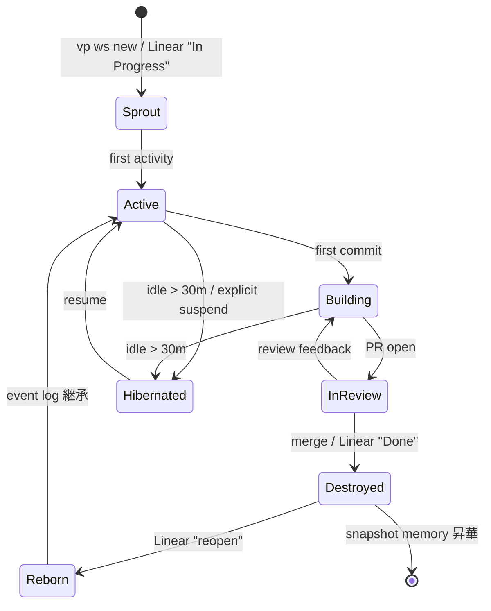
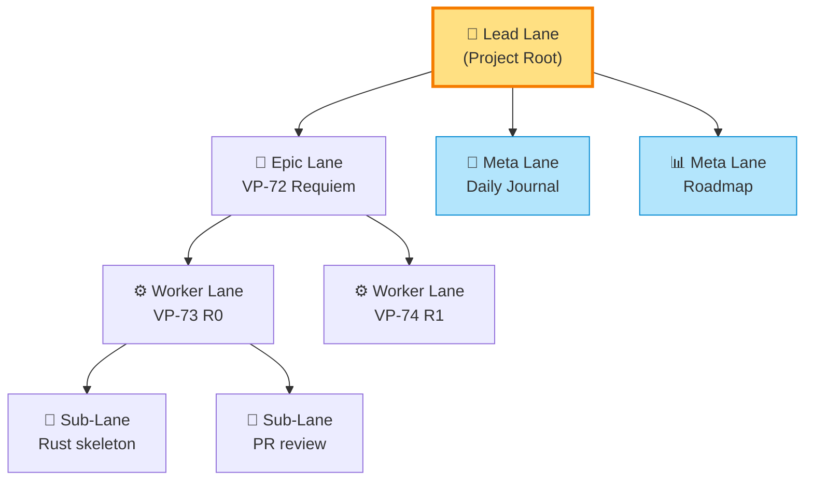
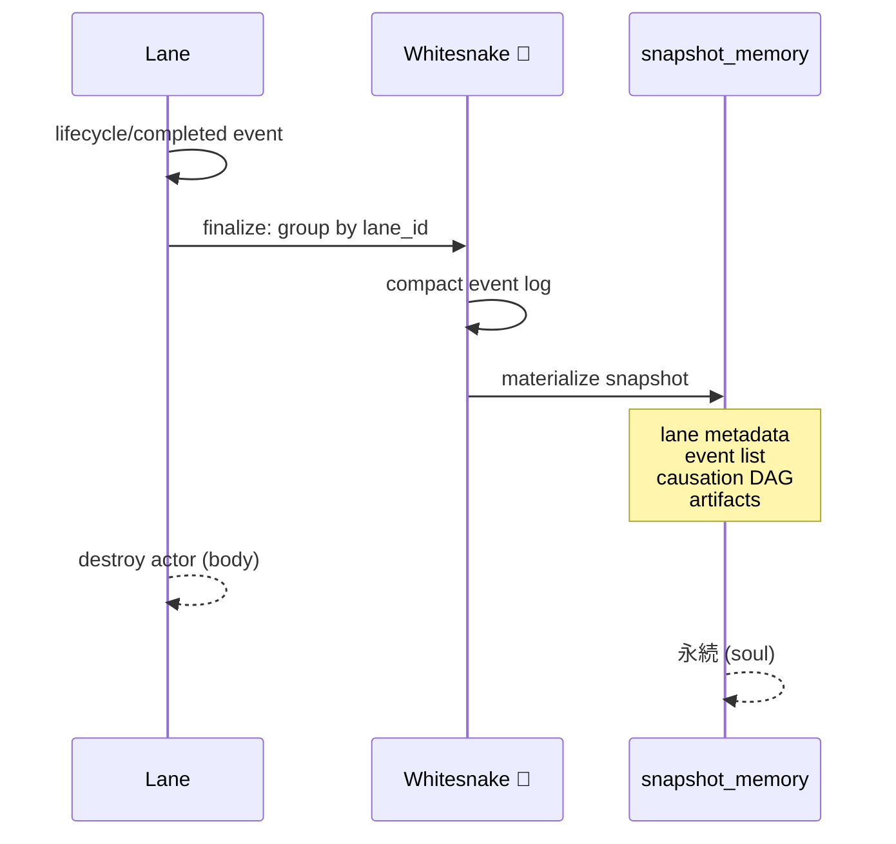

# Lane-as-Process 規約 — Lane の StandActor 化 + Lead Autonomy Level (VP-77 draft)

> **Status**: Draft v0 (2026-04-22)
> **Type**: 規約 (convention / protocol) の追加 — 物理レイヤー新設ではない
> **Linear**: [VP-77](https://linear.app/chronista/issue/VP-77) (parent: [VP-72](https://linear.app/chronista/issue/VP-72) Requiem Architecture)
> **Upstream**: `docs/design/05-pane-content-lane-smart-canvas.md` (4 層モデル), `docs/design/06-creoui-draft.md` (R0 Event schema)
> **Foundation**: VP-69 Stone Free Phase 2 (worker msgbox actor registration)

---

## 0. Executive Summary

Lane を「**目的を持つ有限時間の Process (工程)**」として扱う規約を追加する。
既存の Lane 概念 (docs/design/05 §5) を **Living Actor** に昇華させ、StandActor trait を実装して event stream に参加させる。
Lead Lane は Autonomy Level を持ち、worker 作業中の "待ち" を meta task に変換する。

### 主要決定 (本 draft で確定するもの)
- Lane に state machine を持たせる (Linear status と片方向 sync)
- Lead Lane に Autonomy Level (L0-L3) を導入
- Lane 完了 = event log の snapshot_memory 昇華 (Dual Stream c-stream trigger)
- Meta Lane (Issue 非依存の常駐 Lane) カテゴリを確立

### 核メタファー

> **Issue = DNA / Branch = 体 / Event = 生 / Memory = 成仏後の記憶**

Lane は生まれ、育ち、成熟し、死ぬ。死は喪失ではなく記憶への昇華。

---

## 1. Scope & Non-goals

### In scope (本 spec)
- Lane Identity (state machine, lifecycle, hierarchy)
- Lead Autonomy Level 仕様 (L0-L3)
- Meta Lane カタログ
- Lane actor 化 (StandActor impl) の skeleton
- Linear Sync 仕様 (片方向 subscribe + 限定 push)
- Mortality / Snapshot 昇華の trigger 仕様
- 命名決定 (Lane / Movement / Process rename の是非)

### Out of scope (後続 issue)
- Event bus 実装 → **VP-74 (R1)**
- StandActor runtime 実装 → **VP-75 (R2)**
- Smart Canvas 新 Stand → **VP-76 (R3)**
- Cross-device Lane sync → VP-71 Stone Free Cloud 以降
- Lane snapshot の UI (retrospective viewer) → 別 issue

---

## 2. 用語定義

| 用語 | 定義 |
|------|-----|
| **Lane** | 目的を持つ有限時間の process unit。Identity を持つ Living Actor |
| **LaneId** | Lane の一意識別子。**UUID v7** (`lane-{uuid7}` 形式を推奨)。Event.id と同じ time-ordered 性質で causation chain 参加 |
| **Lead Lane** | Project Root Lane。Project 作成時に自動生成、project 削除時のみ destroy。Meta task の responsibility holder |
| **Worker Lane** | Linear issue 1 つに対応する実装 context。`vp ws new` で create |
| **Meta Lane** | Issue に紐付かない常駐 / 周期 Lane (Daily Journal 等) |
| **Sub-Lane** | Worker Lane 内の細分化 (issue を複数 phase に分割) |
| **Lane State** | state machine の現在位置 (Sprout / Active / Building / InReview / Hibernated / Destroyed / Reborn) |
| **Autonomy Level** | Lead Lane の自律度設定 (L0 Observer 〜 L3 Autonomous Director) |
| **Mortality** | Lane 完了 → event log が snapshot_memory に昇華する振る舞い |

---

## 3. Lane State Machine

### 3.1 ステート図



### 3.2 ステート遷移条件

| 遷移 | Trigger | 副作用 |
|------|---------|--------|
| `* → Sprout` | `vp ws new` / Linear "In Progress" | ccws clone 作成、msgbox 登録 (VP-69) |
| `Sprout → Active` | 最初の event 発行 | actor 起動 |
| `Active → Building` | 最初の commit | build status subscribe 開始 |
| `Building → InReview` | PR open (GitHub webhook) | review queue Meta Lane に enqueue |
| `InReview → Destroyed` | PR merge / Linear "Done" | Mortality trigger |
| `* → Hibernated` | idle > 30m / `vp ws suspend` | actor 停止、state は DB 残存 |
| `Hibernated → Active` | `vp ws resume` / any event addressed | actor 再起動、state 復元 |
| `Destroyed → Reborn` | Linear "reopen" | snapshot から state 復元、event log 継承 |

### 3.3 Hibernated の意味

- **Hibernated ≠ Destroyed**: Worker CC は停止するが、state (cwd, session, msgbox buffer) は DB 保持
- 再訪で即 context 復元できる "作業の栞"
- Lane 数爆発の軽減策

### 3.4 Reborn (記憶付き復活)

- Linear reopen 時、対応 Lane を Destroyed → Reborn
- snapshot_memory から event log を restore
- 新しい活動は既存 event の causation chain に繋がる

---

## 4. Lane 階層 (flat → tree)

### 4.1 構造



### 4.2 階層原則

- **Lead は親、Worker は子**: parent-child 関係は Linear issue hierarchy を mirror
- **時間 DAG × 空間 tree**: 時間は causation (横糸)、空間は parent/child (縦糸)
- **Sub-Lane は optional**: 大きな issue を phase 分割する場合のみ

### 4.3 制約

- Worker Lane の parent は常に Lead Lane または Epic Lane
- Meta Lane の parent は常に Lead Lane (cross-project Meta Lane は別 issue)
- Sub-Lane は Worker Lane の下のみ (深さ ≤ 3)

---

## 5. Lead Autonomy Level 🎚️

### 5.1 4 段階

| Level | 名称 | 自律範囲 | Permission Gate |
|:---:|------|---------|:---:|
| **L0** | 🪷 Observer | 状態を映すだけ、自発行動なし | — |
| **L1** | 🧹 Steward | 低リスク meta task を自律 | auto (log only) |
| **L2** | 🎻 Conductor | 中リスク meta task (user に提案) | log + approve |
| **L3** | 🎼 Autonomous Director | 高リスク meta task (結果報告型) | must approve |

### 5.2 各 Level の具体的行動

#### L0 Observer (default)
- worker 状態を監視、表示のみ
- user 明示的 request がない限り行動しない
- 現状の VP と同じ操作感

#### L1 Steward
- **Linear status sync**: PR merge → issue "Done"、branch push → "In Progress"
- **Daily summary 生成**: 0:00 に前日の全 Lane activity を memory に記録
- **memory 整理**: 重複検出、tag 整合、orphan 回収
- **PR CI 通知**: CI 完了を user に push 通知
- **cross-project ping 受信**: creo-memories からの handoff memo を拾う
- **Cycle burn-down**: Linear cycle の burn-down 更新

#### L2 Conductor
- **Worker nudge**: idle 30m 超の worker に「続ける? suspend?」を提案
- **PR review draft 生成**: 自分の PR に事前レビュー草稿
- **Next task precompute**: Linear backlog から次 candidate を pick、理由付き提示
- **Dependency 警告**: blocker issue の進捗停滞を検出、通知
- **Memory promote 提案**: live_memory から snapshot promote すべきか提案

#### L3 Autonomous Director
- **Worker 自動 spawn**: 定型 issue を自動で worker 化
- **Dependency 自動解決**: blocker が解消したら blocked issue を自動で progress
- **Cycle planning**: 次 cycle の候補 issue セットを提案 → 承認で commit
- **Cross-project coordination**: 他 project lead との automated sync

### 5.3 Default と昇格

- **Default = L0** (全 project)
- 昇格は project 単位で opt-in: `vp config set autonomy L1` (CLI) / GUI switch
- L1 → L2 / L2 → L3 の昇格には creo-memories に actions の 7 日ログが必要 (失敗率 < 5%)
- Permission Gate は The Hand (D-5) が仲介

### 5.4 L1+ の安全装置

- すべての autonomous action は event log に記録 (`causation: Some(autonomy_trigger_event_id)`)
- Dry-run モード: 実行せず log のみ出す (L3 のみ)
- Rollback: snapshot ベースで直前状態に戻せる
- Circuit breaker: 5 回連続失敗で L0 に自動降格

---

## 6. Meta Lane カタログ

### 6.1 Daily Journal Lane 📓
- **Trigger**: 毎日 0:00 JST に Lead Autonomy L1+ が作成
- **Lifecycle**: 24h 後に completed → snapshot 昇華 → 自死
- **Subscribed topics**: `project/*/state/**`, `project/*/lifecycle/**`
- **Output**: その日の全 Lane activity summary + notable events の snapshot_memory

### 6.2 Roadmap Lane 📊
- **Trigger**: Project 作成時に常駐、Project 削除で destroy
- **Subscribed topics**: Linear cycle events、issue status changes
- **Output**: burn-down chart、risk watch、velocity metric
- **Display**: Sidebar の専用タブ or Canvas 固定 pin

### 6.3 Review Queue Lane 👀
- **Trigger**: 常駐
- **Subscribed topics**: `project/**/lifecycle/pr-opened`, `project/**/notify/pr-ci-*`
- **Behavior**: PR を FIFO で queue、review 対象を user に提案 (L2+)

### 6.4 Research Lane 🔍
- **Trigger**: `vp lane new research <topic>` (随時)
- **Scope**: cross-project 可 (memory search を他 atlas にも広げる)
- **Lifecycle**: 明示 close まで常駐

### 6.5 Watchdog Lane 🐕
- **Trigger**: 常駐
- **Subscribed topics**: `**/error/**`, `project/*/lifecycle/process-crashed`
- **Behavior**: 異常検知、Lead に alert、L3 で auto-restart

---

## 7. Lane = StandActor (Rust skeleton)

### 7.1 trait impl

```rust
use vantage_point::creo::{Event, CreoContent, ActorRef, Topic};

impl StandActor for Lane {
    type Event = Event;
    type State = LaneState;

    fn subscribed_topics(&self) -> Vec<Topic> {
        let mut topics = vec![
            // 自分宛の command
            format!("project/lane/command/**/lane-id/{}", self.id),
            // Linear status 変化
            format!("project/linear/state/**/issue-id/{}", self.linear_issue_id),
        ];
        if self.kind == LaneKind::Lead {
            // Lead は project 全体を観測
            topics.push("project/**/lifecycle/**".into());
            if self.autonomy_level >= AutonomyLevel::L1 {
                topics.push("project/**/error/**".into());
            }
        }
        topics
    }

    fn handle_event(&mut self, event: Event) -> Vec<Event> {
        match event.topic.as_str() {
            t if t.starts_with("project/linear/state/") => self.sync_linear_state(event),
            t if t.ends_with("/lifecycle/pr-opened") => self.transition(LaneState::InReview, event),
            t if t.ends_with("/lifecycle/pr-merged") => self.complete(event),
            _ => self.default_handle(event),
        }
    }

    fn render(&self, ctx: RenderContext) -> CreoContent {
        // CreoContent::Markdown にまとめた Lane 情報
        CreoContent {
            format: CreoFormat::Markdown,
            body: serde_json::json!({"text": self.render_dashboard()}),
            source: None,
            memory_ref: None,
        }
    }

    fn state(&self) -> &LaneState { &self.state }
}
```

### 7.2 LaneState 構造

```rust
pub struct LaneState {
    pub id: LaneId,
    pub kind: LaneKind,             // Lead / Worker / Meta / Sub
    pub phase: LanePhase,           // Sprout / Active / ... / Reborn
    pub linear_issue_id: Option<String>,
    pub branch: Option<String>,
    pub parent: Option<LaneId>,
    pub autonomy_level: AutonomyLevel,
    pub actor_ref: ActorRef,
    pub msgbox_topic: Topic,
    pub created_at: DateTime<Utc>,
    pub last_active_at: DateTime<Utc>,
}
```

### 7.3 永続化

- `LaneState` は Whitesnake (SurrealDB) に persist
- Hibernation = actor 停止、state は DB 残存
- Reborn = snapshot_memory から event log を load してstate 再構成

---

## 8. Linear Sync 仕様

### 8.1 SSOT 原則

- **Linear status が canonical source**
- Lane は片方向 subscribe が default
- Lane → Linear への push は Lead Autonomy L1+ でのみ、かつ限定的 (Done 確定等)

### 8.2 Mapping

| Linear status | Lane state | 備考 |
|---|---|---|
| Backlog | (no lane) | Lane は未作成 |
| Todo | (no lane) | Lane は未作成 |
| In Progress | Sprout / Active / Building | 最初のアクティビティ時点で遷移 |
| In Review | InReview | PR open で auto |
| Done | Destroyed | Mortality trigger |
| Cancelled | Destroyed (tombstone) | snapshot は tombstone flag 付き |

### 8.3 双方向性の境界

**片方向 (Linear → Lane)**: 常時有効
- status change → lane state 遷移
- reopen → Reborn

**逆方向 (Lane → Linear)**: Autonomy L1+ 限定
- PR merge → issue "Done" push (L1 Steward の典型)
- branch first push → "In Progress" push (L1)
- 破壊的変更 (Cancelled push 等) は L2 以上 + user approval

### 8.4 Dry-run と Circuit breaker

- L2 以上の Linear push は dry-run 可能、user が approve で実行
- Linear API エラー 5 回連続で circuit open、L1 に自動降格

### 8.5 `lane_map` projection との整合 (VP-74 連携)

VP-74 (R1) の MVP projections 6 本に **`lane_map`** が含まれる (Decision Log #2 D-10)。
Lane の現在状態は **event log から materialize される projection** として表現される:

```sql
-- VP-74 R1 で定義される projection (仮)
-- lane_map: event_log を fold して Lane 現在状態を表示
CREATE VIEW lane_map AS
  SELECT lane_id,
         fold_state(events ORDER BY timestamp) AS state,
         latest(events).causation AS last_causation,
         count(events) AS event_count
  FROM event_log
  WHERE topic LIKE 'project/lane/**'
  GROUP BY lane_id;
```

- Lane state machine (§3) の遷移は全て event として publish → `lane_map` が自動更新
- Sidebar / Dashboard はこの projection を読む (読む側は state machine を知らなくて良い)
- Mortality (§9) 時に lane_map から row を drop → snapshot_memory に移送

---

## 9. Mortality / Snapshot 昇華

### 9.1 流れ



### 9.2 snapshot 内容

Lane destroy 時に生成される snapshot_memory:

- **metadata**: issue_id, branch, duration, actor count, final state
- **event list**: lane scope の全 event (時系列、圧縮可)
- **causation DAG**: 因果グラフ dump (why? tree)
- **artifacts**: commit SHA list, PR url, 生成された memory list
- **retrospective**: autonomous 生成の要約 (L1+ で有効時)

### 9.3 CreoContent として

snapshot_memory の body:

```json
{
  "format": "custom",
  "body": {
    "custom_kind": "lane_snapshot",
    "metadata": {...},
    "events_ref": "event_log:lane-{id}",
    "causation_dag": {...},
    "artifacts": [...],
    "retrospective": "markdown text"
  }
}
```

---

## 10. Causation DAG の Lane scope 閉包

### 10.1 性質

- Lane 内で発生する全 event の causation chain は Lane snapshot の causation_dag に閉じる
- Lane 跨ぎ event は causation root を超える (cross-lane causation)
- `vp tail events --lane worker-VP-73` で単一 tree 可視化

### 10.2 UI 対応

- D-7 Causation UI (Dev Panel + on-demand "why?") は Lane scope で動作
- Lane snapshot 閲覧 = retrospective = lane 単位の causation 可視化
- Cross-lane causation は separate view で全体を見る

---

## 11. 命名の決着

### 11.1 3 案

| 案 | 変更 | Pros | Cons |
|:---:|------|------|------|
| **A** | Lane のまま、意味を拡張 | 最小変更、既存コード無修正 | "Lane" の語義が曖昧化 |
| **B** | Lane → **Movement** 🎵 | JoJo Requiem 楽章メタファー、Phase R0-R9 と整合、Lead = Conductor が自然 | rename のコスト |
| **C** | 既存 `Process` を `Server` に rename | 名前空間クリーン | 広範な migration、breaking change |

### 11.2 推奨: B (Movement)

> Each Lane is a Movement in the Requiem. The Lead Conducts.

理由:
- Requiem Architecture の哲学と直結 (楽章 = Phase = Movement の三重照応)
- "Process" 多義化問題を迂回
- rename コストは今が最小 (利用者少、breaking 許容)
- Lead Autonomy Level の "Conductor" (L2) が語源的に整合

### 11.3 実施タイミング

外部公開モード前 (project_creo_refactor_window.md) に rename するのが理想。
遅延するほど cost 増。

### 11.4 移行戦略 (B 選択時)

- alias: `Lane` を deprecated alias として維持 (永久互換)
- 新コードは `Movement`
- CLI は `vp ws` (worker session) のまま、英語 doc で "worker Movement" を使う

---

## 12. リスクと軽減

| リスク | 軽減策 |
|--------|--------|
| Lead 自律で user agency 喪失 | Autonomy opt-in、L0 default、全 action を log |
| Linear 誤更新 | Dry-run、Permission Gate (TH D-5)、Circuit breaker |
| Lane 数爆発 | lazy activation + auto-hibernate + cycle rotation |
| State machine 硬直 | Linear SSOT、Lane は subscribe only (default) |
| 命名混乱 (Process 多義化) | §11 B 推奨、早期決着 |
| Reborn 時 state 不整合 | snapshot schema バージョニング、migration 必須 |

---

## 13. Phase ロードマップ

### 13.1 R 系 Phase 位置候補

| 候補 | Phase | メリット | デメリット |
|---|---|---|---|
| **R3.5** | SC 着地後、PP Requiem 前 | SC が Lane 情報を表示する client となり、Lane actor 化が意味を持つ | R3 (SC) の完成を待つ |
| R5' | PP Requiem 並走 | PP routing と Lane lifecycle が同時に event-driven 化 | 並行実装でリスク増 |

### 13.2 推奨: R3.5

- SC 利用者 (Lane state を render する) が先に存在している状態で Lane actor 化する方が価値が出る
- PP Requiem は Lane actor が存在する前提で routing 判断を改善できる → R5 を強化
- **VP-76 (R3) の SC Content scope `"lane"` 実装との結合保証**: R3 で `scope="lane"` を抽象化しておけば、R3.5 で Lane actor が自然に scope owner として振る舞える。逆順だと SC が Lane ID をハードコード運用する中間状態が発生

### 13.3 sub-issue 化予定

- Lane state machine 実装 + Linear sync
- Lead Autonomy L1 Steward の最小機能
- Meta Lane: Daily Journal
- Meta Lane: Roadmap
- Mortality / Snapshot 昇華 (VP-74 Event bus 依存)
- 命名 migration (B 採用時)

---

## 14. Open questions (要 decide)

### 14.1 Lead Autonomy 初期 target
- L0 で静観 / L1 Steward から着手 / L2 Conductor を狙う
- **推奨**: **L1 Steward** — Linear sync と daily summary は user 負担が下がる即効性、かつ低リスク

### 14.2 命名
- Lane / Movement / Process rename
- **推奨**: **B (Movement)** — §11.2 理由

### 14.3 R 系 Phase 位置
- R3.5 / R5'
- **推奨**: **R3.5** — §13.2 理由

### 14.4 Meta Lane 実装優先度
- Daily Journal を最初に作るか、Roadmap から作るか
- **推奨**: **Daily Journal** — 24h 周期で destroy/create を繰り返すので Mortality のテストに最適

### 14.5 Linear Sync 方向
- 片方向 subscribe のみ / Done push を含む / 双方向
- **推奨**: **片方向 subscribe + PR merge 時の Done push のみ (L1 限定)**

---

## 15. 成功条件 (DoD)

- [ ] 本 spec が v1 (user decide 反映) で merge される
- [ ] Lane state machine の実装 skeleton が commit される (別 issue)
- [ ] Lead Autonomy L1 Steward が最低 1 task (Linear sync 等) 動く
- [ ] Meta Lane (Daily Journal) が 1 日回る
- [ ] 命名決定 (B 採用時は alias 設計も commit)
- [ ] retrospective auto-generate が 1 本成功

---

## 16. 関連

- **Epic**: [VP-72 Requiem Architecture](https://linear.app/chronista/issue/VP-72)
- **R0 upstream**: [VP-73](https://linear.app/chronista/issue/VP-73) (Event schema + CreoUI draft)
- **Foundation**: [VP-69](https://linear.app/chronista/issue/VP-69) (Stone Free Phase 2 worker msgbox)
- **Prev design**: `docs/design/05-pane-content-lane-smart-canvas.md`, `docs/design/06-creoui-draft.md`

### creo-memories 関連 memo
- `mem_1CaHBz1iFqfW6o4MbF1TaL` — 「規約の追加」 framing (本 spec の発端)
- `mem_1CaHCp6c24xw1s4XqdpvLD` — VP-77 起票
- `mem_1CaGtbmxgE7UKcQNCyauTT` — 4 層 Core (Lane を含む)
- `mem_1CaGvxreWpPRsMrfmddMai` — Stand Ensemble / Requiem Architecture
- `mem_1CaGxnzEsjyyvnqaaVSFBH` — VP-72 Final Summary (D-1〜D-12)

---

## 17. Changelog

- **2026-04-22 v0** — 初版 draft 起案 (VP-77 on branch `mako/vp-77-lane-as-process`)。
  - Canvas pane `lane-as-process` の内容を仕様書に整形
  - Open questions §14 に推奨付きで列挙
  - 命名推奨 = B (Movement)、Autonomy 推奨 = L1 Steward、Phase 推奨 = R3.5
- **2026-04-22 v0.1** — VP-74/75/76 description を精読して整合性 findings を反映:
  - §2 用語定義に `LaneId` (UUID v7、`lane-{uuid7}` 形式) を追加
  - §8.5 `lane_map projection` との整合を新設 (VP-74 R1 連携)
  - §13.2 R3.5 推奨根拠に "VP-76 Content scope `"lane"` との結合保証" を追加
