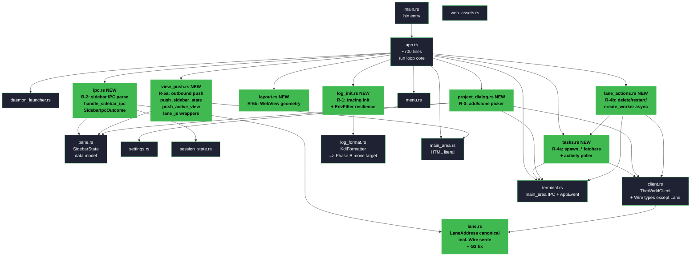
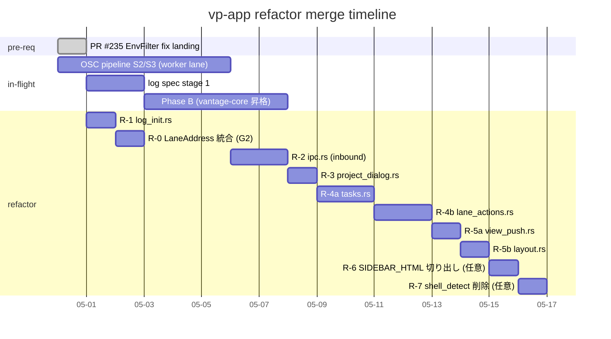

# 11: vp-app holistic architecture refactor — purple-haze proposal (2026-05-01)

> **Status**: design draft (8 必須 + 2 任意 PR roadmap、 R-1 着手 ready は PR #235 main landing 後)
> **Author**: team-bucciarati::purple-haze (research-only agent、 1200 行 raw 提案)
> **Synthesis memory**: creo `mem_1CaaaDoXHZvhR46ZfLN6jx` (圧縮版 v2 plan、 意思決定 sheet)
> **Trigger**: PR #235 review で user が「app.rs 3126 行は重い、 整理した方が良い」 と発言 → main の 5 段 plan (`mem_1CaaYnQDGoYeckjX2TDCnd` v1) を叩き台として holistic 再設計
> **Position**: main 5 段 plan を **「採用 + 修正 + 拡張」**。 5 段は局所的に正しいが、 vantage-core 未着手 / Requiem 進行 / 内部 boundary 不揃い という 3 つの「より深い亀裂」 を見落としている。 本 proposal はそれを縫合する。
> **Implementation freeze**: 本 proposal の reference 実装は **着手しない**。 user の review + main の判断を待つ。

---

## 0. Status & relation to main proposal

### 0.1 main 5 段 plan の評価

| 観点 | 評価 |
|------|------|
| **方向性** | ◎ 採用 — `app.rs` を行数だけで切るのではなく **既存 sibling module の慣例 (pane.rs / terminal.rs / lane.rs / log_format.rs)** に倣って **責務別に追加 module** を増やす方針は正しい (`mem_1CaaYnQDGoYeckjX2TDCnd` § 「既存構造に空き枠」)。 |
| **粒度** | ○ 修正 — R-1〜R-5 の 5 段は **vp-app crate 内部に閉じている** が、 (a) `vantage-core` crate が未存在で Phase B (`mem_1CaSiJkD9HATDY2srrv6D4`) と sequencing conflict、(b) `lane_address_key` 等の境界 type は `lane.rs` ともダブり、(c) `lane_js` inline module は実は `pane.rs` ではなく `main_area.rs` 系列に属する。 5 段の「pane.rs 拡張 (R-5)」 は誤射の risk。 |
| **R-1 を最初に** | ◎ 採用 — 「最小・自己完結・直近で触った context あり」 の 3 拍子で連鎖の skeleton として最適。 ただし `vantage-core` 昇格を見据えて **vp-app 内 file 名を `logging.rs` ではなく `log_init.rs`** にする等、 後の cross-crate move を見越す改名を勧める (§ 3.1)。 |
| **R-2 IPC dispatcher** | △ 大きく修正 — `handle_sidebar_ipc` (210 行) + `lane_js` mod (37 行) + `terminal::handle_ipc_message` (vp-app/terminal.rs 既存) + sidebar 経路の async kicker 群 (delete_lane / restart_lane / add_worker / restart_process) + `MenuClicked` handler が**全部「IPC でくる JSON を resolve して何かに dispatch する」 という同一責務**。 R-2 の scope を 「sidebar IPC dispatcher」 に絞ると、 後続で **既存 terminal.rs と新 ipc.rs の責務重複**が発生する。 §3.2 で再設計。 |
| **R-3 project_dialog.rs** | ◎ 採用 — `spawn_add_project_picker` / `spawn_clone_project` / `spawn_clone_path_picker` / `derive_repo_name` は責務 1 文 (「project の新規追加 dialog」) で言える、 切り出し後も自己完結。 main 案そのまま採用。 |
| **R-4 activity.rs** | ○ 修正 — `spawn_processes_fetch` / `spawn_lanes_fetch` / `spawn_sp_start` / `spawn_activity_poller` / `collect_activity` は **「TheWorld / SP に async で問い合わせて AppEvent を proxy に流す」** という同一責務 + **TheWorldClient の wrapper 性が極めて強い**。 これらは `client.rs` の隣に置く方が `client.rs::TheWorldClient` 単独で見えていた I/O 表面が広がって良い。 file 名は `activity.rs` よりも `tasks.rs` または `client_tasks.rs` の方が責務を語る。 §3.4 で説明。 |
| **R-5 pane/view helpers** | × 却下 — `update_pane_bounds` / `push_active_view` / `push_sidebar_state` / `lane_address_key` は **責務がバラバラ**。 (a) `update_pane_bounds` = WebView geometry layout、(b) `push_active_view` / `push_sidebar_state` = IPC outbound (Rust → JS 方向)、(c) `lane_address_key` = lane.rs の Display impl と二重実装。 これは 1 module に纏めるべきではない。 §3.5 で 3 つに分解。 |

### 0.2 main 5 段が見落としている 3 つの「亀裂」

| # | 亀裂 | 影響 |
|---|------|-----|
| **G1** | `vantage-core` crate が **未存在** (`crates/` 下に居ない、 `mem_1CaSiJkD9HATDY2srrv6D4` の Phase A.5 で「新規」 と明記)。 main 5 段は vp-app 内に閉じるので問題ないが、 `log_format.rs` (197 行) は **既に Phase B の昇格対象**。 R-1 で `log_format.rs` の隣に `log_init.rs` を作ると、 Phase B で両方を `vantage-core` に move する作業が出る。 sequencing 設計が要る。 |
| **G2** | `vp-app::lane.rs` (143 行) の `LaneAddress` Display impl と `app.rs::lane_address_key` (関数) が **同じ文字列形式 (`<project>/lead`)** を独立に実装している。 lane.rs の Display impl は `LaneAddressWire` (= `client::LaneAddressWire`、 wire 型) ではなく **vp-app local 型 `LaneAddress`** に対する Display。 つまり vp-app には **同じ意味を持つ型が 2 つある** (`crate::lane::LaneAddress` と `crate::client::LaneAddressWire`)。 これは「客観 model = 1 つ」 の原則に反し、 refactor 中に `lane_address_key` を 2 度書き直す事故が起きる。 |
| **G3** | `vantage-point` crate (76,000+ 行、 capability / process / mcp / agent / tui 含む) と `vp-app` crate (6,344 行、 GUI native shell) は **共有型を持っていない**。 `LaneAddressWire` は vp-app 側、 一方 vantage-point 側には `lanes_state::LaneAddress` が居る。 wire format が両 crate で独立進化すると incompatible になる risk が高まる (G3 は VP-77 Lane-as-Process 進行で増幅する: lane addressing が Lead Autonomy / Mortality 仕様と紐づく)。 |

### 0.3 本 proposal の position

```
main 5 段 plan (mem_1CaaYnQDGoYeckjX2TDCnd)
   ↓
   ├── R-1 採用 (file 名のみ調整)
   ├── R-2 修正 (scope を sidebar dispatcher に厳密化、 outbound push と分離)
   ├── R-3 採用 (そのまま)
   ├── R-4 修正 (活 file 名を tasks.rs に + activity polling は世代別 module 化)
   ├── R-5 却下 (3 module に分解: layout.rs / view_push.rs / lane.rs 統合)
   └── + R-0 新設 (G2 解消: client::LaneAddressWire と lane.rs::LaneAddress を統合)
   └── + R-6 新設 (G3 への先行布石: 将来 vantage-core に move する型を vp-app 内 prelude module で囲っておく)
```

= **6 段 + R-0 (= 計 7 PR、 任意 R-6/R-7 含めて 8-10 PR)** に再構成。

---

## 1. 現状 audit

### 1.1 vp-app crate file 構造 (full)

| file | 行数 | 責務 1 文 | 重複・薄い依存 |
|------|------|----------|---------------|
| `app.rs` | **3126** | EventLoop + 起動 + sidebar HTML inline + IPC dispatcher + project dialog + activity polling + pane bounds + lane_js inline mod + IPC outbound push + menu handler の **mega-bag** | (mega-bag、 § 1.1.1) |
| `main_area.rs` | 937 | Main area (xterm.js + canvas placeholder + preview iframe) の **HTML literal + 80 行の Rust glue** | (大半 inline JS literal、 logical には 80 行 Rust + 850 行 frontend) |
| `client.rs` | 415 | TheWorld / SP HTTP client (`TheWorldClient` + Wire types `ProcessInfo` / `LaneInfo` / `LaneAddressWire` / `WorkerStatus` etc.) | `LaneAddressWire` ≈ `lane.rs::LaneAddress` で **G2 重複** |
| `web_assets.rs` | 315 | bundled font / asset の `vp-asset://` 配信 | 独立、 重複なし |
| `session_state.rs` | 200 | session 永続化 JSON (expanded / active_lane / currents_order) | 独立、 重複なし |
| `log_format.rs` | 197 | KdlFormatter (`tracing_subscriber::FormatEvent` 実装) | **Phase B で `vantage-core` に昇格予定** |
| `terminal.rs` | 178 | main_area webview からの IPC handler + `AppEvent` enum | `AppEvent` の owner、 ipc handler 表面が limited |
| `pane.rs` | 178 | sidebar **state model** (data only) | 純粋 |
| `lane.rs` | 143 | local `LaneAddress` / `LaneKind` / `LaneStand` enum + Display impl | **G2: client::LaneAddressWire と意味重複** |
| `menu.rs` | 138 | muda menu bar 構築 | 独立、 builder 純粋 |
| `daemon_launcher.rs` | 162 | TheWorld daemon の auto-launch | 独立、 platform-aware |
| `shell_detect.rs` | 178 | OS 別 shell 検出 | **app.rs から呼ばれていない** (PTY 路撤去で usage 喪失、 dead code 候補) |
| `settings.rs` | 119 | TOML user settings | 独立、 IO だけ |
| `lib.rs` | 26 | mod 列挙のみ | — |
| `tray.rs` | 27 | tray-icon dummy (placeholder) | placeholder、 ほぼ責務なし |
| `main.rs` | 19 | bin entry point | — |

#### 1.1.1 app.rs 内部の **logical 区画** (3126 行を責務別に切り分けると)

| 区画 | 行範囲 | 行数 | 責務 |
|------|--------|------|------|
| **A: imports / SIDEBAR_HTML literal + JS literal** | 1-1180 | ~1180 | sidebar の `<style>` + `<script>` (TypeScript-like vanilla JS) を **Rust 文字列 concat** で構築 |
| **B: layout helpers** | 1182-1206 | ~25 | `update_pane_bounds` (WebView geometry) |
| **C: project dialog spawn** | 1208-1448 | ~240 | `resolve_default_project_root` / `spawn_add_project_picker` / `spawn_clone_project` / `spawn_clone_path_picker` / `derive_repo_name` |
| **D: menu pump / async fetchers** | 1450-1693 | ~243 | `spawn_menu_event_pump` / `spawn_processes_fetch` / `spawn_lanes_fetch` / `spawn_sp_start` |
| **E: lane_js inline mod** | 1597-1633 | ~37 | `ensure_lane` / `show_lane` / `remove_lane` (JS evaluate_script wrapper) |
| **F: activity poller + collector** | 1696-1798 | ~103 | `spawn_activity_poller` / `collect_activity` |
| **G: outbound push** | 1809-1848 | ~40 | `push_active_view` / `push_sidebar_state` |
| **H: SidebarIpcOutcome + handle_sidebar_ipc** | 1850-2096 | ~247 | sidebar IPC JSON parse + state mutate + caller への out command 構築 + `lane_address_key` |
| **I: pub fn run() event loop** | 2099-3044 | ~946 | tracing init + Settings load + window 構築 + EventLoop run + 全 AppEvent handler match arm + MenuClicked handler |
| **J: tests** | 3046-3126 | ~80 | sidebar HTML size / artifact / lookup test |

= 10 区画。

### 1.2 vantage-point crate との境界

vp-app と vantage-point は **HTTP API の境界で強く分離** されている:

```
vp-app (GUI client)                            vantage-point (server / daemon)
┌───────────────────┐                          ┌────────────────────────┐
│ TheWorldClient    │ ── HTTP /api/health      │ TheWorld daemon (32000)│
│ TheWorldClient    │ ── HTTP /api/world/*     │   ProcessManagerCap.   │
│ TheWorldClient    │ ── HTTP /api/lanes       │ SP servers (33000+)    │
│ ws (browser)      │ ── /ws/terminal?lane=    │   PtyManager / lanes_  │
│                   │                            │   state                │
│ ProcessInfo Wire  │ ◀═══════ JSON ═══════════│ daemon::server.rs       │
│ LaneInfo Wire     │ ◀═══════ JSON ═══════════│ process::routes::lanes  │
│ LaneAddressWire   │ ◀═══════ JSON ═══════════│ lanes_state::LaneAddress│
└───────────────────┘                          └────────────────────────┘
```

#### 共有されるべきだが共有されていない型 (G3 の core)

| concept | vp-app 側 | vantage-point 側 | 不整合 risk |
|---------|----------|------------------|-------------|
| **LaneAddress** | `client::LaneAddressWire` (serde Deserialize、 fields: project, kind, name) + `lane::LaneAddress` (enum-based、 Display impl) | `process::lanes_state::LaneAddress` (serde + KDL?) | 3 つの型が同じ意味を持つ。 lane spec が VP-77 で進化すると 3 箇所に同じ change が要る |
| **LaneKind** | `lane::LaneKind` enum (Lead/Worker、 Display) | `lanes_state::LaneKind`? | 推定 — 同種の重複が起きうる |
| **ProcessKind / ProcessState** | `client::ProcessKind` / `client::ProcessState` (Wire) | `capability::process_manager_capability` 内? | wire と server-side の二重実装 |
| **OSC notification payload** | `terminal::AppEvent::OscNotification { lane, code }` (sparse) | `process::routes::*` の OSC schema? | S2/S3 が main 着地後に重複が顕在化する |

#### 既に共有されている型

- なし。 `vp-app` の `Cargo.toml` を見ると `vantage-point` への path 依存は **無い** (CLI binary の `vp-cli` が `vantage-point` に依存、 `vp-app` は HTTP wire 越しに独立)。
- これは **意図された設計** (vp-app が daemon と process boundary で完全分離されることで GUI が daemon に寄生せず単独 build 可能) だが、 G3 の代償として **wire schema の共有手段が無い**。

### 1.3 design history との整合 (= conflict / gap)

#### 1.3.1 既出 architectural memory との照合

| memory | conflict / alignment with main 5 段 |
|--------|-----------------------------------|
| `mem_1CaSiJkD9HATDY2srrv6D4` (VP Observability Stack 2026-04-27) | **alignment 中、 conflict 1 件**: Phase B で `KdlFormatter` (= 現 `log_format.rs`) を `vantage-core` crate に昇格。 main 5 段の R-1 は `log_format.rs` の **隣** に `logging.rs` (filter init + appender) を置く提案だが、 Phase B 着手時には R-1 産出物も一緒に move する作業が出る。 = **R-1 と Phase B の sequencing 整合が必須**。 |
| `mem_1CaaLAtsYRhWgpPhnrvaVd` (log viewer execution snapshot 2026-05-01) | **alignment 強**: stage 1 (KDL log spec design) + stage 2 (Phase B 本体) が in-flight。 5 段 plan は in-flight work と独立に進められる。 |
| `mem_1CaTpCQH8iLJ2PasRcPjHv` (Architecture v4: SP `/api/lanes` SSOT) | alignment、 conflict なし。 |
| `mem_1CaSugEk1W2vr5TAdfDn5D` (4 scope architecture: App/Project/Lane/Pane) | **gap**: 4 scope のうち vp-app 内 module 構造に App / Project / Lane / Pane の対応が 1 対 1 で現れていない。 R-2 / R-5 がここを「整える」 余地がある。 |
| VP-77 Lane-as-Process | gap、 ただし spec draft 中。 R-0 (= LaneAddress 統合) は VP-77 が進む時に同じ module を再 touch するので **早めに統合しておく方が良い**。 |
| Requiem R0 (PR #167) | alignment、 conflict なし。 |

#### 1.3.2 design doc との照合

- `docs/design/09-osc-notification-capture.md` (PR #232 で merge): S2/S3 で sidebar に `notifications_by_lane` field 追加 + Lane row tint UI 追加が進行中。 これは **R-2 の sidebar IPC dispatcher と直接 collision**: sequencing 注意。
- `docs/design/06-creoui-draft.md` / `07-lane-as-process.md`: 中長期で vp-app 側に `Event` consumer 追加が要る予定。 R-2 の dispatcher を切り出しておくと、 後で `event_dispatcher.rs` を 1 module 追加するだけで済む。
- `docs/design/04-ccwire-redesign.md` / `03-mailbox-vs-ccwire.md`: vp-app 内の ccwire usage は薄い、 conflict なし。

### 1.4 in-flight worker lane / open PR との衝突

| 進行中 | refactor との衝突点 |
|-------|------------------|
| **OSC pipeline S2 (`vantage-point-vp-osc-pipeline` worker lane)** | R-2 で sidebar IPC dispatcher を切り出すと、 S2 の `lane:notify` handler add がどちらのファイルに居るべきか曖昧化。 → **R-2 着手 PR をマージ後に S2 を rebase** または逆順 (S2 を先に main へ → R-2 をその上に切り出し) で sequencing 必須。 |
| **PR #167 Requiem R0 / PR #168 Lane-as-Process** | review 待ち、 vp-app 内構造には触らない。 conflict なし。 |
| **Phase B / log spec stage 1** | R-1 と密接、 同時 in-flight ならどちらかを wait。 |

---

## 2. Target architecture

### 2.1 module dependency graph



### 2.2 各 module の責務 1 文 + 主要 symbol

#### 既存 (Mostly unchanged)

| file | 責務 1 文 | 主要 symbol |
|------|----------|-----------|
| `pane.rs` | sidebar の **state model** (data only、 mutation logic を持たない) | `SidebarState`, `ProcessPaneState`, `WidgetKind`, `ActiveStand`, `ActivitySnapshot` |
| `client.rs` | TheWorld / SP HTTP client + その wire types | `TheWorldClient`, `ProcessInfo`, `LaneInfo`, `WorkerStatus`, `ProcessKind`, `ProcessState` (但 `LaneAddressWire` は lane.rs に移管) |
| `terminal.rs` | main_area webview からの IPC parse + `AppEvent` enum **owner** | `AppEvent`, `handle_ipc_message` |
| `main_area.rs` | main area の HTML literal + `ActivePaneInfo` / `SlotRect` Rust glue | `MAIN_AREA_HTML`, `ActivePaneInfo`, `SlotRect`, `build_set_active_pane_script` |
| `web_assets.rs` | bundled font + asset の `vp-asset://` 配信 (handler) | `serve`, `lookup_asset`, FONT_ASSETS |
| `session_state.rs` | session JSON 永続化 | `SessionState`, `ProjectUiState` |
| `settings.rs` | TOML user prefs | `Settings` |
| `daemon_launcher.rs` | TheWorld daemon の auto-launch | `ensure_daemon_ready`, `locate_vp_binary` |
| `menu.rs` | muda menu bar builder | `MenuHandles`, `MenuIds`, `build_menu_bar` |
| `log_format.rs` | **KdlFormatter** (Phase B で `vantage-core` 昇格対象) | `KdlFormatter`, `kdl_string` |

#### 新規 (added by this proposal)

| file | 責務 1 文 | 主要 symbol | 出元 |
|------|----------|-----------|------|
| `log_init.rs` | tracing-subscriber の wiring (filter resilience + appender + KdlFormatter inject) | `init_tracing() -> log_dir: PathBuf` | app.rs § I 区画 |
| `ipc.rs` | **sidebar webview から来た IPC JSON** を parse して SidebarState を mutate + caller への async kicker 要求を返す | `handle_sidebar_ipc`, `SidebarIpcOutcome` | app.rs § H 区画 |
| `view_push.rs` | **Rust から JS への outbound push** | `push_sidebar_state`, `push_active_view`, `ensure_lane`, `show_lane`, `remove_lane` | app.rs § E + § G |
| `layout.rs` | **WebView geometry** (sidebar / main bounds 計算) | `update_pane_bounds`, `SIDEBAR_WIDTH` const | app.rs § B |
| `project_dialog.rs` | project の **新規追加 / Clone** dialog | `spawn_add_project_picker`, `spawn_clone_project`, `spawn_clone_path_picker`, `derive_repo_name`, `resolve_default_project_root` | app.rs § C |
| `tasks.rs` | TheWorld / SP への **async fetch + activity polling** | `spawn_processes_fetch`, `spawn_lanes_fetch`, `spawn_activity_poller`, `collect_activity`, `spawn_menu_event_pump` | app.rs § D + § F |
| `lane_actions.rs` | **Lane の lifecycle action** (delete / restart / create_worker / restart_process) を SP port 解決 + async fire | `spawn_delete_lane`, `spawn_restart_lane`, `spawn_create_worker`, `spawn_restart_process`, `spawn_sp_start` | app.rs § I event loop の SidebarIpc handler 内 |

#### 既存変更 (G2 解消、 R-0)

| file | 変更内容 |
|------|----------|
| `lane.rs` | `LaneAddressWire` を **client.rs から移管**、 既存 `LaneAddress` enum と統合。 `From<LaneAddressWire> for LaneAddress` + `Display impl` + `address_key()` を 1 箇所に集約。 `app.rs::lane_address_key` を削除。 |
| `client.rs` | `LaneAddressWire` の definition を `lane.rs` から re-export または import に置換。 |

### 2.3 既存 module との関係 (拡張 / 統合 / 廃止)

| 既存 module | 新 module との関係 |
|------------|------------------|
| `pane.rs` | **拡張なし** — `pane.rs` を mutator helper の置き場にするのは Single Responsibility 違反、 pane.rs は data only で残す |
| `terminal.rs` | **不変** (AppEvent enum は terminal owner のまま)。 ただし `AppEvent::WorkerCreateResult` 等 sidebar 由来 event の owner が terminal.rs なのは奇妙 — § 4 trade-off で議論 |
| `lane.rs` | **拡張** — Wire 型 (Wire serde) を統合、 G2 解消 |
| `shell_detect.rs` | **dead code 削除候補** — Phase 2.x-d で PTY 路撤去の際に caller が消えた |
| `tray.rs` | **不変** (placeholder) |
| `lib.rs` | mod 列挙 + 新 module を append |

### 2.4 新 crate (vantage-core 等) の必要性 + scope

#### 短期 (本 refactor 範囲): **不要**

main 5 段 plan は vp-app 内の整理に閉じる。 本 proposal もそれを継承し、 `vantage-core` crate は **作らない**。 ただし R-1 で `log_init.rs` を作る時に **「将来 Phase B で vantage-core に move する」 ことを前提に command-line surface を vp-app 固有 prefix にしない** よう注意。

#### 中期 (Phase B 着手時): **必要**

`mem_1CaSiJkD9HATDY2srrv6D4` Phase B で `vantage-core` crate を新設し:

```
crates/
  vantage-core/             ← NEW
    src/
      lib.rs
      log_format.rs         ← vp-app から move
      log_init.rs           ← vp-app から move (本 proposal の R-1 産出物)
      lane_address.rs       ← vp-app::lane.rs を export (G2 を crate boundary 越えで解消)
      process_state.rs      ← vp-app::client::{ProcessKind, ProcessState} を export
      kdl_log_spec.rs       ← log spec (stage 1)
```

これは **本 proposal scope 外** だが、 R-1 / R-0 (LaneAddress 統合) は **将来の vantage-core 昇格を見据えた配置** にしておく。

#### 長期 (G3 解消): **vantage-wire crate 検討**

VP-77 Lane-as-Process / Requiem R0 が固まった後、 daemon ↔ vp-app の wire schema を別 crate (`vantage-wire`) に切り出すと Wire compatibility が schema-driven で保証できる。 これは **本 proposal scope 外**。

---

## 3. Refactor roadmap (再 plan)

### 3.0 main 5 段との対応表

| main # | 採否 | 本 proposal での扱い | 主な修正 |
|-------|------|---------------------|----------|
| R-1 | 採用 (修正小) | R-1 (§3.1) | file 名 `logging.rs` → `log_init.rs` |
| R-2 | 採用 (scope 厳密化) | R-2 (§3.2) | scope を **inbound IPC parse のみ** に絞る、 outbound push は R-5a に |
| R-3 | 採用 | R-3 (§3.3) | そのまま |
| R-4 | 採用 (修正中) | R-4a (§3.4a) + R-4b (§3.4b) に分割 | activity polling は `tasks.rs`、 Lane lifecycle action は `lane_actions.rs` に **別 module** |
| R-5 | **却下 + 3 分解** | R-5a / R-5b (§3.5) | view_push (outbound IPC) と layout (geometry) を別 module、 `lane_address_key` は R-0 で吸収 |
| — | NEW | R-0 (§3.0a) | LaneAddressWire 統合 (G2) |
| — | NEW (任意) | R-6 / R-7 (§3.6 / §3.7) | SIDEBAR_HTML 切り出し / dead code 削除 |

### 3.0a R-0: LaneAddress 統合 (G2 解消、 NEW)

**目的**: `lane.rs::LaneAddress` + `client.rs::LaneAddressWire` + `app.rs::lane_address_key` の 3 重実装を 1 箇所に統合。

**切り出し対象**:

```rust
// 移動前: client.rs にある
pub struct LaneAddressWire { pub project: String, pub kind: String, pub name: Option<String> }

// 移動先: lane.rs に統合
impl From<&LaneAddressWire> for LaneAddress { ... }
impl LaneAddress {
    /// Display 形 (`<project>/lead` / `<project>/worker/<name>`)
    /// app.rs::lane_address_key を吸収。
    pub fn key(&self) -> String { format!("{}", self) }
}
```

**risk**: serde wire format が変わらないことを確認する snapshot test が必要。

**Before / After 行数概算**: client.rs -10, lane.rs +30, app.rs -20

### 3.1 R-1: tracing init 切り出し

**file**: `crates/vp-app/src/log_init.rs` (NEW、 ~85 行)

**切り出し対象**: `app.rs` l2099-2177 (= `pub fn run()` の冒頭 79 行)

**signature**:

```rust
pub struct LogInitResult {
    pub log_dir: PathBuf,
}

pub fn init_tracing() -> LogInitResult {
    // PR #235 の EnvFilter resilience を含む既存ロジックをそのまま move
    ...
}
```

**Phase B sequencing**: file 名を `logging.rs` にすると Phase B で `vantage-core::logging::*` と長くなる、 `log_init.rs` のままなら `vantage-core::log_init::init_tracing(...)` でわかりやすい。

### 3.2 R-2: sidebar IPC dispatcher 切り出し (scope 厳密化)

**file**: `crates/vp-app/src/ipc.rs` (NEW、 ~250 行)

**切り出し対象** (app.rs § H、 l1850-2096):
- `SidebarIpcOutcome` struct
- `handle_sidebar_ipc(msg, state, session) -> SidebarIpcOutcome`
- + `process:add` / `process:clone` / `project:clone:pickFolder` 早期分岐

**重要: scope は inbound parse のみ**:
- ✗ outbound (Rust → JS の `evaluate_script`) は **含まない** (= R-5a の view_push.rs)
- ✗ async kicker (`thread::spawn`) は **含まない** (= R-4b の lane_actions.rs)
- ✓ JSON parse + state mutation + Outcome 構築のみ

**signature**:

```rust
pub struct SidebarIpcOutcome {
    pub changed: bool,
    pub active_changed: bool,
    pub sp_spawn_request: Option<(String, String)>,
    pub add_worker_request: Option<(String, String, Option<String>)>,
    pub delete_lane_request: Option<(String, String)>,
    pub restart_lane_request: Option<(String, String)>,
    pub restart_process_request: Option<String>,
    pub sp_spawn_release: Option<String>,
    pub dialog_request: Option<DialogRequest>,
}

pub enum DialogRequest {
    AddProject,
    Clone { url: String, target_override: Option<PathBuf> },
    PickClonePath,
}

pub fn handle_sidebar_ipc(
    msg: &str,
    state: &mut SidebarState,
    session: &mut SessionState,
) -> SidebarIpcOutcome { ... }
```

= app.rs の 1 match arm が ~250 行から ~25 行に削減。

### 3.3 R-3: project dialog 切り出し

**file**: `crates/vp-app/src/project_dialog.rs` (NEW、 ~250-280 行)

**切り出し対象** (app.rs § C):
- `resolve_default_project_root` / `spawn_add_project_picker` / `spawn_clone_project` / `spawn_clone_path_picker` / `derive_repo_name`

**signature 追加**:

```rust
pub fn dispatch(
    req: DialogRequest,
    proxy: EventLoopProxy<AppEvent>,
    settings: &Settings,
    sidebar_state: &SidebarState,
) {
    match req {
        DialogRequest::AddProject => { ... }
        DialogRequest::Clone { url, target_override } => { ... }
        DialogRequest::PickClonePath => { ... }
    }
}
```

### 3.4 R-4: async tasks 切り出し (2 module 分割)

| 区別 | polling fetch | lifecycle action |
|------|--------------|----------------|
| **trigger** | timer / 起動 | user 操作 (sidebar click) |
| **頻度** | 5s 周期 | 散発 |
| **失敗の扱い** | silent retry next tick | sidebar 上 inline error |
| **fire-and-forget** | yes (silent) | no (proxy で結果通知) |

これらを 1 module にするのは Single Responsibility 違反。 2 module に分割する。

#### 3.4a R-4a: tasks.rs (polling fetch)

**file**: `crates/vp-app/src/tasks.rs` (NEW、 ~250 行)

**切り出し対象** (app.rs § D + § F):
- `spawn_menu_event_pump` / `spawn_processes_fetch` / `spawn_lanes_fetch` / `spawn_activity_poller` / `collect_activity`

#### 3.4b R-4b: lane_actions.rs (Lane lifecycle action)

**file**: `crates/vp-app/src/lane_actions.rs` (NEW、 ~280 行)

**切り出し対象** (app.rs § I event loop の SidebarIpc handler 内 thread::spawn block):
- `spawn_sp_start` / restart_process / delete_lane / restart_lane / create_worker_lane

これらは全て同じ pattern の boilerplate。 切り出し時に共通 helper:

```rust
fn spawn_async_action<F, Fut>(name: &str, f: F)
where
    F: FnOnce() -> Fut + Send + 'static,
    Fut: Future<Output = ()> + 'static,
{
    thread::Builder::new().name(name.into()).spawn(move || {
        let rt = tokio::runtime::Builder::new_current_thread().enable_all().build()?;
        rt.block_on(f());
    }).ok();
}

pub fn spawn_delete_lane(proxy: EventLoopProxy<AppEvent>, project_path: String, address: String, port: u16) {
    spawn_async_action(&format!("delete-lane-{}", address), move || async move {
        let client = TheWorldClient::new(port);
        match client.delete_lane(&address).await {
            Ok(()) => { tasks::spawn_lanes_fetch(proxy, project_path, port); }
            Err(e) => tracing::warn!("delete_lane failed: {}", e),
        }
    });
}
```

= **重複 boilerplate ~150 行を 50 行に圧縮**。 純機械的 refactor で behavior 変更なし。

### 3.5 R-5: pane/view helpers の **3 分解**

main 案 R-5 「pane.rs 拡張で 100 行」 は責務が混在 — 以下に **3 分解**:

#### 3.5a R-5a: view_push.rs (outbound IPC)

**file**: `crates/vp-app/src/view_push.rs` (NEW、 ~80 行)

**切り出し対象**:
- `push_sidebar_state` / `push_active_view`
- `lane_js` mod 全体: `ensure_lane` / `show_lane` / `remove_lane`

| inbound (R-2 ipc.rs) | outbound (R-5a view_push.rs) |
|---------------------|----------------------------|
| `lane:select` parse | `push_active_view` + `show_lane` |
| `process:toggle` | `push_sidebar_state` |
| `LanesLoaded` AppEvent | `ensure_lane` (per-Lane) + `show_lane` |
| `osc:notification` | `push_sidebar_state` (with unread count) |

#### 3.5b R-5b: layout.rs (WebView geometry)

**file**: `crates/vp-app/src/layout.rs` (NEW、 ~40 行)

**切り出し対象**:
- `update_pane_bounds` / `SIDEBAR_WIDTH` const

#### 3.5c R-5c: (R-0 と統合) lane_address_key 削除

`app.rs::lane_address_key` は R-0 で `lane::LaneAddress::key()` に吸収済み、 R-5 では何もしない。

### 3.6 R-6 (任意): SIDEBAR_HTML 切り出し

**file**: `crates/vp-app/assets/sidebar.html` (NEW、 1180 行) + `crates/vp-app/src/sidebar_html.rs` (NEW、 ~10 行 = `include_str!` wrapper)

**狙い**:
- IDE syntax highlight が HTML / CSS / JS で効くようになる
- `app.rs` の主犯行数 (= 機械的な inline literal 1180 行) が消えて real Rust logic だけ残る

### 3.7 R-7 (任意): dead code / shell_detect.rs 削除

`crates/vp-app/src/shell_detect.rs` (178 行) は Phase 2.x-d で PTY 路撤去の際に caller が消えた候補。 grep で確認後、 caller が無ければ **削除**。

### 3.8 merge 順序のガイド



**重要 dependency**:
- R-1 は **PR #235 が main に landed** の後
- R-0 は **R-2 の前**
- R-2 は **OSC pipeline S2 が main に landed** の後
- R-4a → R-4b は dependency あり
- R-5a → R-5b は dependency なし (並列可)
- Phase B は R-1 の **後** に着手するのが自然

**total**: R-1〜R-5b で 約 11 working day。 R-6/R-7 込みで 13 day。

---

## 4. Trade-offs / risks

### 4.1 module 数 vs 行数 vs 認知コスト の balance

#### 現状
```
vp-app/src/   17 files, 6344 lines
  app.rs:     3126 lines (49% of total)
  others:     median 178 lines each
```
→ 1 mega + 16 mini という **unbalanced** 構造。

#### 本 proposal 適用後
```
vp-app/src/   24 files, 6344 lines (差分 ±5%)
  app.rs:     ~700 lines
  others:     median ~120-200 lines each
```
→ 1 medium (app.rs 700 行) + 23 small という **balanced** 構造。 全 file が「責務 1 文で言える」 状態。

### 4.2 Phase B / log spec stage 1 との sequencing risk

| scenario | 影響 |
|---------|------|
| **R-1 を Phase B 前に着手** | R-1 の log_init.rs を後で vantage-core に move する追加 PR が必要。 ただし内部 api signature が安定していれば mechanical move なので低 cost。 |
| **R-1 を Phase B 後に着手** | R-1 が薄 wrapper になり意味が薄れる。 |
| **R-1 と Phase B 並列** | conflict 必至、 やめるべき。 |

→ **推奨**: R-1 を **Phase B 前** に切る。

### 4.3 OSC pipeline S2 と R-2 の sequencing risk

S2 worker lane が main に landed する前に R-2 を着手すると、 worker は **両方の change set を再構成** する必要が出る。

**推奨**: S2 を main に先に landed させてから R-2 を切る。

### 4.4 G2 解消 (R-0) の wire compatibility risk

`LaneAddressWire` を `lane.rs` に move する時、 serde Deserialize の field 名 / serde tag が変わると **TheWorld からの JSON parse が壊れる**。

**保険**: snapshot test を導入。

### 4.5 review コスト分散

| PR | 行数差分目安 (削除/追加) | review 時間目安 |
|----|----------------------|---------------|
| R-1 | -85 / +85 (move) | 15min |
| R-0 | +30 / -20 (内部統合) | 25min |
| R-2 | -250 / +260 | 45min |
| R-3 | -240 / +250 | 25min |
| R-4a | -250 / +260 | 30min |
| R-4b | -180 / +280 (boilerplate 圧縮込み) | 35min |
| R-5a | -80 / +85 | 15min |
| R-5b | -25 / +40 | 10min |

= 合計 **3 時間程度の review 工数** を 8 PR に分散。

---

## 5. Open questions (user / main 確認したい)

着手前に判断したい点を 7 件、 重要度順:

### Q1. R-2 と OSC pipeline S2 の sequencing

**purple-haze 推奨**: **S2 先 → R-2 後**。

### Q2. R-0 (LaneAddressWire 統合) の着手時期

選択肢: (a) R-1 直後の独立 PR / (b) R-2 と同 PR / (c) R-2 後

**purple-haze 推奨**: **(a)**。

### Q3. file 名 命名規則

| 候補 | pros | cons |
|------|------|------|
| flat (`logging.rs`, `ipc.rs`, ...) | 既存 vp-app 慣例に合致、 import 文短い | 関連 file の grouping が無く file tree で散らばる |
| sub-module (`app/logging.rs`, ...) | 「app の sub-component」 と semantic に表現 | 既存 sibling との不整合、 mod tree が深くなる |

**purple-haze 推奨**: **flat** (既存 vp-app crate は flat 慣例)。

### Q4. AppEvent enum の owner

選択肢: (a) terminal.rs に残す / (b) `events.rs` に rename + 移動 / (c) AppEvent を `app.rs` に戻す

**purple-haze 推奨**: **(b) 但し別 PR** (本 refactor scope 外、 follow-up)。

### Q5. lane_actions.rs の helper 抽出粒度

選択肢: (a) helper 抽出 / (b) mechanical copy

**purple-haze 推奨**: **(a)**、 ただし closure の lifetime / Send bound でハマる risk あるので「最初は (b)、 follow-up で (a)」 の 2 段でもよい。

### Q6. R-6 (SIDEBAR_HTML 切り出し) の優先度

選択肢: (a) R-5b 後 / (b) Phase B 後 / (c) やらない

**purple-haze 推奨**: **(b)** (creo-ui packaging とセットで体系的に)。

### Q7. tracking 方法

**purple-haze 推奨**: **(b)+(c)** 本 proposal を 1 memory として保存 + 各 R-n は実装着手時に個別 Linear Issue を切る。

---

## 6. References

### 6.1 Memory IDs (creo-memories)

- `mem_1CaaYnQDGoYeckjX2TDCnd` — 本 proposal の起点となった main 5 段 plan v1 (2026-05-01、 supersede 済)
- `mem_1CaaaDoXHZvhR46ZfLN6jx` — 本 proposal の synthesis 圧縮版 v2 plan (2026-05-01、 v1 を supersede)
- `mem_1CaSiJkD9HATDY2srrv6D4` — VP Observability Stack 設計決定 (Phase A-D roadmap、 2026-04-27)
- `mem_1CaaLAtsYRhWgpPhnrvaVd` — VP log viewer execution snapshot (Phase B + C 着手準備、 2026-05-01)
- `mem_1CaTpCQH8iLJ2PasRcPjHv` — Architecture v4: SP /api/lanes SSOT
- `mem_1CaSugEk1W2vr5TAdfDn5D` — VP Architecture: 多 scope (App/Project/Lane/Pane)
- `mem_1CaSYWS4g1qrArR8KeWU5z` — VP 主軸 vp-app 化決定 (2026-04-26)
- `mem_1CYqyT6ZsXBLRzfo51sUg6` — Crate 分離決定 (2026-03-09)
- `mem_1CaGxnzEsjyyvnqaaVSFBH` — VP UI Design Discussion Final Summary (Requiem D-1〜D-12、 2026-04-21)
- `mem_1CaJSQuLM3t6vzAsEhJFfb` — VP MainWindow cockpit 完成形 milestone (2026-04-23)
- `mem_1CaKLm2YnpHvcqpGUZx8Ux` — VP Lane Registry 統合 Backbone 設計 (2026-04-23)

### 6.2 Source files (relative paths from repo root)

#### vp-app crate

- `crates/vp-app/Cargo.toml`
- `crates/vp-app/src/lib.rs`
- `crates/vp-app/src/main.rs`
- `crates/vp-app/src/app.rs` (3126 行、 主対象)
- `crates/vp-app/src/main_area.rs` (937 行)
- `crates/vp-app/src/client.rs` (415 行)
- `crates/vp-app/src/web_assets.rs` (315 行)
- `crates/vp-app/src/session_state.rs` (200 行)
- `crates/vp-app/src/log_format.rs` (197 行、 Phase B 移動候補)
- `crates/vp-app/src/terminal.rs` (178 行)
- `crates/vp-app/src/pane.rs` (178 行)
- `crates/vp-app/src/shell_detect.rs` (178 行、 dead code 候補)
- `crates/vp-app/src/daemon_launcher.rs` (162 行)
- `crates/vp-app/src/lane.rs` (143 行、 G2 統合先)
- `crates/vp-app/src/menu.rs` (138 行)
- `crates/vp-app/src/settings.rs` (119 行)
- `crates/vp-app/src/tray.rs` (27 行)

#### vantage-point crate (boundary observation のみ)

- `crates/vantage-point/Cargo.toml`
- `crates/vantage-point/src/lib.rs`
- `crates/vantage-point/src/cli.rs`
- `crates/vantage-point/src/process/lanes_state.rs` (526 行、 G3 wire boundary)
- `crates/vantage-point/src/process/routes/lanes.rs` (560 行)

### 6.3 design docs

- `docs/design/01-architecture.md`
- `docs/design/03-mailbox-vs-ccwire.md`
- `docs/design/04-ccwire-redesign.md`
- `docs/design/06-creoui-draft.md` (R0 Event schema)
- `docs/design/07-lane-as-process.md` (VP-77 v0.3)
- `docs/design/08-viewport-semantic-split.md`
- `docs/design/09-osc-notification-capture.md` (S2/S3 進行中、 R-2 と sequencing 関係)
- `docs/design/10-kdl-log-spec.md` (PR #234、 stage 1 deliverable)
- `docs/design/vp-app-hd-bridge.md`

### 6.4 Recent commits (architectural context)

- `802918e` — fix(vp-app): EnvFilter で vp_app target が silent 化する Phase 5-D 回帰を修正 (= PR #235、 R-1 の出元)
- `658be02` — chore(vp-app): OSC handler に structured key=value debug log を追加 (PR #233)
- `ff222ec` — docs(design): OSC notification capture pipeline (PR #232、 S2/S3 worker lane の親)
- `160b91e` — feat(vantage-point): SP startup を Mailbox actor 経由に置換 (PR #231、 I-b 2/3 + 3/3)
- `1298be5` — feat(vantage-point, Phase 6-E, VP-107): LaneStandSpec trait + shell-hosted Lane (PR #216)

### 6.5 in-flight (未着地、 sequencing 注意)

- OSC pipeline S2 (`vantage-point-vp-osc-pipeline` worker lane、 PR # 不明)
- log spec stage 1 (`docs/design/10-kdl-log-spec.md` PR #234 着地済)
- Phase B (KdlFormatter `vantage-core` 昇格)

---

## 7. Concrete next action (推奨)

1. **本 proposal を user / main で review** — Q1〜Q7 を順番に判断
2. **Q1 (S2 sequencing) を最初に決める** — これが R-2 着手 timing を決める
3. **R-1 着手** — PR #235 が main に landed 済 = 着手可能、 1 day で完了
4. **R-1 review feedback で Q3 (flat vs sub-module) 確定**
5. **R-0 着手 (Q2 で (a) 選択時) または R-2 と同 PR (Q2 で (b) 選択時)**
6. 残り R-3〜R-5b を merge 順序ガイド (§3.8) に従って順次

着手後の実装は **本 proposal の reference 実装ではなく**、 main session または別 worker lane で行う (purple-haze は調査・提案のみ)。

---

> **Closing note**: vp-app の app.rs 3126 行は **1 ファイルが大きすぎる** という表面の問題ではなく、 **「責務 (state model / IPC inbound / IPC outbound / async fetch / async action / WebView geometry / event loop) が単一 namespace で混在している」** という構造的問題。 main 5 段 plan は方向性正しく、 本 proposal はそれを **(1) 既存 sibling module との整合 + (2) Phase B / Requiem 進行との sequencing + (3) G1〜G3 の根の亀裂を縫合** で extend した。 採用 / 修正 / 却下の判断は user / main の文脈把握に委ねる。 — Purple Haze 🍇
