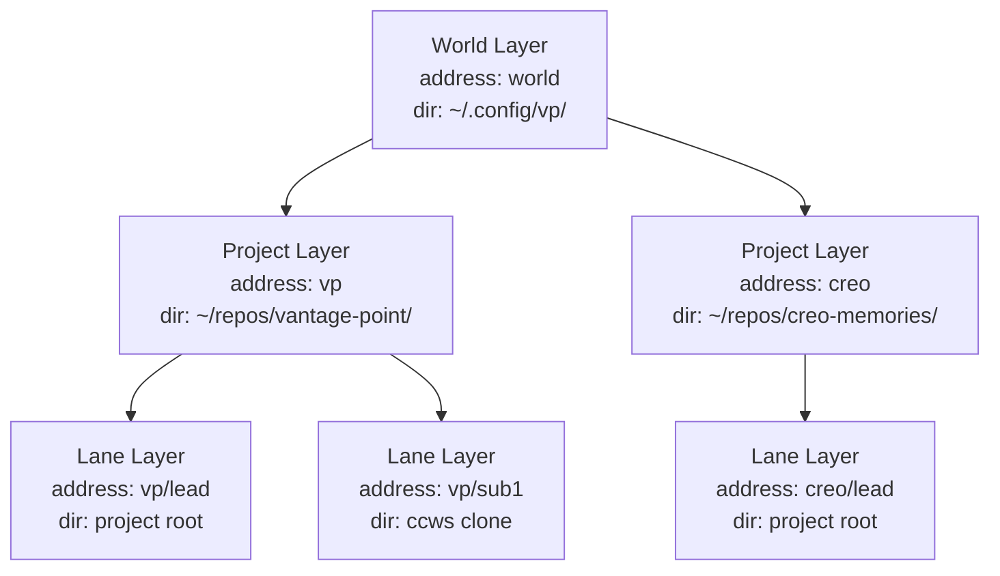
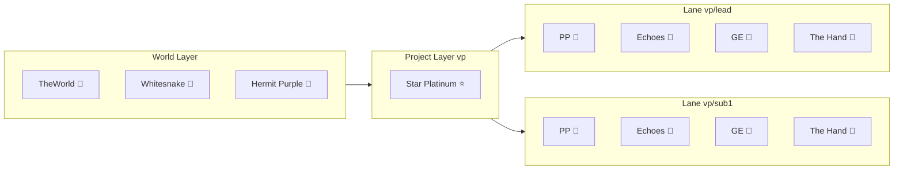

# 12. Stand architecture — Layer-Stand Composition Model (LSCM)

> **改訂 note (2026-05-21)**: 本 doc 中の「msgbox」「`msgbox_registry.rs`」「`MsgboxRouter`」 はいずれも 2026-05 の **wiremsg 再設計 (R1〜R6、 PR #406〜#420) で全廃**された旧 messaging 実装。 現行の agent 間 messaging は wiremsg (`wire_send` / `wire_recv` / `wire_thread`、 `vp wire` CLI、 `wiremsg_store.rs` / `wire_remote.rs`)。 wire address は `<actor>@<project>[/<wing>]` (slash 区切り、 [doc 14](14-wire-address-v3.md) 参照)。 §9 catalog 等の「actor」「channel で copy 渡し」 という Stand 間通信の **概念モデル自体は有効** — substrate が msgbox → wiremsg に置き換わっただけ。

> **Status**: target architecture (現実装は移行元、 §9 catalog の "現実装 vs target" を参照)
> **Date**: 2026-05-04
> **Pair memories**:
> - LSCM Presence Model (11 axiom): `mem_1CagCMmSTLEGxoAwXgcJvH`
> - LSCM Catalog (8 Stand): `mem_1CagCQjUUp4GxdRoxFhEiD`
> **Predecessor**: [doc 11 — Stand init_script system](./11-stand-init-script-system.md)
> **Successors (planned)**: doc 13 (Paisley Park 復活設計)、 doc 14 (Thin View アーキテクチャ)

---

## §0. Glossary — 用語衝突の disambiguation

VP では "Layer" という単語が複数の文脈で使われていた。 doc 12 では下記 3 義を厳密に分離する:

| 用語 | 意味 | 出典 |
|------|------|------|
| **Layer** (canonical) | LSCM の address-bearing container (World / Project / Lane) | 本 doc |
| **tier** | PTY 階層 (旧 `#VP layer=N`、 0=shell / 1=tmux / 2=hd) | `crates/vantage-point/src/process/stand_metadata.rs` |
| **Stack** | Protocol stack (旧 4-Layer Roadmap、 1 Physical / 2 Transport / 3 App Address / 4 Federation) | creo memory `mem_1CaVeQEKXd8U2XHn75RD4M` |

**本 doc 内での "Layer" は LSCM canonical のみ**。 PR-pre1 (terminology cleanup) で `#VP layer=N` → `#VP tier=N` rename + 4-Layer Roadmap の "Layer" → "Stack" rename を別 PR で実施する。

---

## §1. 背景と問題意識

### doc 11 で固まったもの

[doc 11](./11-stand-init-script-system.md) で **Stand の起動方法** が確定した: mise task 1 ファイル = 1 Stand、 metadata-driven (`#VP icon=`, `#VP layer=`、 PR-pre1 で `tier=` に rename)、 `vp:stand:*` namespace。 これにより Lane 起動の declarative path が成立。

### 残った宙ぶらりん

doc 11 は **Stand の "起動"** を扱ったが、 **Stand の "構造"** は未整理だった:

- Stand 同士の関係は?
- どの Stand が project に属し、 どの Stand が Lane に属し、 どの Stand が world に属するのか?
- Stand の概念上の階層と実装上の actor 位置はどう対応するのか?
- Stand 間通信の address syntax は?
- Pane (UI 上の Stand 表示領域) は Stand とどう関係するのか?

### PP 復活で顕在化した

PP (Paisley Park = Information Navigator) を VP-42 で廃止 (`commit 7f88357`) して以降、 PP の "場所" が宙に浮いた。 復活させる際に「Project に置くか / Lane に置くか / 二重持ちか」 の議論が起こり、 Stand 概念のブレが顕在化した。

VP-42 廃止の真の教訓は「Canvas が UI と State を混在させていた」 ─ 本 doc はこの混在を **概念的に分離** する装置を立てる。

---

## §2. 定義 — Layer-Stand Composition Model (LSCM)

### 中心命題

> **Stand に階層色を付けず、 Layer (address-bearing container) が必要な Stand を保持する**

これは OOP の inheritance ではなく **composition** の関係。 Stand は portable entity、 Layer が container として機能し、 Stand の context (cwd / supervisor / scope) を提供する。

### 三要素

| 概念 | 定義 |
|------|------|
| **Layer** | address を持つ container。 World / Project / Lane の 3 kind。 Layer instance が階層 tree を成す。 自分が必要な Stand を保持する |
| **Stand** | portable entity (色なし)。 任意の Layer に保持されうる。 保持される Layer から context (cwd / supervisor / scope) を得る |
| **保持関係** | Layer → Stand (composition、 lifecycle 連動、 supervisor tree) |

### 哲学的背景

LSCM は以下の design pattern と同型:

- **Composition over Inheritance** (Gang of Four): Stand に "Lane" や "Project" を inheritance させない
- **Entity-Component-System (ECS)**: Layer = entity、 Stand = component、 保持 = composition
- **Erlang/OTP supervisor tree**: Layer = supervisor、 Stand = supervised child
- **Plan 9 "filesystem as universal namespace"**: Layer = directory、 Stand = file in directory

---

## §3. Layer — 3 kind と階層 tree (A2 / A9)

### A2: Layer 階層と address

> **Layer は World / Project / Lane の 3 kind、 Layer instance が階層 tree を成す、 Layer は address (path-like) を持つ**

### A9: Layer は独自 dir 空間

> **Layer は独自 dir 空間を持つ**:
> - World Layer = global config dir (`~/.config/vp/`、 `~/.local/share/vp/`)
> - Project Layer = project root dir
> - Lane Layer = working tree (Lead Lane = project root、 Worker Lane = ccws clone)

**dir 共有は filesystem 上の作業場所の共有であり、 Stand 間 memory 共有を意味しない** (A6 を継承)。 dir = "world" であって "channel" ではない (Plan 9 thinking)。

### Layer kind table

| kind | address pattern | dir | 例 |
|------|----------------|-----|-----|
| World | `world` (singleton) | `~/.config/vp/`、 `~/.local/share/vp/` | `world` |
| Project | `{project}` | project root dir | `vp`、 `creo`、 `bikeboy` |
| Lane | `{project}/{lane}` | working tree | `vp/lead`、 `vp/sub1` |

### A11: Lead Lane の特殊性

> **Project Layer は Lead Lane を代表 Lane として持つ。 Project Stand は Lead Lane supervisor tree に住む** (実装 hint、 制約は A3 + catalog が SSOT)

Lead Lane = project root dir に住む lane = project の代表。 Worker Lane (ccws clone) は Lead Lane の sibling。

### Layer tree (Mermaid)



---

## §4. Stand と保持関係 (A1 / A3)

### A1: Stand = portable entity

> **Stand は portable entity (色なし)、 Layer に保持されることで context を得る**

Stand 種 (PP / HD / GE / etc.) 自体は階層所属を持たない。 階層は **保持する Layer 側の属性**。

### A3: 保持の規則と catalog 制約

> **Layer は任意の Stand を保持可、 1 Layer = N Stand 保持可、 同 Stand 種が複数 Layer に保持されることも可** (例: PP は各 Lane に独立 instance)。
>
> **ただし各 Stand 種の許容居住 Layer pattern は catalog で定められる ─ catalog の "保持 layer pattern" 列が cardinality と layer kind の制約 SSOT**

これにより catalog (§9) は単なる inventory ではなく、 **axiom 制約の formal source** となる。

### "保持" の 4 機能

Layer が Stand を保持するとき、 以下の 4 機能を提供する:

| 機能 | 内容 |
|------|------|
| Lifecycle | Layer 起動 → Stand spawn、 Layer 終了 → Stand 終了 (cascade) |
| Address resolution | `{stand}@{layer}` を Layer registry で解決 |
| State ownership | Stand state は Layer supervisor が管理 |
| Routing | Stand 間 message は Layer registry 経由 (Msgbox / Topic) |

### Stand-Layer 保持関係 (Mermaid)



---

## §5. 交信 — Stand Network (A4 / A6 / A7)

### A4: Stand address — hybrid canonical

Stand address grammar は **2 表記の hybrid canonical**:

| 用途 | 表記 | 例 |
|------|------|-----|
| 概念用語 (本 doc / 設計議論) | `{stand}@{layer_path}` | `pp@vp/lead` |
| wire format (実装 / msgbox) | `{stand}.{lane}@{project}` | `pp.lead@vp` |
| 変換 library | `address::canonicalize()` / `address::display()` | 双方向変換集約 |

wire format は既存 `creo/event.rs::ActorRef` を維持し、 概念議論では path-like 表記を使う。 Federation で `@host` 拡張 (§12 参照)。

**Validation** (`msgbox_registry.rs`): actor 名は英数字 + `_` のみ、 TTL 48h、 GC sweep 5min。

**Reserved actors**: `echoes`, `paisley_park`, `gold_experience`, `protocol`, `agent`, `mcp` (PR-pre2 / VP-118 で `heavens_door` → `echoes` rename)

### A6: CSP — share nothing memory

> **Stand network は CSP (share nothing memory)**

Stand 同士は memory を共有しない。 通信は channel (msgbox / topic) で copy 渡し。 Erlang の "share nothing" + Go CSP の合成。

ただし **filesystem (Layer dir) は world として共有可能** ─ in-band channel と out-of-band filesystem を分離 (A9 参照)。

### A7: 二様通信 — Actor face + CSP face

| face | 用途 | 実装 |
|------|------|------|
| **Actor face** (direct) | 1:1 named address、 命令、 リクエスト | `msgbox` capability (`{stand}.{lane}@{project}`) |
| **CSP face** (broadcast) | 1:N pub/sub、 state propagation、 fan-out | `Unison TopicRouter` (`canvas/lane/lead/*` 等) |

両者は補完的。 Actor face = "誰" を answer する layer、 CSP face = "どう繋がるか" を answer する layer。

### Stand network 図

```
[Actor face — identity]                [CSP face — interaction]
direct wire address                   broadcast topic channel

Stand A                                 Stand A
   │                                       │ publish
   ▼ wire_send                             ▼
agent@vp/lead  ←──────  Stand B        ┌─────────────────┐
wire inbox                             │ canvas/lane/    │
                                        │ lead/content    │ topic
                                        └─────────────────┘
                                         │  │  │ subscribe
                                         ▼  ▼  ▼
                                        Stand B / C / D
                                        + Pane (network 外)
```

---

## §6. 可視 — Pane (A5 / A8)

### A5: Pane は GUI 責務、 Stand を bind する view

> **Pane は GUI 責務、 Stand を bind する view**

Pane = GUI 上で Stand を可視化する rectangle (vp-app WebView 内の領域、 wry standalone window、 etc.)。 ユーザーが自由に配置・toggle・resize 可能。

### A8: Pane は network 外

> **Pane は network 外** (subscriber/sender だが node ではない)

Stand は Pane の存在を知らない。 Pane は Stand に subscribe + send する **anonymous edge consumer**。 Stand network の整合性は Pane に依存しない (旧 VP-42 Canvas が UI と State を混在させた失敗の構造的回避)。

### binding API

```
pane.bind(stand_address, scope)
   - stand_address: 物理的 message 投送先 (例: pp@vp/lead)
   - scope: Pane の context (例: lane:lead-hd)

pane.send(stand_address, message)
pane.subscribe(stand_address, topic)
```

### Reference: PP creo-memory-pane

PR-ε で実装する PP の典型 use case (`mem_1Ca8xHcMf9sFBB2VHUpHzZ` 参照):

- **サイドバー** = PP 常駐フィード (lead Claude が `remember` / `search` / `get_*` するたびにカード追加・結果表示)
- **Canvas (Pane)** = 検索 UI + memory 本文展開 (`get_*` で auto-display)
- **双方向** = lead ↔ VP (UI 操作で context 注入)
- **MCP 中継** = VP が creo-memories を wrap する MCP サーバを兼ねる

---

## §7. 内部実装 — Trait 設計 (β Soft 案、 暫定)

### Stand には 2 種類ある

VP 現実装の観察より:

| 種類 | 実体 | 例 |
|------|------|-----|
| **In-process Stand** | Rust struct (SP daemon 内 actor) | TheWorld、 Whitesnake、 HP、 SP |
| **Process Stand** | mise task で外部 process spawn | HD、 shell、 tmux、 GE |

両者を unified に host するために `HostedStand` enum で wrap する。

### β Soft 案 (推奨 default)

```rust
// Layer trait (host 側の契約)
trait Layer: Send + Sync {
    fn address(&self) -> LayerAddress;
    fn kind(&self) -> LayerKind;        // World / Project / Lane
    fn dir(&self) -> &Path;
    fn host(&mut self, stand: HostedStand) -> Result<StandHandle>;
    fn registry(&self) -> &StandRegistry;
}

// Stand core trait (能力 sub-trait なし、 色を付けない)
trait Stand: Send + Sync {
    fn name(&self) -> &'static str;
    fn icon(&self) -> &'static str;
    async fn start(&mut self, ctx: LayerContext) -> Result<()>;
    async fn stop(&mut self) -> Result<()>;
    async fn handle(&mut self, msg: StandMessage) -> StandResponse;
}

// 能力は Msgbox message variant で表現
enum StandMessage {
    Navigate(NavigateReq),
    Store(StoreReq),
    Run(RunReq),
    Assist(AssistReq),
    // 新能力 = 新 variant 追加で増える
}

// In-process と Process を unified host
enum HostedStand {
    InProc(Box<dyn Stand>),
    Process(MiseTaskHandle),
}
```

### 設計理由

- **能力 sub-trait なし** → A1 portability 維持 (色を付けない)
- **HostedStand enum** → in-process と process を統一 API、 doc 11 mise task path と整合
- **能力 = message variant** → 新能力追加が enum 拡張で済む、 msgbox semantics と整合 (A6/A7)

### 候補比較

| 案 | trait 縛り | 評価 |
|----|----------|------|
| α Hard | sub-trait で能力契約 (`Navigator: Stand`、 `Persistence: Stand`) | compile-time safety 最強だが LSCM の "色なし" を侵食 |
| **β Soft (default)** | Layer trait + Stand core trait のみ、 能力は message variant | 推奨 |
| γ No | trait なし、 declarative + dyn | plugin friendly だが型安全弱い |

**α / γ trade-off の精緻化は §13 Open Questions に保留。**

→ **VP-159 (2026-05) で実装は β Soft 案を採らず、 i 路線 minimal で確定。 actual な trait 体系は §7.5 参照。**

---

## §7.5. VP-159 実装 (2026-05-11) — i 路線 minimal で確定した trait 体系

§7 の β Soft 案 (= `Stand` core trait に `start` / `stop` / `handle` method を持たせる) は
**採用せず**、 VP-159 (PR-1〜PR-5、 #326〜#331+) で **i 路線 minimal** (= passive marker から
段階的拡張) で実装した。 本 §7.5 が actual な trait 体系の SSOT。

### Stand / Service / SpawnableService trait

VP-24 original 設計意図「Stand に component bolt-on で msgbox 使える」 を、 actor を 2 系統に
分離する形で formalize (= ECS 純度回復):

| trait | 意味 | 例 | landed PR |
|-------|------|-----|-----------|
| `Stand` | ECS entity bound actor | `agent` (Echoes 💬)、 `protocol` (ProtocolCapability) | PR-2 (#327) |
| `Service` | singleton infra actor | `notify`、 `lane-spawn`、 `hermit_purple` 🍇 | PR-3 (#329) |
| `SpawnableService: Service` | 持続的 recv loop を起動できる Service | `NotificationActor`、 `LaneSpawnActor` | PR-4b (#331) |

```rust
// crates/vantage-point/src/capability/stand_service.rs
pub enum LayerScope { World, Project, Lane }  // LSCM 3 層 (§3)

pub trait Stand: Any + Send + Sync + 'static {
    fn actor_name(&self) -> &str;        // msgbox address の actor 部分と一致
    fn layer_scope(&self) -> LayerScope;
    fn as_any(&self) -> &dyn Any;        // downcast 用 (Any 慣用句)
}

pub trait Service: Any + Send + Sync + 'static {
    fn actor_name(&self) -> &str;
    fn layer_scope(&self) -> LayerScope;
    fn as_any(&self) -> &dyn Any;
}

pub trait SpawnableService: Service {
    fn spawn_loop(self, shutdown: CancellationToken) -> JoinHandle<()>;
}
```

**i 路線 minimal の意義**: PR-1 で passive marker (= `actor_name` / `layer_scope` / `as_any` のみ)
を landed、 lifecycle method (`spawn_loop`) は PR-4b で `SpawnableService` super-trait として追加。
§7 β Soft 案の `start` / `stop` / `handle` は採用せず — actor ごとに observer / consumer / hold
pattern が異なる現実 (= `AgentCapability` は EventBus observer、 `NotificationActor` は msgbox
consumer、 `MidiCapability` は instance hold + 内部 `monitor_task`) に合わせて、 trait を strict に
しすぎない設計。 `Service` trait に `spawn_loop` を直接追加すると `MidiCapability` (= consume 不適)
が compile error になるため、 `SpawnableService: Service` super-trait に分離 (= consume 適合 actor
のみ impl)。

### ActorRegistry — supervisor 受け皿

```rust
// crates/vantage-point/src/capability/actor_registry.rs
pub enum ActorKind { Stand, Service }

pub struct ActorRegistryEntry {
    name: String, scope: LayerScope, kind: ActorKind,
    task: Option<JoinHandle<()>>,  // spawn_service で attach、 register_* では None
}

pub struct ActorRegistry {
    entries: HashMap<String, ActorRegistryEntry>,
}

impl ActorRegistry {
    pub fn spawn_service<S: SpawnableService>(&mut self, service: S, shutdown: CancellationToken);  // spawn + JoinHandle 保持
    pub fn register_service<S: Service>(&mut self, service: &S);  // metadata only
    pub fn register_stand<S: Stand>(&mut self, stand: &S);
    pub fn list_by_scope(&self, scope: LayerScope) -> Vec<&ActorRegistryEntry>;
    pub fn list_by_kind(&self, kind: ActorKind) -> Vec<&ActorRegistryEntry>;
}
```

- **SP mode**: `AppState.actor_registry` で `notify` / `lane-spawn` を `spawn_service` 経由で起動・register
- **World mode**: 空で構築 (= World scope actor = `hermit_purple` の register は後続 PR、 cf. §7.6)
- PR-5 段階では JoinHandle を保持するだけ、 supervisor 機能 (= abort / await / restart) の activate は将来

### Stand / Service の現状一覧

| actor | trait | scope | spawn pattern | host location |
|-------|-------|-------|---------------|---------------|
| `agent` (Echoes 💬) | Stand | Project | EventBus observer (VP-157、 spawn loop なし) | `ProcessCapabilities` |
| `protocol` | Stand | Project | msgbox consumer | `ProcessCapabilities` |
| `notify` | SpawnableService | Project | msgbox consumer (spawn_loop) | `AppState.actor_registry` (PR-4b) |
| `lane-spawn` | SpawnableService | Project | msgbox consumer (spawn_loop、 Semaphore-gated) | `AppState.actor_registry` (PR-4b) |
| `hermit_purple` 🍇 | Service (not Spawnable) | World | instance hold + monitor_task | `WorldCapabilities.midi` |
| `paisley_park` 🧭 (将来) | LaneStandHost (marker、 PR-δ-1) | Lane | — | `LaneCapabilities` (PR-β) |
| `gold_experience` 🌿 (将来) | (skeleton) | Project (将来 Lane) | — | `ProjectStandsPool` (skeleton) |

> `paisley_park` / `gold_experience` の `Stand` impl は将来 PR-γ で Lane scope に migrate される
> 時に行う (= 元 roadmap)。 `hermit_purple` の `SpawnableService` 化 (= consume pattern) は MIDI
> dynamic routing vision 確定後に再設計 (= design-spark `mem_1CavFi5D1aMSpEkas89SvQ`)。

## §7.6. actor じゃないもの — init code と別 abstraction

「actor」 condition = **(a)** 持続的 loop + **(b)** owned msgbox (= MsgboxRouter `register`) +
**(c)** lifecycle (= 起動→動作→shutdown) + **(d)** address 責任 (= 特定 address msg の処理 owner)。
4 つ全部満たすものが VP-159 の `Stand` / `Service` trait の対象。 満たさないものは別扱い:

### sp-bootstrap — init code (= msgbox を経由するが actor じゃない)

`server.rs` の SP startup で `register("sp-bootstrap")` で handle 取得 → ccws workers 件数分
`send_to("lane-spawn", ...)` を投入 → handle drop。 recv loop も lifecycle もない **一過性 sender**。
msgbox を経由する init code であって actor ではない (= 4 condition のうち (a)(b)(c)(d) すべて欠如)。
VP-159 PR-3 で「actor 性質を持つのは `notify` / `lane-spawn` / `hermit_purple` の 3 つ、 `sp-bootstrap`
は除外」 と確定。

### TmuxActor — mpsc-based actor (= msgbox-based じゃない別 abstraction)

`process/tmux_actor.rs`、 tmux 透過統合 (Issue #90) の core component。 actor 4 condition のうち
**(a) 持続的 loop は満たす** が、 **(b) owned msgbox は `tokio::sync::mpsc::Receiver`** であって
VP の `MsgboxRouter` ではない、 **(d) address 責任も `MsgboxRouter` に register せず `TmuxHandle`
direct call**。 → **「actor pattern だが msgbox-based ではない別 abstraction」**。 役割: tmux shell
command (`split-window` / `capture-pane` / `kill-pane` 等) の async wrapper + agent metadata
(= pane_id → agent name mapping) の stateful manager。 VP-159 scope outside、 msgbox-based に
統合するなら別 epic (= 「all actor を MsgboxRouter 経由に集約」)。

## §7.7. 通信 primitive 使い分け guideline

VP の通信 primitive と使い分け:

| primitive | 用途 | 使うもの |
|-----------|------|---------|
| **Msgbox (`MsgboxRouter`)** | address-bound actor 間通信 (= `register("name")` で address 所有) | `Stand` / `SpawnableService` (= agent / protocol / notify / lane-spawn / hermit_purple) |
| **EventBus (broadcast)** | observer pattern (= 1 event を複数 subscriber に配信) | `AgentCapability` の notification 受信 (VP-157 observer 化)、 `CapabilityEvent` 配信 |
| **TopicRouter (topic 購読)** | topic ベースの pub/sub (= `{scope}/{capability}/{category}/{detail}`) | Canvas / pane_contents / RetainedStore |
| **mpsc (internal channel)** | 自己完結 actor の internal command queue | `TmuxActor` (= tmux command queue)、 `ProcessRunner` (= Ruby VM 系) |
| **Unison QUIC** | cross-Process 通信 (= SP ↔ TheWorld) | `SystemEvent` push / registry channel / process チャネル |

判断基準:
- **address に対する責任を持つ actor** → Msgbox (= `MsgboxRouter` register、 = `Stand` / `Service` trait の対象)
- **broadcast したい event** → EventBus
- **topic 購読 model** → TopicRouter
- **自己完結する internal queue** (= 外部から address で reach する必要がない) → mpsc
- **process 跨ぎ** → Unison QUIC

**「actor であるべきものだけ actor」** — 4 condition (= 持続 loop / owned msgbox / lifecycle /
address 責任) を満たさないものは Msgbox actor にせず、 init code (= `sp-bootstrap`) や別
abstraction (= `TmuxActor`) として明示する。 trait impl は「対象が trait の condition を満たすか」
を critical に判断する (= VP-159 PR-3 で `sp-bootstrap` を audit して除外したのが典型例)。

---

## §8. Lifecycle

### Layer ↔ Stand の保持関係 (A6 + A9)

| Phase | Layer 側 | Stand 側 |
|-------|---------|---------|
| spawn | Layer instance 生成 (dir 確保 / supervisor 起動) | 保持 Stand 群を spawn |
| run | Stand を route / supervise | message 処理、 state 管理 |
| destroy | 保持 Stand を全て先に shutdown (LIFO) | graceful stop、 state persist or discard |

### 階層 cascade

```
TheWorld destroy
   ↓ (cascade)
全 Project Layer destroy
   ↓ (cascade)
全 Lane Layer destroy
   ↓ (cascade)
全 Lane Stand destroy
```

逆方向 (起動) は World → Project → Lane の topological order。

### A6 share nothing と A9 dir 共有の関係

- **memory** は CSP で share nothing (A6)
- **filesystem (Layer dir)** は共有可能 (Stand から見ると "world"、 not "channel")
- Stand 同士が dir 経由で間接通信することは技術的に可能だが、 これは構造化通信ではなく "out-of-band" として扱う

### Lead Lane の特殊性 (A11 補足)

- Lead Lane = Project supervisor (Project Stand のホスト)
- Lead Lane destroy = Project Layer destroy (project 全体終了)
- Worker Lane destroy = 単独 Lane destroy (Project は生き残る)

---

## §9. Stand Catalog

### Catalog 表

| Stand | description | 保持 layer pattern | 概念 address | wire format | Hub federation? | 現実装 vs target |
|-------|-------------|-------------------|------------|-------------|----------------|----------------|
| TheWorld 👑 | Process Manager | `world` | `theworld@world` | `theworld@world` | ✅ (host id 的) | 現状 = target |
| Whitesnake 🐍 | Persistence | `world` | `whitesnake@world` | `whitesnake@world` | ❌ (per-machine DB) | 現状 = target |
| Hermit Purple 🍇 | External IF (MIDI/MCP/tmux) | `world` | `hp@world` | `hp@world` (実装は `hermit_purple@world`) | ✅ | ✅ **target = 現状** (PR-α 完了 2026-05-04、 `WorldCapabilities.midi` で host) |
| Star Platinum ⭐ | Project Core | `{project}` | `sp@vp` | `sp@vp` | ✅ | 現状 = target |
| Paisley Park 🧭 | Information Navigator | `{project}/{lane}` | `pp@vp/lead` | `pp.lead@vp` | ✅ | target = Lane instance、 現状 = Project actor、 **PR-β** |
| Echoes 💬 | Coding Assistant | `{project}/{lane}` | `echoes@vp/lead` | `echoes.lead@vp` | ✅ | 現状 = target (Lane mise task)。 PR-pre2 (VP-118) で Heaven's Door 📖 → Echoes 💬 rename (zsh→tmux→claude chain spawn が Echoes Act 1/2/3 進化と完璧 fit、 terminal echo 構造とも literal に一致)。 |
| Gold Experience 🌿 | Code Runner | `{project}/{lane}` | `ge@vp/lead` | `ge.lead@vp` | ❌ (security) | target = Lane instance、 現状 = Project actor、 **PR-γ** |
| The Hand 🤚 | Shell Terminal | `{project}/{lane}` | `hand@vp/lead` | `hand.lead@vp` | ❌ (local shell) | 現状 = target (Lane mise task) |

**分布**: World 3 / Project 1 / Lane 4 ─ 全 8 Stand
**Hub federation 対象**: 5 Stand (TheWorld / SP / PP / Echoes / HP)

### 後続 PR roadmap

doc 12 起草後、 catalog の "target vs 現実装" gap を埋める PR 連鎖 + B2 rename PR:

| PR | 内容 | 規模 | Status |
|----|------|------|--------|
| **PR-pre1** | terminology cleanup (`#VP layer=N` → `#VP tier=N`、 mem_1CaVeQ "4-Layer" → "4-Stack" update、 doc 11 update) | S | ✅ done (#264、 VP-110) |
| **PR-α** | HP を Project capability から World daemon に移管 | M (実 4 sub-PR) | ✅ done (#265-#269、 VP-111/112/113/115/114) |
| PR-β | PP を Project actor から Lane instance 化 | L | ⏳ next (origin 願い直結) |
| PR-γ | GE を Project actor から Lane instance 化 | M | ⏳ |
| PR-δ | Lane Layer supervisor 整備 (SP 内 Lane registry、 host API) | M | ⏳ |
| PR-ε | PP に creo-memory-pane 機能実装 (`mem_1Ca8xHcMf9sFBB2VHUpHzZ` の実体化) | M | ⏳ origin 願い 3 本実現 |
| PR-ζ (Phase 8) | Hub federation (`@host` 拡張、 VP publish 5 Stand) | L | ⏳ |

**PR-α 実体験** (2026-05-04 完了): 当初 M 規模見積を 4 sub-PR + 1 cleanup PR (VP-111 受け皿 / VP-112 物理移管 / VP-113 caller migration / VP-115 cleanup / VP-114 CLI 経路復活) に分割して着地。 milestone memory `mem_1CagThezKS1sV9t4LAFfBq` 参照。 doc 11 (9 PR 連鎖) と並ぶ architectural milestone。

---

## §10. 既存実装との対応

### codebase 対応

| LSCM 概念 | 既存実装 |
|----------|---------|
| Layer = container | (将来) `Layer` trait + `LayerRegistry`、 現状は `WorldCapabilities` (PR-α-1 で新設) / `ProcessCapabilities` / `ProjectStandsState` / `LanesState` に分散。 World 階層だけは struct 化済、 Project / Lane は β 以降で `Layer` trait に統一予定 |
| Stand catalog | `crates/vantage-point/src/stands.rs` の `StandAlias` 定数 (現状 8 個) |
| In-process Stand | `crates/vantage-point/src/capability/*.rs` (whitesnake / msgbox / etc.) |
| **World 階層 Stand container** | `crates/vantage-point/src/daemon/world_capabilities.rs` (PR-α-1 / VP-111 で新設、 `WorldCapabilities` struct で `process_manager` / `update` / `msgbox_registry` / `whitesnake` / `midi` を host) |
| Process Stand | `.mise/tasks/vp/stand/{hd,shell,tmux}` (doc 11 mise task) |
| Msgbox | `crates/vantage-point/src/capability/msgbox.rs` + `msgbox_registry.rs` (Q-7 暫定 HACK: pseudo project name `"world"` で World scope 表現) |
| TopicRouter | `crates/vantage-point/src/process/topic_router.rs` |
| RetainedStore | `crates/vantage-point/src/process/retained.rs` |
| Lane = clone dir | `crates/vp-cli/src/ccws/` (worker workspace management) |
| D11 path key | `running_processes` HashMap key = 正規化パス (memory MEMORY.md D11 参照) |

### Lane manifest (Phase 6.5) との接続

`mem_1CaVeQEKXd8U2XHn75RD4M` Phase 6.5 の Lane manifest (`[add] / [remove] / [override]`) は LSCM の **"Layer が保持する Stand 群を declare する操作"** そのもの。 LSCM が確定したことで manifest の意味が「Layer の Stand 構成 declarative config」 として明確化された。

### doc 11 mise task 経路との整合

doc 11 で確立した「Stand 追加 = mise task 1 ファイル」 は LSCM では **Process Stand の追加 path**。 In-process Stand は Rust struct として `capability/` に追加される別 path。 両者は `HostedStand` enum で unified に Layer に host される。

---

## §11. doc 系列内の位置

```
doc 11 (起動方法)        ─→  doc 12 (構造、 本書)        ─→  doc 13 (PP 復活、 予告)
                                                          ─→  doc 14 (Thin View、 予告)
```

| doc | 役割 | status |
|-----|------|------|
| 11 | Stand init_script system (mise task で Stand を起動する規約) | 完了 (2026-05-03) |
| **12** | **Stand architecture (LSCM = Stand の構造定義)** | **本書 (2026-05-04)** |
| 13 | Paisley Park 復活設計 (PR-β/δ/ε の technical design、 creo-memory-pane 実体化) | planned |
| 14 | Thin View アーキテクチャ (#102 の本格設計、 TUI/NSView dumb client 化) | planned |

doc 13 と 14 は doc 12 の axiom + catalog を前提として、 PP / Thin View の各論を扱う。

---

## §12. Federation — Phase 8-9 への射程 (A10)

### A10: Federation は opt-in

> **Federation は opt-in、 Hub 障害時 machine-local 継続**

VP は machine-local で完結する。 Federation は他マシンの Stand と reach する際の opt-in 機能。

### 4-Stack モデル (旧 4-Layer Roadmap)

`mem_1CaVeQEKXd8U2XHn75RD4M` の 4-Layer モデルを 4-Stack に rename:

| Stack | 内容 | LSCM との対応 |
|-------|------|--------------|
| Stack 1 (Physical) | ccws clone + XDG scoping + Lane manifest | A9 (Layer dir 空間) |
| Stack 2 (Transport) | port (32xxx/33xxx/34xxx)、 Unison QUIC、 msgbox transport | A6/A7 internal detail |
| Stack 3 (Application Address) | TheWorld registry (machine-local resolution) | A4 wire format |
| Stack 4 (Federation) | Hub registry (`@host` 拡張) | A4 + A10 |

### Hub spec との接続

`mem_1CaVeTysipdgVHoxwxUcPj` (chronista-club Atlas) で定義された Hub federation spec:

- `chronista-hub/docs/spec/world-tree.kdl` の `vp-actor` resource (canonical_name + lane + stand enum)
- ownership: "index-only" (= VP が primary SSOT、 Hub は navigation cache)
- Identity 委譲: Creo ID SSOT、 Hub は `usr_id` (EntId) で stable mirror
- Event sync: at-least-once、 HMAC-SHA256、 idempotency 24h

### Federation 対象 = 2 段階 subset (X-prime)

```
LSCM catalog (8)
   │
   ├── Whitesnake          ❌ federation 不要 (per-machine DB)
   ├── The Hand            ❌ federation 不要 (local shell)
   │
   └── 他 6 ─→ Hub spec enum (6、 受け入れ max)
                  │
                  ├── GE 🌿            ❌ VP publish しない (security: cross-machine code execution)
                  └── 他 5 ─→ VP publish 対象 (TheWorld/SP/PP/HD/HP)
```

| 集合 | 数 | 内容 |
|------|---|------|
| LSCM catalog | 8 | 全 Stand |
| Hub spec enum (受け入れ max) | 6 | LSCM から Whitesnake / The Hand を omit (machine-local-only) |
| VP publish 対象 (実 federation) | **5** | Hub spec から GE を omit (security) |

### GE security rationale

Ruby VM (GE) の cross-machine dispatch は **arbitrary code execution の attack surface 最大化**:
- federation 越しの code 実行は ssh より緩い path で trust boundary を crossing
- sandbox / capability cap が整うまで publish しない判断
- **将来拡張**: VP 側 publish guard を緩めるだけで Hub spec 変更不要で GE federation を enable 可能

---

## §13. Open Questions

doc 12 は target architecture を確定するが、 以下は **後続議論** で詰める / 別 doc で扱う。

### Address grammar (A4 拡張)

- **Q-1**: 将来 wire format も `{stand}@{layer_path}` 形式に統一する migration を行うか? (現 hybrid → full LSCM)

### Stand identity / lifecycle (axiom A12-A20 候補、 Purple Haze 提案)

- **Q-2**: 同種 Stand 複数 instance の identity = `(kind, layer_path)` の組で一意 (A12 案)
- **Q-3**: Layer 間 Stand migration protocol = drain → snapshot → relocate → restore の 4-step (A13 案)
- **Q-4**: 動的 spawn / kill = Layer の lifecycle event として規定 (A14 案)
- **Q-5**: 親 Layer destroy 時の child Stand cleanup = LIFO order shutdown (A15 案)
- **Q-6**: Address resolution scope chain = cwd Layer から root に向け ascending lookup (A16 案、 shadowing 許容)
- **Q-7**: Msgbox registry の `(layer_path, actor)` key 拡張 (現 `(project, actor)` から、 A17 案)
  - **2026-05-04 実体験 (PR-α-3 / VP-113)**: `MidiCapability` を World 階層に host する際、 現 `MsgboxRegistry` は `(project_name, actor)` key で管理されているため、 World scope を表現するための **暫定 HACK として pseudo project name `"world"`** を使用。 `world_capabilities.rs::with_midi` 内 `msgbox_registry.register("hermit_purple", "world", world_port)` 呼び出しで具体化。 LSCM 公理上は `(layer_path, actor)` (例: `World/, hermit_purple`) が正だが、 短期的に動かすため pseudo namespace で凌いでいる状態。 Q-7 を解いた段階で pseudo project name 全部の sweep が必要 (`hermit_purple@world` に reach する caller も全て update)。
- **Q-8**: R/R primitive = ephemeral process として別 axiom 化 (A18 案)
- **Q-9**: Layer hierarchy = immutable after creation (A19 案、 移籍は destroy + new create)
- **Q-10**: Discovery 3 modal = static config / Hub manifest / mDNS (A20 案)

### Catalog 拡張

- **Q-11**: catalog hardcode vs runtime registry pattern (doc 11 mise task 経路との整合)
- **Q-12**: catalog 漏れ Stand 候補の取扱い:
  - Smart Canvas (VP-76 R3 新 Stand 候補)
  - EventBus / Msgbox / MsgboxRouter / ProtocolCapability (現 implicit network)
  - AgentCapability (HD と独立)
  - UpdateCapability (self-update、 PR-α-1 で `WorldCapabilities.update` field 化済 = catalog 候補に格上げ可能)
  - ProcessRunner / Ruby VM (GE のサブシステム)
  - FileWatcher / TmuxActor / PtyManager / SessionManager / DaemonRegistry / Bonjour
  - Watchdog Lane / Daily Journal Lane / Roadmap Lane (Meta Lane 5 種)
  - ~~MidiCapability (HP と独立)~~ — **2026-05-04 PR-α 完了で解消**: HP catalog entry の実装本体 = `MidiCapability` であることが明確化、 別 Stand として独立する必要なし。 §9 catalog の HP 行参照。

### Trait 設計

- **Q-13**: α (Hard sub-trait) / β (Soft、 default) / γ (No 縛り) の最終決定 ─ §7 で β 推奨だが trade-off 精緻化要

### 忘却領域 (Purple Haze 抉り出し)

- **Q-14**: Security / Trust boundary (3rd party plugin Stand の sandbox / capability cap)
- **Q-15**: Observability (Stand 自己診断 = `mem_1CabUfFmMr9dHC4wMtZeAy`、 OTel span との bind)
- **Q-16**: Migration / Versioning (LSCM schema_version、 axiom 拡張時の policy)
- **Q-17**: Accessibility / I18n (Pane の a11y hint、 Stand UI metadata)
- **Q-18**: Resource / Quota (Layer per limit、 Stand per Layer limit、 total limit)
- **Q-19**: Failure semantics (Stand crash 時の Layer cascade、 supervisor restart strategy)
- **Q-20**: Time / Causality (cross-layer causation の閉包)
- **Q-21**: Backward compat (LSCM 導入時の旧 ActorRef alias policy)
- **Q-22**: Testability (Layer composition test 戦略、 mock layer / in-memory layer)
- **Q-23**: Tombstone / GC (Stand individual の tombstone 概念、 Hub spec G4 との対応)

### Pane / Task 関連

- **Q-24**: Pane = Task 昇格時 (doc 07 §4.4) の network 観測者化と A8 「Pane は network 外」 の整合
- **Q-25**: Smart Canvas (VP-76 R3) catalog 入りか Lane scope の Pane 機能か

---

## 関連 memory (creo-memories)

### vp Atlas

- `mem_1CagCMmSTLEGxoAwXgcJvH` — **LSCM Presence Model (11 axiom)、 本 doc の axiom SSOT**
- `mem_1CagCQjUUp4GxdRoxFhEiD` — **LSCM Catalog (8 Stand)、 本 doc §9 の SSOT**
- `mem_1CagThezKS1sV9t4LAFfBq` — **doc 12 LSCM PR-α series 完了 milestone (2026-05-04)、 6 PR 連鎖の architectural snapshot**
- `mem_1CagReS5cn8CwZC8PstfET` — VP LSCM session milestone (PR-α 完了時点の grand recap、 origin 願いまでの distance plot)
- `mem_1CagvdVHD4kq44oFG66w35` — Auto-merge × squash race feedback rule (PR-α-3 経験から lift up、 review round 中の auto-merge disable 運用)
- `mem_1CaVeQEKXd8U2XHn75RD4M` — VP Roadmap Phase 5→9 (4-Stack roadmap、 Lane manifest、 federation)
- `mem_1Ca8xHcMf9sFBB2VHUpHzZ` — VP creo-memory-pane 設計方針 (PR-ε 対象、 §6 reference)
- `mem_1CaBRBdh1PGop2iGLAnwSY` — Msgbox Cross-Process Address (A4 wire format の現実装)

### chronista-club Atlas

- `mem_1CaVeTysipdgVHoxwxUcPj` — Chronista Hub × VP Federation (Hub side、 §12 spec 整合)

---

## 起草経緯 (本 session 要約)

1. PP 復活 (#102 Thin View) を C 路線で進める方針確定
2. Stand 概念の悩み (Project / Lane / 二重持ち) を Stand 色付け→ Layer 保持に転換
3. Stand 種 8 個の階層を catalog で訂正 (HP=World、 PP=Lane、 GE=Lane)
4. LSCM (Layer-Stand Composition Model) を最終確定
5. team-b review (Moody Blues + Purple Haze 並列) で P0 4 件発見
6. P0 全件確定 → doc 12 起草

本 doc は target architecture。 後続 PR (PR-pre1 / α / β / γ / δ / ε / ζ) で実装、 後続 doc (13 PP 復活 / 14 Thin View) で各論を扱う。

## 起草後 update (2026-05-04)

PR-pre1 + PR-α 完了に伴う反映:

- §9 後続 PR roadmap table: PR-pre1 / PR-α を ✅ done に
- §9 Stand Catalog 表 (HP 行): "target = world、 現状 = Project capability、 PR-α" → "target = 現状 (PR-α 完了 2026-05-04)"
- §10 codebase 対応: `WorldCapabilities` struct (PR-α-1 で新設) を追加、 Layer = container 行を refine
- §13 Q-7: PR-α-3 で観測した pseudo project name `"world"` HACK の実体験を追記
- §13 Q-12: catalog 漏れ list から `MidiCapability (HP と独立)` を打消し (PR-α 完了で HP 実装本体と判明)、 `UpdateCapability` を WorldCapabilities.update field 化済として catalog 候補に格上げ可能と注記
- 関連 memory section: PR-α completion milestone (`mem_1CagThezKS1sV9t4LAFfBq`) + session snapshot (`mem_1CagReS5cn8CwZC8PstfET`) + auto-merge race feedback (`mem_1CagvdVHD4kq44oFG66w35`) を追加
