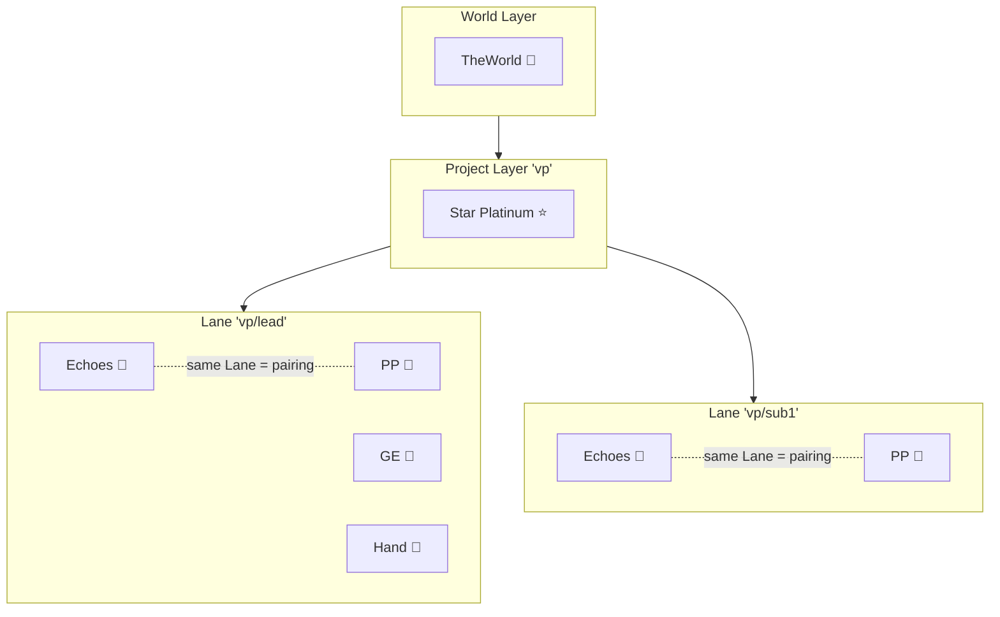
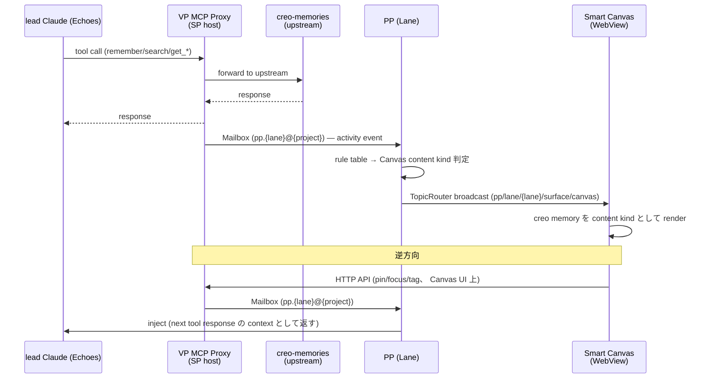

# 13. Paisley Park 復活設計 — Information Router on LSCM

> **Status**: target architecture (PR-β/δ/ε で実装、 PR-ε 完了で origin 願い 3 本実現)
> **Date**: 2026-05-04
> **Predecessor**: [doc 12 — Stand architecture (LSCM)](./12-stand-architecture.md)
> **Successors (planned)**: doc 14 (Thin View アーキテクチャ)
> **Pair memories**:
> - PP Orchestrator 確定 (Option D): `mem_1CaGv48H8tBuJYjE5axrbM`
> - PP 再設計 (VP Pane 統合): `mem_1CZCgpQpf5n8fy8F3BMfJj`
> - creo-memory-pane 設計方針: `mem_1Ca8xHcMf9sFBB2VHUpHzZ`

---

## §0. 立場 — LSCM の上に乗せる、 公理を再定義しない

doc 13 は **doc 12 LSCM の application doc**。 公理レベル (A1-A11) を再定義せず、 PP 既存 design memory 群 (4 件) を LSCM 公理の **自然な instantiation** として組み立て直す。

| doc 11 | doc 12 | **doc 13 (本書)** | doc 14 (planned) |
|--------|--------|------------------|------------------|
| Stand の起動方法 | Stand の構造定義 | **構造への PP 配置** | Thin View 配置 |
| mise task 規約 | LSCM 公理 (A1-A11) | LSCM への PP apply | LSCM への UI apply |

PP 既存 design 決定がどの axiom から導かれるか (= 根拠) を明示することで、 後の review / refactor で公理に矛盾する変更を入れない gardrail とする。

---

## §1. 背景

### VP-42 で何が消えたか

`commit 7f88357` (2026-03-20、 VP-42) で削除されたもの:

- `crates/vantage-point/src/canvas.rs` (tao/wry 独立ウィンドウ管理、 241 行)
- `commands/canvas.rs` / `canvas_cmd.rs` (`vp canvas` CLI、 110 行)
- MCP tool `open_canvas` / `close_canvas` / `split_pane`
- `MainWindowView.swift` の HStack 右側固定配置 (Cmd+O トグル、 canvasWidth、 ドラッグハンドル、 CanvasRepresentable)
- `process/state.rs` の `canvas_pid` / `ensure_canvas` / `close_canvas`

**残置**: `CanvasRepresentable.swift` / MCP `show` / `clear` / `web/canvas.html`。

### 廃止理由 (doc 12 §1.3 の再掲)

> Canvas が UI と State を混在させていた。 復活させる際に「Project に置くか / Lane に置くか / 二重持ちか」 の議論が起こり、 Stand 概念のブレが顕在化した。

VP-42 廃止の真の教訓は「**UI surface と State (情報の流れ) が同じ entity に同居していた**」。 doc 13 の復活設計はこの混在を **A1 (Stand portable entity) + A7 (Actor + CSP 二様通信)** で構造的に防ぐ。

### LSCM 確定で何が変わったか

doc 12 で Stand catalog に PP 行が **target = Lane instance / 現実装 = Project actor / PR-β** と明記された (§9)。 復活時に「どこに置くか」 の議論が catalog 1 行で answer 済の状態に到達したので、 doc 13 では「**どう Lane に置くか**」 の technical design に集中できる。

### 既存 codebase rule の supersede 明示 (P0-1)

2026-04-27 時点で `crates/vantage-point/src/process/lanes_state.rs:5-14` および `project_stands_state.rs:1-17` に「**Lane scope = Echoes/TH 専用、 PP/GE/HP は Project scope**」 (rename 前は HD/TH) という rule が comment として書き込まれている。 既存 `ProjectStandsPool` には `paisley_park: PaisleyParkState` field が存在し、 PP は Project scope の data model として実装されている。

doc 12 LSCM catalog §9 で PP target = Lane instance を明記したことで、 上記 2026-04-27 rule は **明示的に supersede** された。 PR-β-2 (PP 物理移管) の definition of done に「両 file の 2026-04-27 rule 言及を update + `PaisleyParkState` を `LaneCapabilities` 配下に移管」 を含める。

---

## §2. 復活の 5 原則 — LSCM 公理から導出

### P1: PP は Lane Layer に保持される (← A2 / A3 / catalog §9)

PP の保持 layer pattern は `{project}/{lane}` (catalog §9 SSOT)。 1 Lane = 1 PP instance、 同 PP 種が複数 Lane に並列に host される (A3: "同 Stand 種が複数 Layer に保持されることも可")。

**含意**: project 全体で 1 つの PP ではなく、 Lane ごとに独立 PP。 Lead Lane の PP が project 代表 PP (A11)。

### P2: PP は portable entity、 階層色なし (← A1)

PP の実装は Lane 階層を hard-code しない。 `MidiCapability` 移管 (PR-α-2) と同じく、 **Layer container 側が PP を保持する** 方向の設計。 Lane が destroy されると保持されている PP も終了 (lifecycle 連動、 §4 機能 Lifecycle 参照)。

### P3: UI surface と State は分離 (← A6 + A7)

VP-42 廃止の教訓を構造化:

- **State**: PP が "情報の流れ" を持つ (CSP face で broadcast、 RetainedStore に保持)
- **UI surface**: Smart Canvas / Echoes Chat / Inline / Modal / Dev Panel は PP 指揮下の **rendering target**、 PP 自体は背後 logic

A6 (share nothing memory) により PP と Surface は memory 共有せず、 TopicRouter (CSP face) で接続される。 UI を差し替えても PP は無傷、 PP を refactor しても UI は逆向きに依存しない。

### P4: PP は Information Router (← A7、 mem_1CaGv48H8tBuJYjE5axrbM)

doc 12 §9 catalog で `description = Information Navigator` だが、 mem `mem_1CaGv48H8tBuJYjE5axrbM` (2026-04-21) で **Public 機能名は "Information Router"** に update 確定済。 PP の責務は「情報をどの surface に出すか judge する router」 で、 **どこで render するかの判断は PP が一元化** する (Option D Orchestrator)。

| 層 | 名前 |
|----|------|
| Stand codename (内部) | Paisley Park 🧭 |
| Public 機能名 | **Information Router** |
| Surface 名 (public) | Smart Canvas / Echoes Chat / Inline / Modal / Dev Panel |

### P5: Echoes と PP は同 Lane で 1:1 (← A3 + A11、 mem_1CZCgpQpf5n8fy8F3BMfJj)

LSCM A3 の "1 Layer = N Stand 保持可" を Lane に apply: 1 Lane が 1 Echoes + 1 PP を保持。 Echoes と PP は **同じ Lane address で並列 host** されるので、 pairing は別途 ID を持たない (Lane address 自体が pairing key)。

旧 design (`mem_1CZCgpQpf5n8fy8F3BMfJj`) の「HD のペアリング ID で自分の PP を特定」 は、 LSCM では **Echoes の Lane address ≡ PP の Lane address** で自動成立。 「`mcp__show` の送り先」 は Echoes と同 Lane の PP (`pp.{lane}@{project}`)。

---

## §3. PP の Layer 居住 — address grammar

### address (← A4 hybrid canonical)

| 用途 | 表記 | 例 |
|------|------|-----|
| 概念用語 | `pp@{project}/{lane}` | `pp@vp/lead`、 `pp@vp/sub1` |
| wire format | `pp.{lane}@{project}` | `pp.lead@vp`、 `pp.sub1@vp` |
| MCP boundary | `pp` (caller の Lane に解決) | tool call は Lane 解決後 |

**Reserved actor**: `paisley_park` は予約語 (doc 12 §5)、 短縮 `pp` も同 entity を指す。

> **⚠ 実装 reality (P0-3)**: 現実装の `validate_actor` (`msgbox_registry.rs:184-194`) は actor 名に `.` を **reject** するため、 wire format `pp.lead@vp` は現状 parse 不可。 PR-β-1 prerequisite として **address parser 拡張** (`{actor}.{lane}@{project}` sub-suffix grammar 認識) が必要。 詳細は §10 Q-6 参照。

### 保持関係図 (← doc 12 §4 Mermaid を PP 視点で再描画)



破線は **同 Lane host 関係 = pairing**、 別途の pairing ID は不要 (P5 の言い換え)。

---

## §4. PP の Information Router 機能

### Routing rule table (← mem_1CaGv48H8tBuJYjE5axrbM の Option D 表)

PP は受信した「情報」 を以下のルールで surface に routing する。 MVP は rule table、 v2 で AI-driven (LLM 判断) 拡張 (Phase 7.5)。

| 情報 kind | 出力先 surface | 性質 |
|----------|--------------|------|
| Reference doc (long-lived) | Smart Canvas (pin) | 永続表示、 user 任意 close |
| AI 応答 (conversational) | Echoes Chat | Echoes pane 内 inline |
| Search result (ephemeral) | Smart Canvas (transient) | 一時表示、 次の routing で消える |
| Error (critical) | Modal | block 系、 user 確認必須 |
| Error (non-critical) | Inline (status bar) | non-block、 通知のみ |
| Memory surface (creo) | Smart Canvas (creo memory pin) | creo memory を Canvas content kind として render (PR-ε で実装、 VP-121 で sidebar feed 統合確定) |
| Tool use log | Dev Panel | 開発モード時のみ |
| Progress (build/test) | Inline (progress bar) | 進行中 indicator |

### 動作モード (P / A / H)

`mem_1CaGv48H8tBuJYjE5axrbM` の継続論点を確定させる:

- **P (Passive)**: 呼ばれたときのみ routing (例: `pp.show` MCP 呼び出し)
- **A (Active)**: event 監視、 能動 push (例: build 完了 → 自動で Inline 表示)
- **H (Hybrid)**: MVP Passive → v2 Active 追加

**本 doc で確定** (元 memory `mem_1CaGv48H8tBuJYjE5axrbM` では継続論点として残置だったが、 doc 13 で解決): **H** (MVP は P、 PR-ε 後の Phase で A 追加)。 A1 portable entity 原則に従い、 PP の "監視対象 event" は外部 (Mailbox / TopicRouter subscription) から注入。 PP 自身の broadcast を再 subscribe する loop 検出は publisher tag で防御 (実装詳細は §10 Q-9 参照)。

---

## §5. 通信パターン — Actor face + CSP face

### 入力面 (Actor face + Active subscriber、 ← A7)

PP は **passive (名指し受信)** と **active (subscriber)** の両形で input を取る (動作モード H、 §4 確定済):

| 経路 | mode | 形 | 例 |
|------|-----|----|-----|
| MCP tool call | P | `mcp__show` / `mcp__clear` (caller Lane に自動解決) | Echoes 内 Claude が `mcp__show("# Hello")` |
| Mailbox direct | P | `pp.{lane}@{project}` send | 別 Stand から `pp.lead@vp` に push |
| HTTP API | P | `POST /api/pp/{action}` (vp-app から) | Canvas UI 操作 (pin/focus/tag 等、 VP-121 で sidebar 廃止 → Canvas 統合) |
| TopicRouter subscribe | A | 他 Stand の event topic を subscribe | `process/build/event/completed` を listen → Inline 通知 |
| External watcher | A | filesystem / process / hub event を Mailbox 経由で受信 | build watcher → PP → Inline progress bar |

### 出力面 (CSP face、 ← A7)

PP は topic で broadcast:

| Topic | 用途 | Subscriber |
|-------|------|------------|
| `pp/lane/{lane}/surface/canvas` | Smart Canvas content 更新 (creo memory 含む全 content kind) | WebView Canvas |
| `pp/lane/{lane}/surface/inline` | Inline status 更新 | TUI / vp-app status bar |
| `pp/lane/{lane}/surface/modal` | Modal 通知 | vp-app modal layer |

**RetainedStore 連携**: state category (`pp/lane/{lane}/surface/canvas`) は最新値を保持、 Canvas 後発接続時に最新 content が即取得できる (RetainedStore 実装は doc 12 §10 codebase 対応表 + A7 CSP face 参照)。

> **⚠ Topic 命名規約 ambiguity (P1-8)**: doc 12 §5 命名規約 `{scope}/{capability}/{category}/{detail}` は 4 階層、 上記 doc 13 例 `pp/lane/{lane}/surface/canvas` は 5 階層で Lane 軸が中間に挿入されている。 規約厳密化は §10 Q-8 で扱う、 暫定として Lane 軸を含む 5 階層を許容する。

### MCP 中継経路 (← mem_1Ca8xHcMf9sFBB2VHUpHzZ、 VP-121 で sidebar feed 廃止 → Canvas 1 surface)

origin 願いの core: lead Claude の creo MCP 呼び出しを VP が中継して Smart Canvas に流す (creo memory を Canvas content kind として render)。



**MCP 中継は SP (Project Stand) で実装、 PP は Lane instance** ─ MCP boundary は project 単位だが、 PP は Lane 単位で Canvas content を split する。 caller Echoes の Lane address を MCP request envelope から取得して route する。

> **⚠ caller Lane resolution path 未確定 (P0-2)**: 現実装の `ShowParams` (`mcp.rs:26-49`) には `lane` field がなく、 `/api/show` handler (`routes/health.rs:379-387`) は lane filter なしで全 broadcast。 「caller Echoes の Lane address を MCP envelope から取得」 path は spec のみで実装が未整備。 解決案 (env / param) は §10 Q-5 で扱う、 PR-β-3 caller migration の hard prerequisite。

---

## §6. Echoes ↔ PP pairing

### 自動 spawn rule (← mem_1CZCgpQpf5n8fy8F3BMfJj 改訂版)

| トリガー | 動作 |
|---------|------|
| Lane 起動 (= Echoes spawn) | 同 Lane に PP 自動 spawn (**default**、 user opt-out 可能) |
| Echoes が `mcp__show` 呼出 (PP なし state) | PP を lazy spawn してから routing (旧 design memory 互換) |
| Echoes が `mcp__show` 呼出 (PP 既存) | routing |
| user が Cmd+D で Pane 追加 | Lane 内に PP Pane 追加、 既存 PP の surface に bind |
| Lane destroy | PP 自動終了 (cascade、 A3 lifecycle) |

default は「Lane 起動時に PP 同時 spawn」 だが、 ccws Worker Lane 等で resource 節約したい場合は opt-out して lazy spawn (= 旧 memory の挙動) に切替可能。 「PP は Lane に居住する Stand 種だが、 Lane が必ず PP を保持する required 制約は catalog SSOT に書かれていない」 ことを尊重し、 axiom レベルの required 化は doc 12 catalog 拡張 (back-port 候補 2: 上界 / 下界 separate 列) に持ち上げる (現 doc 13 では declare せず)。

### 1:1 vs 1:N

LSCM A3 では「1 Layer = N Stand 保持可、 同 Stand 種が複数 Layer に保持されることも可」。 では "1 Lane = N PP" は許される?

**確定**: **1 Lane = 1 PP** に制約する。 理由:

- PP = Information **Router** (Option D) なので、 同 Lane に複数 router がいると routing 経路が分岐して predictable でなくなる
- 旧 design memory の "1:1 (将来 1:N の余地)" は、 「**同 PP が複数 surface を drive** する」 形で 1:N を表現する設計に integrate (Surface adapter I/F、 §7 参照)
- LSCM 公理は許す (許容の上界) が、 catalog SSOT で具体的な cardinality を制約する余地がある (doc 12 A3 の "catalog で定められる" 規定)

**catalog 更新提案** (doc 12 §9 row update): `Paisley Park 🧭 | Information Router | {project}/{lane} (1 instance / Lane)` と cardinality を明示 (PR-β で apply)。

---

## §7. Surface 群 — PP が drive する rendering targets

### Surface adapter I/F

PP は複数 surface を共通 I/F で drive する。 P3 (UI/State 分離) を保つため、 surface 側は state を持たず、 PP の TopicRouter broadcast を render するだけ:

```rust
trait Surface {
    fn id(&self) -> &str;                   // canvas / hd_chat / inline / modal / dev_panel
    fn render(&mut self, content: &CreoContent);  // pure render
    fn capabilities(&self) -> SurfaceCapabilities; // pin support / scroll / interactive
}
```

`CreoContent` schema は creo-memories が SSOT (mem `mem_1CaGv48H8tBuJYjE5axrbM` D-1 参照) ─ VP は consumer。 schema import で型 share。

### 5 Surface

| Surface | 配置 | 性質 | implementing component |
|---------|------|------|----------------------|
| **Smart Canvas** | vp-app WebView (主領域 or Lane Pane) | 永続 + 検索 UI + 本文詳細 | `creo-ui` 経由 (CreoUI render client) |
| **Echoes Chat** | Echoes Pane 内 inline | conversational AI 応答 | Echoes Pane 拡張 (claude session) |
| **Inline** | TUI status bar / vp-app status bar | non-block 通知 | crossterm + SwiftUI status |
| **Modal** | vp-app modal layer | block 系 critical | SwiftUI sheet |
| **Dev Panel** | vp-app sub window | tool use log / debug | SwiftUI panel (debug build only) |

### Surface 切替 — PP の RetainedStore で永続

user が「次回起動時もこの Canvas pin を維持したい」 のような期待 ─ TopicRouter category=state の topic は RetainedStore で永続化 (doc 12 §5)。 PP は Lane shutdown 前に pin state を Whitesnake (DB) に書き出し、 Lane spawn 時に restore。

---

## §8. creo memory in Canvas (PR-ε) — PP 上の代表 use case

> **VP-121 simplification (2026-05-05)**: 旧版で「creo-memory-pane」 として独立 surface (sidebar feed + Smart Canvas の 2 surface broadcast) として設計されていたが、 user 提案により **Smart Canvas の content kind として inlining** に simplify。 sidebar feed 廃止、 Canvas 1 surface に集約。

### 配置

PR-ε で実装する creo memory feature は **Smart Canvas の content kind**、 PP 自体ではない。 PP からみて: lead Claude の creo activity (remember / search / get) を Smart Canvas に「creo memory」 という content kind として render する router 機能。

- **Smart Canvas (creo memory render)**: `pp/lane/{lane}/surface/canvas` topic に creo memory を broadcast、 Canvas で content kind 別 (timeline / search results / detail body) に render
- **独立 surface 廃止**: 旧設計の sidebar feed (常駐 creo activity card) は廃止、 Canvas に統合。 sidebar feed は元来 §5 出力面 table の subscriber 欄に `pp/lane/{lane}/feed` topic として存在、 VP-121 で topic ごと削除 (§5 参照)。 §7 Surface table は 5 Surface のまま不変 (sidebar feed は formal Surface 列挙には元々含まれていなかった)。

### 反応 event mapping (← mem_1Ca8xHcMf9sFBB2VHUpHzZ、 VP-121 で Canvas 1 surface に統合)

| MCP tool call | PP 動作 |
|--------------|--------|
| `remember` | canvas topic に新着 creo memory を broadcast (Canvas timeline content kind に追加表示) |
| `search` | canvas topic に検索結果 list を broadcast (Canvas search-results content kind、 pin で memory detail に切替可) |
| `get_*` | canvas topic に本文 broadcast (Canvas memory-detail content kind で展開) |

### 双方向同期

origin 願いの「気持ちよくリアルタイム連携」 = 双方向。 逆方向 (UI → lead) は MCP boundary を介した **context injection**:

| user action | PP 動作 |
|-------------|--------|
| Canvas timeline カードを pin | PP が pin 状態を RetainedStore に保持、 Canvas memory-detail に固定切替 |
| Canvas で memory focus | PP が next MCP response の context resource として inject |
| Tag 編集 | PP が `mcp__update_memory` を caller Echoes 経由で実行 (caller agency 維持) |

**Tag 編集の caller agency 原則** (← A6 share nothing + A7 Actor face、 本 doc で確定): VP が直接 creo-memories を mutate せず、 必ず Echoes (= lead Claude) を経由する。 Stand 越境の write 権限を「ユーザーが見ているエージェント」 に集約させる security model。 元 memory `mem_1Ca8xHcMf9sFBB2VHUpHzZ` の「VP → lead 方向の具体: Focus / Pin / Tag / 全部？」 は未確定として残されていたが、 doc 13 で **Tag 編集を caller agency 経由で確定** (Pin / Focus は §8 user action table 参照)。

なお Echoes が idle (no pending tool call) 状態時の inject 先 semantics は §10 Q-10 で扱う。 LSCM 全体で適用すべき security 原則として doc 12 §13 への back-port (A12 候補) も検討中。

### MVP scope (PR-ε)

PR-ε で実装する最小 scope (VP-121 simplification 後):
1. Smart Canvas content kind として「creo memory」 を追加 (timeline / search-results / memory-detail の 3 view)
2. remember / search で Canvas timeline 自動更新 (旧 sidebar feed 機能を Canvas に統合)
3. get_* で Canvas memory-detail に本文展開
4. Pin / Focus の RetainedStore 保持 (Canvas 永続)
5. Tag 編集 (caller agency 経由、 §8 上記)

Out-of-scope (Post-PR-ε):
- AI-driven routing (PP 動作モード A、 Phase 7.5)
- Cross-Lane PP federation (Hub federation = PR-ζ で扱う)
- Offline fallback (creo-memories 上流不在時の queueing)

---

## §9. PR roadmap

doc 12 §9 で plot された PR-β/δ/ε を本 doc で技術設計確定:

| PR | Linear (起票予定) | scope | 規模 | 依存 |
|----|------------------|------|------|------|
| **PR-β** | TBD | PP を Project actor から Lane instance 化 (catalog §9 SSOT に揃える) | L | PR-α 完了 |
| **PR-δ** | TBD | Lane Layer supervisor 整備 (SP 内 Lane registry、 host API、 LaneCapabilities) | M | PR-β 完了 |
| **PR-ε** | TBD | Smart Canvas に「creo memory」 content kind 追加 (本 doc §8、 VP-121 で creo-memory-pane → Canvas 統合に simplify) | M (旧 L) | PR-δ 完了 |

### PR-β sub-issue 分割案 (PR-α 経験を踏襲)

PR-α の 3 sub-issue (受け皿 → 物理移管 → caller migration) pattern を踏襲、 ただし **prerequisite PR (PR-β-0)** を 1 本前置。 PR-β-2 着手前の grep 検証で **PaisleyParkState の実 caller がゼロ** と判明 (data model 予約のみの skeleton)、 doc 13 §9 PR-β series を当初 5 sub → **4 sub に縮小** (PR-β-3 caller migration を skip):

| sub-issue | scope | status | prerequisite |
|----------|------|--------|--------------|
| **PR-β-0** | address grammar 拡張 (`{actor}.{lane}@{project}` parser、 §10 Q-6) | ✅ Done (#272、 VP-117) | なし |
| **PR-β-1** | LaneCapabilities 受け皿 struct 新設、 既存挙動への影響ゼロ | ✅ Done (#274、 VP-119) | PR-β-0 完了 |
| **PR-β-2** | PP 物理移管 (ProjectStands → LaneCapabilities) + 2026-04-27 rule comment supersede (§1 P0-1) + cardinality 1 → N | ✅ Done (#275、 VP-120) | PR-β-1 完了、 §10 Q-7 暫定確定 |
| ~~PR-β-3~~ | ~~caller migration~~ | ⏭️ skip (caller ゼロと判明) | — |
| **PR-β-4** (cleanup) | catalog §9 row 更新 (target = 現状、 description: Information Navigator → Information Router)、 doc 12 §10 既存実装表 update、 legacy `hd` alias 削除 (`routes/health.rs` / vp-app) | planned | PR-β-2 完了 |

### 各 PR の boundary 担保

LSCM 公理を守るため、 各 PR で以下 invariant を test 化:

- PR-β: `pp@{project}/{lane}` address が解決できる + Lane destroy で PP 終了
- PR-δ: LaneCapabilities が PP 含めて N Stand を host できる generic interface
- PR-ε: MCP 中継経路で creo activity が `pp/lane/{lane}/surface/canvas` topic に到達 (creo memory content kind として Canvas に render、 旧 feed topic は VP-121 で廃止)

---

## §10. Open Questions

PR-β 開始前 (および各 sub-PR 開始前) に確定すべき残点。 P0 = PR-β-1 着手前 hard prerequisite、 P1 = sub-PR 中盤までに解消、 P2 = PR-β-4 cleanup でまとめて。

| Q | priority | 解決時期 |
|---|---------|--------|
| Q-1: Worker Lane PP spawn (常時 vs on-demand) | P2 | 暫定確定、 dogfood で見直し |
| Q-2: Lead Lane PP の代表性 (project 集約 vs 局所) | P2 | 暫定: Lane 局所 |
| Q-3: Smart Canvas の配置 (Pane vs WebView 主) | P2 | 暫定: WebView 主 + Pane opt-in |
| Q-4: Hub federation 公開範囲 | P2 | 暫定: state stream のみ |
| ~~Q-5~~: caller Lane resolution path (env 注入 vs param 拡張) | LATER | PR-β-3 skip により未解決、 PR-ε で再 visit |
| **Q-6**: address grammar `.{lane}` sub-suffix 拡張 | **P0** | PR-β-1 hard prerequisite |
| **Q-7**: `interactive_agent` vs Lane Echoes 整理 | **P0** | PR-β-2 物理移管時 |
| Q-8: Topic 命名規約 4→5 階層拡張 | P1 | doc 12 §5 update PR (並列) |
| Q-9: Active subscriber loop 検出 | P1 | PR-ε 実装で具体化 |
| Q-10: Echoes idle 時の context inject 先 | P1 | PR-ε 実装で具体化 |
| Q-11: SP restart vs Lane PP lifecycle 連動 | P1 | PR-β-2 dogfood で観察 |

### Q-1: Worker Lane の PP を spawn するか?

P5 では 1 Lane = 1 PP を default 化したが、 ccws Worker Lane (sub1 etc.) で PP を **常時 spawn** するか、 **on-demand** か?

- **常時**: 一貫した Lane geography、 user 期待値が予測可能。 ただし resource 重複 (8 Worker = 8 PP)
- **on-demand**: Echoes が初めて `mcp__show` 呼んだ時に lazy spawn。 resource 節約だが、 first call latency

**暫定**: 常時 spawn (一貫性優先)、 PR-β 実装時に dogfood 観察で見直し。

### Q-2: Lead Lane の PP は project 代表か、 Lane 局所か?

A11 では Lead Lane = project 代表だが、 PP の context は Lane 局所。 例: Lead Lane PP の Smart Canvas が "vp project 全体" の creo activity を集約するか、 "vp/lead Lane" のみか?

- **vp/lead** のみ ─ A1 portable + Lane 居住の自然な解
- **project 全体集約** ─ user 期待値 (1 Canvas で全部見たい) と一致するが、 cross-Lane state share を生む (A6 違反の risk)

**暫定**: vp/lead のみ。 project 集約 view は将来の `pp@{project}` (= Project Stand 上に集約 router) として別途設計。

### Q-3: Smart Canvas は Lane Pane の 1 つ? 別 window?

旧 PP は独立 wry ウィンドウ (VP-42 で削除)。 新 PP の Smart Canvas は:

- **Lane Pane の 1 leaf** (`mem_1CZCgpQpf5n8fy8F3BMfJj` 旧案: contentType="pp" の Pane)
- **vp-app 主領域 WebView**
- **両方** (user 切替)

**暫定**: vp-app 主領域 WebView default、 Pane embed は Cmd+D 経由で opt-in。

### Q-4: PP の Hub federation 公開範囲

doc 12 §9 で PP は Hub federation 対象 (✅)。 ただし、 surface routing は machine 局所、 federation 越しに「他 machine の PP に情報送る」 シナリオは未定義。

- 公開: state stream のみ (creo activity feed) ─ 他 machine から read 可能
- 非公開: surface routing (rendering target は machine 局所) ─ federation 越しに send しても render する surface がない

**暫定**: 公開 scope = state stream のみ、 surface routing は per-machine。 PR-ζ (Hub federation) で正式化。

### Q-5: caller Lane resolution path (PR-β-3 skip により未解決のまま LATER)

**status update (PR-β-2 / VP-120)**: PR-β-2 着手時 grep 検証で `PaisleyParkState` の実 caller (canvas routes / show handler / mcp 等) がゼロと判明、 PR-β-3 (caller migration) が skip された。 本 Q-5 (caller の Lane address 解決) は将来 caller が生まれた時 (= PR-ε で Smart Canvas に creo memory content kind を追加し、 `mcp__show` 系が PP 経由になる時) に再 visit。 当面は env 注入 (案 A) を推奨として保留。

MCP 中継経路 (§5) で「caller Echoes の Lane address を MCP request envelope から取得して route する」 と declare したが、 現実装の `ShowParams` (`mcp.rs:26`) と `/api/show` handler (`routes/health.rs:379`) には Lane 識別子を渡す経路がない。

- **案 A (env 注入)**: Echoes spawn 時に `VP_LANE_ADDRESS=lead@vp` を env で MCP subprocess に注入 → MCP server 起動時に env から read、 全 tool call の implicit context として保持
- **案 B (param 拡張)**: `ShowParams` 等に `lane: Option<String>` 追加、 unset = caller default (= MCP server 起動時の env)

**暫定推奨**: **案 A** (env 注入、 既存 `VP_PROCESS_PORT` pattern と整合、 MCP tool 全部に lane 引数追加する必要なし)。 PR-β-3 caller migration の前提作業。

### Q-6: address grammar `.{lane}` sub-suffix 拡張 (P0、 PR-β-1 hard prerequisite)

現実装の `validate_actor` (`msgbox_registry.rs:184-194`) は actor 名に `.` を **reject**、 `parse_address` (line 245-270) も `{actor}.{lane}@{project}` grammar を認識しない。 doc 12 / 13 で declare した wire format `pp.lead@vp` は実装に存在しない grammar。

doc 12 §13 Q-7 (Mailbox registry の `(layer_path, actor)` key 拡張) は **registry-side** の話、 本 Q-6 は **parser-side** の grammar 拡張で別軸。

- **案**: `validate_actor` を `actor` と `actor.lane` の両形を許容、 `parse_address` で sub-suffix を切り出して `(actor, lane, project)` triple を返す形に拡張

**hard prerequisite**: PR-β-1 LaneCapabilities 受け皿 struct 新設の前に、 address grammar 拡張だけ単独 PR (PR-β-0?) で先行着地が cleanest。 もしくは PR-β-1 内に inline 実装。

### Q-7: `interactive_agent` (Project scope) と Lane Echoes (PTY 経由) の関係整理 (P0)

現実装 `state.rs:124` に `interactive_agent: Arc<RwLock<Option<InteractiveClaudeAgent>>>` (Project scope の in-process Claude SDK 経由 Echoes) があり、 一方 `lane_pool.pty_slots[lane]` に各 Lane の Echoes process (tmux 経由 claude CLI) も別エンティティとして立つ。 PP が pair する Echoes は後者だが、 前者の存在 / 役割が doc 12 §9 catalog で整理されていない。

- **暫定**: PP pair 対象 = Lane Echoes (PTY 経由)。 `interactive_agent` (in-process) は cleanup PR で別 Stand に格上げするか削除するかを別途判断
- **doc 12 back-port**: §13 Q-12 catalog 漏れ list に「`interactive_agent` (Echoes と独立 / 同体?)」 追加候補

### Q-8: Topic 命名規約 4 → 5 階層拡張 (P1、 doc 12 §5 back-port 候補)

§5 で議論した通り、 doc 12 §5 命名規約 `{scope}/{capability}/{category}/{detail}` (4 階層) では Lane 軸を表現できない。 doc 13 例 `pp/lane/{lane}/surface/canvas` は 5 階層で Lane 軸を中間挿入。

- **案 ① 5 階層化**: `{scope}/{capability}/{lane}/{category}/{detail}` で Lane を category 直前に固定 ─ doc 12 §5 minor schema change
- **案 ② category 直前に Lane embed**: `{scope}/{capability}/{category}/{lane}/{detail}` ─ 既存 retained 判定ロジック (`topic.rs:46`) を変えずに済む
- **案 ③ scope 拡張**: `{scope=lane:lead}/{capability}/{category}/{detail}` ─ scope を `process` `lane:lead` `world` の 3 値に拡張

**暫定**: **案 ①** が直感的。 doc 12 §5 update の小 PR を別途切る (PR-β series と並列)、 doc 13 暫定として 5 階層を許容しつつ最終 commit は doc 12 update に依存。

### Q-9: Active subscriber loop 検出 (P1)

§4 動作モード H で「PP 自身の broadcast を再 subscribe して再 broadcast する loop」 の防御が未定。 publisher tag (= broadcast に source actor を埋め込み、 PP 自身が source の event は subscribe path で skip) で防げるが、 実装方式は PR-ε で具体化する。

### Q-10: Echoes idle 時の context inject 先 (P1)

§8 Tag 編集を「caller Echoes 経由」 と確定したが、 Echoes が idle (no pending tool call) 状態時に inject 先がない問題。

- **案 A**: PP が pending operation を Whitesnake (Lane scope persistent) に持ち、 次の Echoes tool call 時に MCP middleware が context 注入
- **案 B**: Echoes 不在時は user UI 上で operation を queue 表示、 user が「次の対話で送る」 を明示確認
- **案 C**: rejection (Echoes idle 時は Tag 編集 disabled、 UI で grayed out)

**暫定**: **案 A** (queue + middleware injection) が最低限の UX を保つ。 PR-ε 実装で詳細詰める。

### Q-11: SP restart vs Lane PP lifecycle 連動 (P1)

`vp restart` (= SP 再起動) 時に各 Lane の PP は ① SP cascade で全 destroy → 再 spawn ② Lane 単位で independent 維持 のどちらか。 RetainedStore の状態 (pin / focus) が Lane scope 永続層 (Whitesnake) で生存するため、 SP cascade destroy + Whitesnake からの restore で UX 上問題ないと予想。

**暫定**: SP cascade で全 destroy + Whitesnake restore (Whitesnake は World scope なので SP 再起動に巻き込まれない)。 dogfood で実観察。

---

## §11. doc 系列内の位置

```
doc 11 (起動)         ─→  doc 12 (構造)        ─→  doc 13 (PP 配置、 本書)
                                                   ─→  doc 14 (Thin View 配置、 planned)
```

| doc | 役割 | status |
|-----|------|------|
| 11 | Stand init_script system (mise task で Stand を起動) | 完了 (2026-05-03) |
| 12 | LSCM (Stand の構造定義) | 完了 (2026-05-04) |
| **13** | **Paisley Park 復活 (LSCM 上での PP 配置 + creo memory in Canvas)** | **本書 (2026-05-04 起草、 2026-05-05 VP-121 で simplify)** |
| 14 | Thin View アーキテクチャ (#102 の本格設計、 TUI/NSView dumb client 化) | planned |

doc 13 と doc 14 は LSCM 公理を foundation として、 各 Stand 種 (PP / View) の具体配置を定める **applicaton doc**。 共通点は「公理を再定義せず、 公理の自然な instantiation として組み立てる」 アプローチ。

---

## §12. memory への記録方針

doc 13 起草と PR-β/δ/ε 実装に伴って creo memory に記録するもの:

1. **doc 13 起草 milestone** (本 doc draft 完成時): atlas vantage-point、 category project、 doc 11 / doc 12 milestone と並ぶ position
2. **PR-β 完了 milestone** (sub-issue 全 merge 後): doc 11 9 PR / doc 12 6 PR と同 pattern
3. **PR-ε 完了 = origin 願い実現 milestone**: chronista-club Atlas にも cross-post (doc 11 grand recap と同型)

各 memory は `derivedFrom` で本 doc の起草 milestone を root として連鎖、 `references` で 4 つの予備 design memory (`mem_1CaGv48H8tBuJYjE5axrbM` / `mem_1CZCgpQpf5n8fy8F3BMfJj` / `mem_1Ca8xHcMf9sFBB2VHUpHzZ` / Stand 命名 mem) を参照。

本 doc 自体の SSOT は **repo の `docs/design/13-paisley-park-revival.md`**、 creo memory は snapshot 的位置付け (CLAUDE.md feedback rule "memory 粒度 = 1 decision" 踏襲)。
