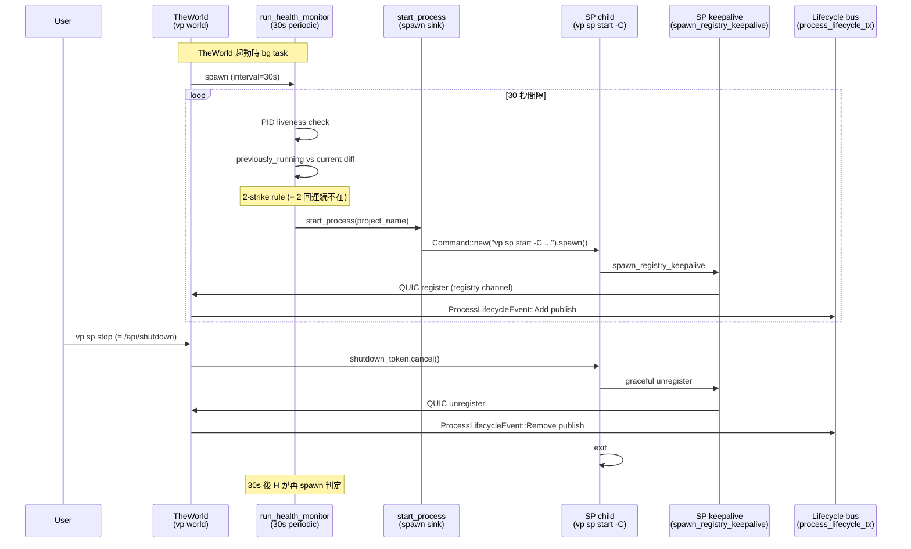

# 15. SP auto-spawn triggers (= 自動復帰経路の audit)

> **Status**: Stage C (= doc-only audit、 既存挙動への変更なし)
> **Linear**: `VP-155`
> **Stage B 候補**: 同 issue (= `SpDesiredState` enum + `SpSupervisor` actor 化、 VP-154 epic 完結後)

---

## 0. 背景

VP-154 PR-2.5 dogfood 中、 `vp daemon processes --watch` で `vp sp stop` 後に時間を置くと ➕ Add event が realtime で再発火する挙動を観察。 PID parent trace により **TheWorld (= `vp world`) が SP child を自動 spawn** していることを確認。 仕様通りだが trigger ロジックが散在しており、 「いつ / なぜ / どこから start_process が走るか」 を 1 枚にまとめて可視化する。

---

## 1. 全体像



---

## 2. caller mapping

実 spawn point (= `vp sp start -C <path>` 子プロセス起動の本体) は **既に 1 箇所** = `ProcessManagerCapability::start_process`。 散らばっているのは「いつ start_process を呼ぶか」 の判断 (= **trigger**) ロジック。

| trigger | 場所 | 動機 | 頻度 |
|---|---|---|---|
| **crash recovery** (= 主要因の auto-respawn) | `process_manager_capability.rs:1261` `run_health_monitor` | 30s periodic + 2-strike rule | 30 秒間隔 |
| **explicit start (HTTP)** | `process/routes/world.rs::world_start_process` | vp-app accordion expand / curl | user demand |
| **explicit restart (HTTP)** | `process/routes/world.rs::world_restart_process` | vp-app restart button | user demand |
| **open_pointview (内部)** | `process_manager_capability.rs::open_pointview` | open_pointview 経由で SP 必要 | demand-on-use |
| **MCP lazy start** | `mcp.rs:863` `auto_start_process` | MCP tool 呼び出しで SP 不在 → spawn | tool call 時 |
| **start_process (sink)** | `process_manager_capability.rs:650` | 全 trigger の最終 spawn 実行 | 全 trigger 経由 |

すべての trigger は最終的に `start_process` を call し、 そこで `Command::new("vp sp start -C <path>").spawn()` で SP child を起動。 SP child は内部で `spawn_registry_keepalive` を spawn → QUIC register → `ProcessLifecycleEvent::Add` publish の流れ。

---

## 3. 各 trigger 詳細

### 3.1 crash recovery (= run_health_monitor)

`run_health_monitor` は **TheWorld 起動時** に bg task で spawn (= `process/server.rs:1032`)。 30 秒間隔で:

1. **PID liveness check** — 既存 `running_processes` の PID を `is_pid_alive(pid)` で確認、 死んでたら除去 (= ゴースト除去)
2. **previously_running diff** — 前回 tick 時点の HashMap (`previously_running`) と現在 (`running_processes`) を比較、 「前回いたが今いない」 = `missing_count++`
3. **2-strike rule** — `missing_count >= 2` (= 60 秒以上連続不在) で **`start_process(project_name)`** を call、 spawn 後 `missing_count` を clear

これが user 観察の Add 復活源。 **`vp sp stop` で SP プロセス kill → 30 秒後の tick で 1-strike → さらに 30 秒後の tick で 2-strike → respawn** の流れ。

### 3.2 explicit start / restart (HTTP)

`POST /api/world/start_process` / `POST /api/world/restart_process` は `process/routes/world.rs` で受信、 `world_cap.start_process(name)` / `restart_process(name)` を call。 caller は:

- **vp-app**: accordion expand 時に `client.start_process` を call
- **curl** (= 手動): debug / dogfood 用

### 3.3 open_pointview (内部 demand)

`process_manager_capability::open_pointview` は「Process が起動してなければ起動する」 lazy-spawn を内包。 vp-app の Open Pointview button や MCP の open 系 tool で経由。

### 3.4 MCP lazy start (= auto_start_process)

`mcp.rs:863` `auto_start_process` は MCP tool が SP を必要とした時、 SP 不在なら **detached spawn** (= `Stdio::null()` + `spawn()`)、 後 retry で接続 try。 これは `start_process` を **経由しない** 独立 spawn point (= 非 sink、 redundant) で、 Stage B でここも `start_process` 経由に統合する path がある。

---

## 4. 「何 → なぜ → いつ」 audit

| 何 | なぜ | いつ |
|---|---|---|
| run_health_monitor が auto-respawn | 「user が close したか / crash したか」 を区別する手段が現状の HashMap diff のみ。 結果、 **意図的 stop も crash と同等扱いで再起動される** | 30s × 2 = 60s 後 |
| MCP auto_start_process が独立 spawn | MCP tool が SP 不在で fail するのを避けるため。 historical な独立実装、 TheWorld の crash recovery 経路が後付けで重複 | tool call 時 |
| open_pointview 内部の lazy spawn | UI 経路で「ボタン押したら起動」 の即応性確保 | demand-on-use |

**核心の散らばり**: 「user の意図 (Stopped にしたい)」 を表現する path が無い。 現状は HashMap に居るか / 居ないか の binary でしか policy を表現できない → `vp sp stop` した直後の SP も「不在」 として 60s 後に respawn される。

---

## 5. Stage B 移行時の rewire 候補

Stage B (= `SpDesiredState` enum 化) で以下を整理:

```rust
enum SpDesiredState {
    Running,       // = active に動かしたい (= explicit start / restart / accordion expand)
    Stopped,       // = user が止めた (= explicit stop、 30s 後 auto-respawn 抑止)
    Restarting,    // = restart in progress (= 一時的 transition state)
}
```

各 caller は `set_desired_state(project, state)` で意図を declare、 supervisor task が actual spawn を reconcile:

| caller | rewire 案 |
|---|---|
| `world_start_process` HTTP | `set_desired_state(name, Running)` |
| `world_restart_process` HTTP | `set_desired_state(name, Restarting)` → 完了 → `Running` |
| `vp sp stop` (= `/api/shutdown` 受信) | `set_desired_state(name, Stopped)` ← **新設 (= auto-respawn 抑止 key)** |
| `run_health_monitor` 2-strike | `desired_state == Running` 時のみ respawn |
| `mcp::auto_start_process` | `set_desired_state(name, Running)` (= 独立 spawn 廃止) |
| `open_pointview` | `set_desired_state(name, Running)` |

これで「意図的 stop は respawn されない」 が user expectation 通りに振る舞う。

---

## 6. scope 外 (= 本 doc では触れない領域)

- 既存 `run_health_monitor` の動作変更 (= Stage C は doc only)
- 30s 間隔 / 2-strike rule の policy 変更
- vp-app accordion 由来の UX 変更
- D10 Reconciliation (= Push QUIC + Pull port-scan の discover/track 側) — 本 doc は **respawn trigger 側** に focus

---

## 7. 関連

- **Linear**: `VP-155` (= 本 doc の origin issue)
- **Linear**: `VP-154` (= Msgbox v3.1 routing topology Option B' epic)
- **Memory**: `mem_1CaTpCQH8iLJ2PasRcPjHv` (= TheWorld が SP lifecycle を持つ Architecture v4)
- **Memory**: `mem_1CZ2Skaeyy8xWMVfyFMVo5` (= D10 Reconciliation アーキテクチャ)
- **PR**: #318 (= VP-154 PR-2.5 dogfood で本 issue を発見)
- **Code**: `crates/vantage-point/src/capability/process_manager_capability.rs:1261` (= `run_health_monitor`)
- **Code**: `crates/vantage-point/src/capability/process_manager_capability.rs:650` (= `start_process` sink)
