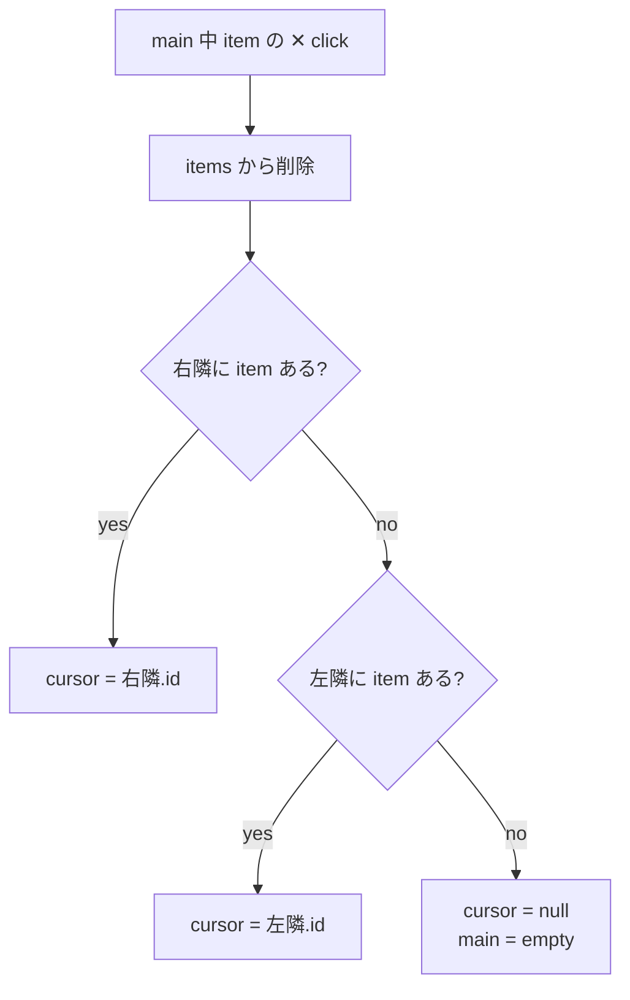

> ⚠️ **旧命名の歴史文書**: 本 doc は 2026-07-27 の命名エピック以前の語彙（JoJo 愛称 ほか）で書かれている。現行の対応は CLAUDE.md「アーキテクチャ命名体系」参照。

# PP Canvas Stack Model

> **status: draft v0.1** — 2026-05-27 起草。 mcp__show の UX redesign spec。 「show = pane 上書き render」 から「show = canvas に push、 cursor が新 item に切替、 旧 main は bottom strip に残る」 への mental model 移行を物理化する。
>
> mcp__show の Rust API は **不変** (= breaking change なし、 既存 caller 影響なし)。 vp-app の WebView 側だけで stack 化を実装する。
>
> 関連 memory:
> - decision-record: `mem_1CbRgqVr3awnr2jGsyvofP` (= 不動 spec)
> - dev-journal: `mem_1CbRgwD9szzzTf7aCY3cCd` (= 議論経緯)
>
> 関連 doc:
> - [13-paisley-park-revival.md](./13-paisley-park-revival.md) — PP 復活設計 (= 本 spec の前提となる PP body = Smart Canvas の物理化)
> - [05-pane-content-lane-smart-canvas.md](./05-pane-content-lane-smart-canvas.md) — 4 層モデル (Project/Lane/Pane/Content)

---

## 1. コンセプト

mcp__show を呼ぶたびに content が PP body を **上書き render** する単発描画モデルを廃止。 代わりに **canvas = items の ring buffer + cursor = 現在表示中 item の id** という stack model を物理化し、 bottom strip に直近 N=10 件の thumbnail (icon + 8-char title) を新→古 順で並べる。

### 旧モデル

```
mcp__show 投入 → renderPP() 直 call → PP body 上書き (= 直前 content 喪失)
```

### 新モデル

```
mcp__show 投入 → canvas.items に push (head) → cursor が新 item に切替 → main pane が新 item を render
                                                       ↓
                                               旧 main は strip に残る (= trace 可能)
```

### 採用理由

- user が **過去の show 結果に戻れる** (= thumbnail click で cursor 移動)
- mcp__show 連投時に **直前の content を失わない** (= strip に降りる)
- 「投げる」 → 「降りる」 → 「振り返れる」 の trace が visual に残る
- mcp__show の Rust API 不変 = 既存 caller (app.rs:2060 directive inject / files:open / 外部 MCP client) は無変更で新 UX を享受 (= backward compat)

### Why ring buffer (N=10) ?

- 無限 history は永続化が必要になる (= SurrealDB record)、 ephemeral にしたい
- N=10 は「直近の作業 context」 を cover する経験値 (= ブラウザ tab 数感覚)
- N=10 全件 を viewport 横並びで visible にできる sizing が成立

---

## 2. メンタルモデル

### 2.1 location vs cursor の分離

| 概念 | 役割 | 命名 |
|------|------|------|
| **location** | pane の物理 region (= 固定 / 不動) | **main** (= 中央 region 名) |
| **indicator** | 現在表示中 item を指す論理 reference (= 動く) | **cursor** (= moving) |

「main を見ながら cursor を動かす」 「cursor が null になっても main region は存在する」 という mental が clean に成立。 editor の caret / form の cursor / DOM の `aria-activedescendant` 等の標準 UX vocabulary に整合。

### 2.2 3x3 grid 上の配置

creo-ui の 3x3 grid concept で本 spec の layout を表現:

```
┌────────┬────────┬────────┐
│        │        │        │  ← 上行 (reserved、 future control / prompt input / breadcrumb)
├────────┼────────┼────────┤
│ lside  │  main  │ rside  │  ← 中央行: main = canvas.items[cursor] を render
├────────┴────────┴────────┤
│  ◆ bottom history strip ◆ │  ← 下行 (3 cells merge): items 全件 thumbnail 横並び
└──────────────────────────┘
```

**main の横幅優先**で history は下 row。 vertical rside ではなく horizontal bottom strip にした理由:
- main の content は markdown / log / url 主体 = **縦長 content** が多い
- 縦より横の幅が削られると痛い → strip は下 row で main の幅 keep
- 「macOS Dock / Mission Control 風」 の visual で時系列を表現

lside / rside / 上行 は **future reserved** (= 後続 PR で「prompt input」 「memory feed」 「control bar」 等を充てる候補)。

### 2.3 stack-based content navigator

```
       ┌──────────────────────────────────────────────────────┐
       │       main pane (= canvas.items[cursor])             │
       ├──────────────────────────────────────────────────────┤
       │ 📝 N-0 │ 🌐 N-1 │ 📋 N-2 │【📝 N-3】│ 🔗 N-4 │ ...  │
       └──────────────────────────────────────────────────────┘
                                   ↑
                          cursor (太枠 / brand color で強調)
```

```
       click N-1 → cursor のみ N-1 に移動、 strip 順は不変、 N-3 の強調外れる:
       ┌──────────────────────────────────────────────────────┐
       │       main pane (= canvas.items[N-1.id])             │
       ├──────────────────────────────────────────────────────┤
       │ 📝 N-0 │【🌐 N-1】│ 📋 N-2 │ 📝 N-3 │ 🔗 N-4 │ ...  │
       └──────────────────────────────────────────────────────┘
```

```
       mcp__show 投入 → 新 item を head に push、 cursor が新 item に切替、 N=10 超過で tail drop:
       ┌──────────────────────────────────────────────────────┐
       │       main pane (= canvas.items[new.id])             │
       ├──────────────────────────────────────────────────────┤
       │【📝 new】│ 📝 N-0 │ 🌐 N-1 │ 📋 N-2 │ ... │ 🔗 N-8 │  ← N-9 (旧 tail) drop
       └──────────────────────────────────────────────────────┘
```

---

## 3. データモデル

### 3.1 TypeScript interface (WebView 側)

```typescript
interface CanvasItem {
  id: string                              // uuid7 (時系列 ordered)
  content: string                         // markdown / html / log / url の生 body
  content_type: 'markdown' | 'html' | 'log' | 'url'
  title?: string                          // alias 表示用 (mcp__show の title field)
  created_at: string                      // ISO 8601
}

interface CanvasState {
  items: CanvasItem[]                     // ring buffer N=10、 ephemeral
  cursor: string | null                   // 現在 main に表示中の item の id、 null 可能
}
```

### 3.2 制約 / Invariant

- `items.length <= 10` (= ring buffer 上限)
- `cursor === null` または `items.find(i => i.id === cursor) !== undefined` (= cursor は items 内 id を指すか null)
- `items` は **append-only 順序固定** (= push 順で並ぶ、 click では reorder しない)
- ephemeral (= session 限り、 vp-app 再起動で clean、 SurrealDB 永続化なし)

### 3.3 mcp__show ShowParams からの変更

```rust
// 旧 (= 現行)
pub struct ShowParams {
    pub content: String,
    pub content_type: Option<String>,
    pub pane_id: Option<String>,           // 実質 dead field (canvas-handler が無視)
    pub append: Option<bool>,              // ← 削除予定
    pub title: Option<String>,
}

// 新
pub struct ShowParams {
    pub content: String,
    pub content_type: Option<String>,
    pub pane_id: Option<String>,           // 互換のため keep (= 値は無視、 v2 で削除候補)
    pub title: Option<String>,
    // append field は spec から削除 (= stack model で「= 新 item push」 に吸収)
}
```

caller 影響:
- `crates/vp-app/src/app.rs:2060, 2085` の `"append": false` hardcode → 削除
- 外部 MCP client が `append: true` を送ってきた場合は **silent ignore** で互換 (= breaking しない、 ただし stack model 上は無効)

---

## 4. 操作 (4 経路)

| trigger | 動作 | data 影響 |
|---------|------|----------|
| **mcp__show 投入** | 新 CanvasItem 生成 → `items.unshift(new)` (head push) → `cursor = new.id` → 11 件目で `items.pop()` (tail drop) | items + cursor 更新 |
| **thumbnail click** | `cursor = clicked.id` 更新のみ | cursor のみ更新、 items 順不変 |
| **thumbnail ✕ click** | `items` から該当 item 削除、 cursor 中なら **右隣 → 左隣 → null** の優先で cursor 移動 | items + cursor (場合により) 更新 |
| **cursor === null 時 main pane** | empty placeholder 表示 (= 次の mcp__show or click で復活) | 表示のみ |

### 4.1 main 中 ✕ の fallback ("右隣 → 左隣 → null")



VS Code / Safari の tab close と同型。 strip layout 上「右 = やや古い方向」 なので「close 後は 1 段古い item を見る」 が自然 (= history scroll と同じ向き)。

---

## 5. Visual / Interaction 詳細

### 5.1 Thumbnail (= strip 1 cell)

```
┌───────────────────┐
│ 📝  これはタイ…  ✕ │
└───────────────────┘
  ↑   ↑          ↑
  │   │          └── small ✕ button (= 個別削除)
  │   └── title 8 chars truncate + ellipsis
  └── icon (content_type 別)
```

| 観点 | 仕様 |
|------|------|
| icon | creo-ui Phosphor set (`ph:file-text` markdown / `ph:browser` html / `ph:list` log / `ph:link` url) |
| title | 8 chars truncate + ellipsis、 mcp__show の title 未指定なら content 先頭 8 chars を fallback |
| ✕ button | small (= icon size 10-12px)、 right-aligned、 hover で highlight |
| cursor 強調 | 該当 cell に **太枠 + brand color frame** (= visual に「これが main」 が分かる) |
| cell sizing | viewport 幅 / 10 件で fit、 cell width 〜100-120px 想定 (dogfood で調整) |

### 5.2 Hover tooltip (= full title 表示)

cell 自体は不変、 hover で OS-style tooltip popup が cell 近傍に浮かぶ:

```
       ┌──────────────────────────┐
       │ Hello, world! Long title │ ← tooltip popup
       │ here on this very item   │
       └──────────────────────────┘
                  ↓ (hover 元 cell)
        ┌────────────────────┐
        │ 🌐  Hello, w…   ✕ │
        └────────────────────┘
```

layout shift / overlap なし。 OS 標準 tooltip (= HTML `title` attribute) で軽量実装、 もしくは custom tooltip component (= creo-ui 既存があれば流用)。

### 5.3 Strip 順序

- **左 = 新** (= 最新 push が左端 = head)
- **右 = 古** (= 最古 item が右端 = tail)
- click では reorder しない (= push 順固定)

---

## 6. 設計の rationale

### 6.1 Ring buffer + MRU cursor の組合せ

`items` は **push 順固定** (ring buffer)、 `cursor` は **論理 indicator** で独立。

- push 順は **physical** (= 時系列の trace)
- cursor は **logical** (= 現在 user が見たい位置)
- 両者を分離することで「履歴 trace の order」 と「navigate 順」 が衝突しない

これは browser tab navigation (= tab 順 = 開いた順 / focus = 動く) と同型。 cmd-tab MRU (= 順序が動く) とは異なる選択。

### 6.2 「append=true」 を omit した理由

旧 spec の `append=true` field は「現 PP body content に追記」 という mutate 系操作だった。 stack model に移行する文脈では:
- 「追記したい」 = 新 item として push すれば良い (= 別 cell で表示)
- mutate 系は items の immutable 性 と相性が悪い
- API field 1 個減で spec も clean

caller の 1 行修正 (= "append": false hardcode 削除) のみで済む。

### 6.3 G hierarchical 拡張 (Conductor → Performer → Performer → ...) を阻害しない

本 spec は **PP の content layer のみ** の話で、 `LaneAddress` / `LaneKind` / `LanePool` には touch しない。 将来の hierarchical 拡張 (= 別 PR、 関連 memory `mem_1CbRMvKtC9vW9Ptm1NZmma` の Future scope) は独立に進められる。

### 6.4 ephemeral 採用 (永続化 v2 で再検討)

session 限りで clean = vp-app 再起動で history リセット。 理由:
- SurrealDB record すると history 量が無制限に増える (= 何ヶ月分の trace ?)
- 「直近の作業 context」 が main use case であり、 長期 trace は別 system (= memory / journal) に分離
- v1 は ephemeral で UX 検証、 dogfood で「永続化欲しい」 となれば v2 で SurrealDB に拡張

---

## 7. 実装 scope (= 別 PR)

| layer | file | 変更内容 |
|-------|------|---------|
| Rust mcp__show | `crates/vantage-point/src/mcp.rs` | `ShowParams.append` field 削除、 doctring 更新 |
| Rust caller | `crates/vp-app/src/app.rs:2060, 2085` | `"append": false` hardcode 削除 |
| vp-app WebView | `crates/vp-app/webview/canvas-handler.ts` | `dispatchShow` を `CanvasState` 操作 + items push + cursor 更新に rewire |
| vp-app new component | `crates/vp-app/webview/HistoryStrip.tsx` (新規) | bottom strip 描画 (icon + title + ✕ + cursor 強調 + tooltip) |
| vp-app PP render | `crates/vp-app/webview/pp.ts` | main pane render を `items[cursor]` 連動に rewire |
| vp-app DOM | `crates/vp-app/src/main_area.rs` | strip 用 HTML / CSS 追加 (= bottom row 物理化、 grid layout) |
| Tests | `crates/vp-app/webview/canvas-handler.test.ts` 等 | CanvasState push / cursor 移動 / ✕ fallback の unit tests |

### 7.1 PR 分割案

| Phase | 内容 |
|-------|------|
| Phase 1 | data model + canvas-handler rewrite (= ring buffer 化、 cursor 管理)、 mcp.rs ShowParams.append 削除 |
| Phase 2 | HistoryStrip component 新規 + main_area.rs DOM 拡張 + cursor 強調 / tooltip / ✕ button |
| Phase 3 | dogfood + sizing 調整 + N tune (= 10 で OK か検証) |

1 PR で land でも OK (= scope 中程度)。

---

## 8. Out of scope (= future)

### 8.1 永続化 path (SurrealDB)

session 跨ぎで history 復元 (= vp-app 再起動後も「昨日見た mcp__show」 を辿れる)。 v2 提案、 v1 は ephemeral。

### 8.2 lside / rside / 上行 semantic

本 spec では reserved。 後続 PR で:
- 上行: prompt input / breadcrumb / control bar 候補
- lside: source / nav / channel 候補
- rside: detail panel / context / annotation 候補

### 8.3 G hierarchical 拡張 (Conductor → Performer → Performer → ...)

別 PR。 `LaneAddress` / `LaneKind` の構造改修と合わせて進める。

### 8.4 thumbnail mini render

mini markdown / html 描画を thumbnail に乗せる UX。 v1 は icon + title でシンプル、 v2 で検討 (= cost が見合うなら)。

### 8.5 strip overflow handling

N=10 で全件 viewport 収まる sizing 想定だが、 dogfood で「もっと多く見たい」 となれば horizontal scroll / pagination を検討。

---

## 9. 関連 memory / doc

### 関連 memory (creo-memories)

- decision-record: `mem_1CbRgqVr3awnr2jGsyvofP` — PP Canvas Stack Model (= 不動 spec、 EntId URL 発行済)
- dev-journal: `mem_1CbRgwD9szzzTf7aCY3cCd` — 設計議論経緯 + 学び
- 関連 (PR-ε milestone): `mem_1CahZnDfQpTNegtLZ5NCaA` — PP 復活設計 doc 13

### 関連 doc

- [13-paisley-park-revival.md](./13-paisley-park-revival.md) — PP 復活設計 (= 本 spec の base)
- [05-pane-content-lane-smart-canvas.md](./05-pane-content-lane-smart-canvas.md) — 4 層モデル
- [18-shortcut-convention.md](./18-shortcut-convention.md) — shortcut 規約 (= `p` directive が PP に投げる経路 + 本 spec が物理化)

### 関連 source location

- mcp__show 入口: `crates/vantage-point/src/mcp.rs:1391-1429`
- ShowParams: `crates/vantage-point/src/mcp.rs:23-47`
- SP HTTP handler: `crates/vantage-point/src/process/routes/health.rs:322-330`
- WebView 注入口: `crates/vp-app/webview/canvas-handler.ts:40-60`
- 現 PP render: `crates/vp-app/webview/pp.ts`
- main pane DOM: `crates/vp-app/src/main_area.rs:201-220` (`.pp-content`)
