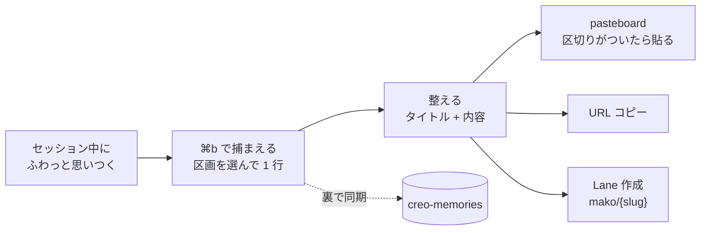
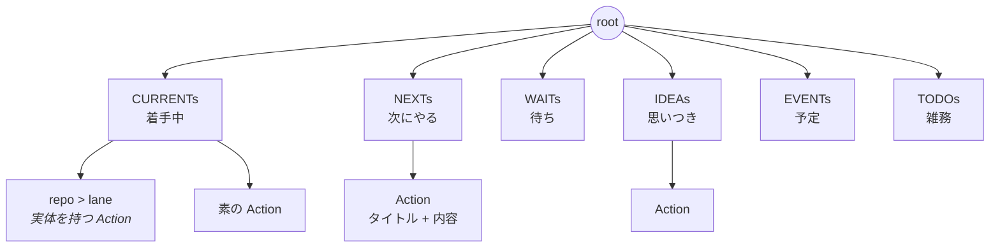
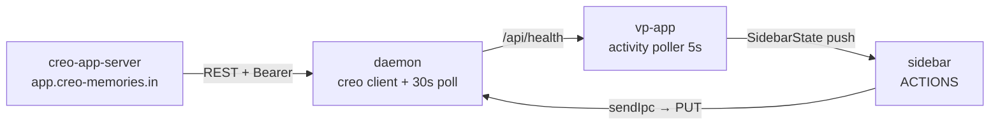

# doc 57 — ACTIONS: サイドバーを「今やっていること」の面にする

**Status**: **設計確定（2026-08-02、mako × Claude の一問一答）。Phase 1 実装中。**
発端 = mako「L sidebar の daemon の上に `actions` というアコーディオンで伸縮可能な
コンポーネント置きたい」→「creo-ui が新しく追加した Outliner で TODO っぽいのを想像していた」。
doc 56 §7 が「app 級の家 = サイドバー下部・daemon status の上」として**予約していた住所**が、
ここで実体化する。
**Owners**: vp-app（webview + main_area.rs）/ 後続 Phase で vantage-point（daemon）
**Related**: [56-edge-rail.md](./56-edge-rail.md)（§7 が本 doc の住所を予約。動詞の級 = 住所の原理）/
[54-lane-worker-model.md](./54-lane-worker-model.md)（lane = 席を占める働き手）/
外部: `creo-memories`（Action の保存先）/ `creo-ui` の Outliner（木の代数を借りる）

> 各決定に mako の決め言葉を引用してある（facts-over-narrative）。

---

## 0. 解いている問題 — 差し込みの緩衝

> mako「私が結構セッション中に、ふわっと思いついたことを、そのタスクの実行中に、よく
> 差し込みで入れてしまうから、**まず ACTIONS というバッファで**、CURRENTs とか一層目選んで、
> 二層目に、そのアイデアをメモっておく。**Creo 同期は裏で走ってる**。で、メモったものの
> 文章を整えたりして、**OS の pasteboard にコピー**したり、**url コピー**したりできて、
> そこから **Lane 作成**もできる」

ACTIONS は保管庫ではなく **緩衝材**。解いているのは「今やっている作業を止めて別件をセッションへ
投げ込んでしまう」衝動に、**会話以外の着地点**を与えること。ここから 3 つが決まる:

**① 捕捉はキーボードだけで完結する。** サイドバーへマウスを伸ばした時点で既に「中断」しており、
差し込みの代替になっていない。`Cmd hold b`（§6 Phase 1c）は後追いの飾りではなく **本命の入口**。

**② 出口が最初から要る。** 出せないバッファはゴミ溜めになる。3 つの出口は実装コストが違う:

| 出口 | 要るもの | Phase |
|---|---|---|
| **pasteboard コピー** | 既存の `copy` IPC（→ `arboard`）だけ。統合 WebView なのでサイドバーからも撃てる | **1** |
| **URL コピー** | creo の memory id（`https://app.creo-memories.in/m/{id}`。chatview の `CREO_MEMORY_BASE` と同じ） | 4 |
| **Lane 作成** | `mako/{slug}` で lane を立てる配管 | 5 |

pasteboard が最初に来るのが効く — 「**今すぐ頼まずに、区切りがついたら貼る**」という
差し込み回避の本体がそれで完成する。

**③ creo 同期は「裏」。** user から見た主役ではない。表の主役は **捕まえる → 整える → 出す**。
§3 の写像は裏方の契約であって、UI の中心ではない。

### 一生（差し込みから出口まで）



---

## 1. 原理: lane = 実体化した Action

**VP の規約はすでにこの同一性を前提にしていた。** 別々の場所に書かれた 2 つの決まりを並べると
浮かび上がる:

- CLAUDE.md のブランチ表 — **lane / performer = 「単一タスク隔離」**
- CLAUDE.md の task 運用 — **ブランチ名 `mako/{slug}` は task memory の slug から推論**

つまり creo の task memory と VP の lane は、**slug を継ぎ目にした同じものの 2 つの姿**として
すでに手作業で運用されている。起票 → slug から branch 名を決める → lane を作る → 終わったら
memory を done にする。**その往復が UI になっていなかっただけ。**

この原理から 3 つが決まる:

1. **CURRENTs は 1 つに束ねられる** — 既存サイドバー最上部の `CURRENTs`（repo 一覧）と、
   mako が挙げた 1 層目の `CURRENTs`（着手中）は名前が偶然一致したのではない。そこにいる
   **lane がまさに着手済みの Action** だから
2. **「着手」が動線になる** — NEXTs の Action を着手 → その slug で lane が立つ → CURRENTs に現れる
3. **区画は状態** — Action は区画の間を移動する。lane を持つかどうかが CURRENTs 在籍の実体

> mako「そう、別物で考えてたけど、偶然一致してるね。うまく使えないかな？」

---

## 2. 構造: root → 区画 → Action（深さ 2 段で固定）



| 区画 | 意味 | 中身 |
|---|---|---|
| **CURRENTs** | 着手中 | repo > lane（既存のまま）+ lane を持たない Action |
| **NEXTs** | 次にやる | Action |
| **WAITs** | 待ち（人 / CI / 返事） | Action |
| **IDEAs** | 思いつき | Action |
| **EVENTs** | 予定（日付を持つ） | Action |
| **TODOs** | 雑務 | Action |

**Action = タイトル + 内容（チェックリスト or 説明文）。**

- 行は**畳んだ状態が既定** — タイトル + 未完チェック数の badge だけ。開くと内容が出る
- **自由な indent / outdent は無い**。深さは区画が決める
- 区画内の並べ替えはある（⌥↑↓）
- **入力は VP のチャット入力と同じ体系** — `Enter` = 確定して抜ける / `⌘Enter` = 改行。
  会話入力の「Enter で送信 / Shift+Enter で改行」と同じ族に揃えた（mako 指定 2026-08-03）。
  差し込みを捕まえる面では「書いたら元の作業へ戻る」が支配的なので `Enter` がそこに就く。
  ⚠️ この結果 **キーボードから「次の行を足す」経路は無くなった** — 追加は `⌘ hold b` か「追加」ボタン

### なぜ 2 段固定が効くか

自由階層なら `parentId` + DAG 検証 + 深さ上限 + 並びの再採番が要る。**区画が親を決めるなら
`bucket` + `order` の 2 フィールドで済む**。UI の制約が data model を単純化した例で、
逆（data から UI を決める）だと出てこない畳み方。

### 配置

CURRENTs は既存どおり伸縮する中段（`flex:1` + scroll）。残り 5 つは daemon の直上に
コンパクトな `<details>` として並ぶ。**兄弟だが volume が桁違いなので描画は分ける。**

> ⚠️ **repo を状態で出し入れしてはいけない。** 2026-07-10 に「repo presence の再起動フラップで
> repo がタブ間を移動し、見ているタブから消える」体感バグを構造的に断った経緯がある
> （`Shell.tsx:61-65`）。repo は常に全部 CURRENTs にいるまま、Action が同居する形にする。

---

## 3. creo-memories への写像（境界の契約）

**Action = memory。** VP の書き込みは `metadata.vp` 名前空間に閉じ、他クライアントが触らないことを
名前で示す。creo の `metadata` は `TYPE none | object FLEXIBLE` なので任意 key を足せる。

```jsonc
{
  "content": "doc 56 設定画面\n\n- [x] A 形トグルの設計\n- [ ] 設定の永続先を決める",
  "status": "active",
  "metadata": {
    "priority": "medium",      // creo 既存 — 触らない
    "vp": {                    // ← VP の名前空間
      "board": "actions",      // この印がある memory だけ ACTIONS に出る（表示のゲート）
      "bucket": "nexts",       // 区画
      "order": "0|hzzzzz:",    // 区画内の並び（LexoRank 形式。挿入で後続を再採番しない）
      "lane": "vantage-point/mako-doc56"   // 実体化した lane（Phase 5）
    }
  }
}
```

| VP | creo-memories |
|---|---|
| Action | memory |
| タイトル | `content` の 1 行目 |
| 内容 | `content` の 2 行目以降（markdown） |
| 区画 | `metadata.vp.bucket` |
| 区画内の並び | `metadata.vp.order` |
| 表示のゲート | `metadata.vp.board == "actions"` |
| 実体化した lane | `metadata.vp.lane` |

タイトルに `display_name` を使わないのは、creo 側の一覧表示と食い違わせないため。

### 区画 → status の写像（他人の道具を汚さない線引き）

| 区画 | status | 理由 |
|---|---|---|
| CURRENTs / NEXTs / WAITs / TODOs | `active` | task なので creo の todo 一覧に出てよい |
| IDEAs / EVENTs | 付けない | task ではない。`list_todos` を汚さない |
| 完了 | `done` | |

### なぜ「VP が印を付けたものだけ」なのか

実測（2026-08-02）で creo の `status:'active'` は **10 atlas に散った 94 件**
（vantage-point 42 / Personal 19 / creo-memories 11 …）、うち **63% は priority すら無い**。
これは「今日やること」ではなく積み上がったバックログで、280px には入らない。

**`vp.board` のゲートがあるので、94 件が流れ込むことは構造的に起きない。**
バックログから引っ張る picker は将来の別糸。

---

## 4. 経路: daemon が fetch、sidebar は受けるだけ



webview から外部 HTTP を叩く**前例はゼロ**、CORS は相手次第、token を JS に渡すことにもなる。
**daemon が fetch して流す**のが唯一の筋 — hub federation / in-app update と同じ雛形で、
写せる完成形がある（`hub_client.rs` → `/api/health` → `spawn_activity_poller` → `SidebarState`）。

書き込みは `PUT /api/memories/:id` 1 本で `content` / `metadata` / `status` / `tags` すべて書ける
（`creo-memories` の `routes/memories.ts:334-342` で確認済）。新規だけ `POST /api/memories`
（status を受け付けない）→ `PUT` の 2 段。

---

## 5. creo-ui Outliner の扱い — 木の代数だけ借りる

**`CUOutliner` はそのまま使えない。IME が壊れる。**

`CUOutliner.tsx:89` の `createMemo(() => flattenVisible(nodes()))` は毎回新しい `FlatRow` を作り、
`:184` の `<For>` は `solid.js:1147-1177` の `mapArray` が**参照 `===`** で差分を取る。結果、
1 文字入力のたび全行の DOM が破棄・再生成され、**focus・caret・変換中の composition が飛ぶ**。
ACTIONS の本文は日本語が主なので致命的。加えて `setText` は編集行の node 自体を新オブジェクトに
するため、node id でキーイングしても編集行だけは再生成される。

**採る道**: `outliner-tree.ts` の**純関数だけ借りて、行の描画は VP 側で書く**。

| 借りる | 使わない |
|---|---|
| `flattenVisible` / `setText` / `setDone` / `toggleCollapsed` / `moveUp` / `moveDown` / `removeNode` | `CUOutliner`（描画）/ `indent` / `outdent`（深さは区画が決める）/ `createNodeId` |

純関数は immutable + **「操作不成立なら同一参照を返す」規約**で 24 test 済み。木の代数という
一番価値の高い部分はそのまま受け取れる。描画を自分で持てば Light Grid 語彙も 280px の
done トグルも自然に入る（`CUOutliner` を直しても拡張点は `renderMeta` = 右端固定しかなく、
行左のチェックは作れない）。

> ⚠️ `createNodeId` を使わない理由 — VP の origin は `vp-asset://` で secure context 外の可能性が
> あり、`crypto.randomUUID` が無いと**モジュール連番に縮退**する。連番は app 再起動でリセット
> されるので**永続 id と衝突する**。

上流には issue を 2 本投げた（2026-08-02）が、**VP はブロックされない**:

- [creo-ui#124](https://github.com/chronista-club/creo-ui/issues/124) — 入力の度に全行を作り直す
  （`<For>` → `<Index>` + uncontrolled input の 2 段構え。片方だけでは IME が救えない）
- [creo-ui#125](https://github.com/chronista-club/creo-ui/issues/125) — done を切り替える UI が無い
  （`renderLead` slot か `checkable` prop）

この 2 本が入れば `CUOutliner` 本体に戻せる（VP 側は `ActionRow.tsx` の差し替えで済み、
data の形は `OutlinerNode` と同型なので永続層は無傷）。

---

## 6. Phase

各 Phase は単独でマージでき、前を捨てない。Phase 1 は永続を持たないので
**migration は最後まで一度も発生しない**（書いたものが creo に載るのは Phase 4 から）。

| Phase | 内容 | 依存 |
|---|---|---|
| **0** | creo-ui に issue 2 本（[#124](https://github.com/chronista-club/creo-ui/issues/124) / [#125](https://github.com/chronista-club/creo-ui/issues/125)） | — |
| **1** | 器と触感 + **pasteboard コピー**（webview のみ、creo に繋がない） | — |
| **1b** | Action を開いて内容を整える（タイトル + 内容の編集面） | 1 |
| **1c** | **`Cmd hold b` で捕まえる** — 作業を止めない入口（§0 ①） | 1 |
| **2** | Creo ID を creo audience でも取れるように（credentials を audience ごとに） | — |
| **3** | 読み（daemon → sidebar） | 2 |
| **4** | 書き（sidebar → creo）+ **URL コピー** | 3 |
| **5** | 着手の動線（Action → lane、CURRENTs の合流） | 4 |
| 6 | バックログ picker / スリム帯の未完 dot / Logbook | 5 |

> **1c を Phase 6 から前倒しした**（2026-08-02、§0 の usage が判明して）。差し込みの緩衝は
> 「マウスを伸ばさずに置ける」ことが本体で、そこが無いと器だけあっても使われない。
>
> 実装は既存の `Cmd hold l`（lane を番号で選ぶ mode、`handlers.ts:178-198`）が**そのまま雛形**:
> mode に入る → hint bar に区画が `1..6` で出る → 数字を押すとその区画に 1 行足って focus。
> ⚠️ `a` ではない — ⌘A = Select All（doc 18 §C.4）を奪うため。`b` = mako の言う「バッファ」。

### Phase 2 の未確定（着手前に確かめる）

1. creo-app-server の `AUTH0_AUDIENCE` 実値（`.env.live.*` 側にあり repo に無い。
   歴史記録は `https://app.creo-memories.in`）
2. Auth0 の Native app client（`KF9BRED9ZVWEI7YDqbncNQ0LhX9QoUYm`）にその API の grant があるか

現在の `vp auth login` の token は `aud=https://hub.chronista.club` 固定
（`commands/auth.rs:65`）で creo-app-server には通らない。`credentials.json` は**単一 token**
なので audience を変えると **hub federation の token を潰す**。

---

## 7. 語彙の出どころ — Actions by Bonobo（連携は不可、2026-08-02 調査）

本 doc の `Action` という語と 2 段構造は **[Actions by Bonobo](https://bonobolabs.com/actions/)**
から来ている（mako「ここのデータと同期・連携できたら最高」）。対応は素直:

| Bonobo Actions | doc 57 |
|---|---|
| **List**（色分けされた括り） | 区画（1 層目） |
| **Action Card**（title / due date / reminder + checklist + note） | Action（2 層目） |
| **Schedule**（日付で束ねた面） | EVENTs |
| **Logbook**（完了の保管庫 + レビュー） | — **VP に無い概念**（§8） |

**⚠️ 直接の同期・連携はできない。** 製品ページとサポート Overview の双方に
**公開 API / URL scheme / x-callback-url / Shortcuts / AppleScript / エクスポート /
バックアップ形式のいずれも記載が無く**、連携先として挙がるのは自社アプリだけ
（Timepage / Flow / Overlap）。data は自社クラウド。

> 「Timepage's events will appear in Actions' Schedule panel, while Action Cards will
> make their way over to Timepage」

Web 版があるので裏の HTTP を解析する手は物理的にはあるが、**規約的にグレーで壊れやすい**ため
採らない。**再調査しないこと** — Bonobo が公開 API を出したら Phase として足す。

---

## 8. 今後

- **CURRENTs に素の Action を置くか** — Phase 5 で判断。「Action から lane を立てる」配管が
  できて初めて、CURRENTs に Action 行を出す必要があるかが実測でわかる
- **区画は固定 6 つ** で始める。増やせる形にするなら区画自体の永続が別途要る
- **既存 CURRENTs の名前の揺れ** — 13 repo のうち大半は idle で「current」ではない。ただし
  「今の開発の場」と読めば Action 側の CURRENTs（着手中）と地続きなので、今は直さない
- **Logbook**（§7）— 完了した Action の行き先。今は `status: done` にして一覧から消えるだけで、
  「先週何を終えたか」を振り返る面が無い。creo 側には data が残っているので、読む面を足せば済む
