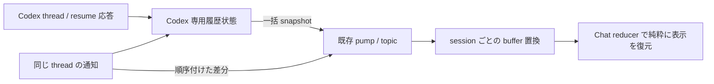

# 65. Codex Chat の履歴復元

> **Status**: 実装済み・実機確認待ち
> **Related**: design 41、design 64、`mem_1Cex9hm7knkwwNWrjqTEBu`
> **対象**: `conversation/codex_host.rs`, `conversation/codex_history.rs`, `repo/conversation_replay.rs`, `webview/chat-model.ts`, `webview/console.ts`

## 目的と範囲

Console で進めた Codex の会話を、同じ VP session の Chat で履歴付きで継続する。
履歴の正本は Codex の thread。VP の Chat pump を通った記録だけでは Console の発話が欠ける。
Claude の transcript 復元とは別の実装とし、表示用の既存部品は使えるところで利用する。

最初の到達点は直近の履歴復元と live 更新の接続。長い履歴は省略の有無を表示する。
古い履歴の追加読み込み操作は次段階に分ける（ユーザー裁定は関連 task の注釈）。
model / effort 操作、承認、subagent の専用表示は本変更の対象外。

## 実測と制約

- Codex 0.154.0 の生成 schema と実 `thread/read(includeTurns=true)` を確認した。
  Console 由来の検証対象は 15 turn、生 JSON 約 6 MB、最大 turn 約 2.6 MB。
  会話本文は調査レポートへ複写せず、種類・件数・サイズだけ記録した。
- 同じ対象への `thread/turns/list(limit=2, itemsView=full)` も成功し、次ページの cursor が返った。
  metadata の `historyMode` は `paginated`。公式文書の paginated 制約の説明と実動作には差があり、
  対応対象版の実測を優先する。公式 API は [Codex App Server](https://learn.chatgpt.com/docs/app-server)。
- `TopicRouter` の購読キューは 1024 件、`try_send` の失敗を現在は捨てる。
  長い履歴を小さいイベントの大量送信で配る方法は使わない。
- club-unison 2.0.0 のフレーム上限は 8 MiB。件数制限だけでなく履歴・転送の byte 上限を設ける。
- GUI は過去の `TurnCompleted` を通常経路へ流すと type-ahead を送信する。
  過去のイベントは reducer の中でのみ処理する。

## 構成

### 履歴と差分の境界

1. resume 応答の `thread.id` と要求 ID を照合し、`turns` / `itemsView` を検査する。
   完全な履歴を得ていない状態を空の成功として扱わない。
   paginated 応答や hydration cursor があれば `thread/read(includeTurns=true)` で本文を取得する。
   初期取得は native の全履歴読み出しで、VP 内の保持・表示・転送を直近へ制限する。
2. turn / item ID を保持し、同じ item の開始・delta・完了を更新として反映する。
   復元済み item の完了通知をもう一度追記しない。
   復元時に生成中だった item の完成は、全文を含む snapshot で表示を置き換える。
   これにより未観測の delta があっても本文末尾を落とさず、既表示の tool 開始も重複させない。
3. native 状態の反映・live の enqueue と snapshot の採取・enqueue は同じ lock で直列化する。
   VP の disk replay_log と host tail の単純連結は行わない。
4. snapshot は UI まで一つの Codex 専用イベントとして運ぶ。過去のイベント列を
   pump や UI の通常イベントハンドラーで再発火させない。
5. `in_flight` は現在の host 状態から取得する。過去の完了イベントから推定しない。

### 送信と復元が重なる場合

- UI の既存 request ID を Codex の `clientUserMessageId` まで渡す。
- 送信中表示に使う ID と、履歴との照合用 ID を分ける。ACK 成功だけでは照合 ID を捨てない。
- snapshot に**実際に含む** user item の ID で optimistic 発話を置き換える。
  host が受理しただけの prompt、未送信の queue、表示範囲外の発話を包含済みとみなさない。
- 内容一致では重複判定しない。同じ文の再送は別の送信として扱う。

### UI とメモリの境界

- reducer 内だけで過去の列を畳み、最後に現在の生成状態を設定する。
- console の ring は同じ session の旧 snapshot と、それ以前の差分を置き換える。
  他 session の buffer は維持する。snapshot を件数制限だけで蓄積しない。
- 保持・転送を byte 数と item 数で制限し、古い turn の境界を優先して表示を区切る。
  最新 turn だけで上限を超える場合も、ツール結果だけを残すなどの孤児を作らない。
  表示用イベント列は 1 MiB を上限（64 KiB を envelope 用に確保）、800 イベント / item 以下。
  単一本文・tool 入力・結果は UTF-8 境界で約 32 KiB の末尾へ切り詰め、省略記号を付ける。
  非テキストの user 入力はデータ本体を表示せず、省略 placeholder を置く。
- 省略は表示する。snapshot の入れ子や過去の承認操作など、表示以外の副作用は運ばない。

### 起動失敗・再接続

- ready 前の replay 要求は合流して保持し、履歴が用意できてから応答する。
  成功 snapshot より先に現在の表示を消さない。
- 起動失敗は保持した理由を表示し、保留 replay に終点を与える。
  design 41 §2-5 の元 ID 保持・明示的再試行を維持する。
- 初回 `thread/read` の待機中に対象 thread の item / turn 更新が来た場合は、
  取得を失敗として送信 queue を解除し、同じ会話への再試行を案内する。
  offset のない delta と snapshot を推測で合成しない。遅い read 応答は破棄し、
  元 ID と既存表示を保持する。更新が続く会話では再試行も失敗し得る。
  ready 後の live 更新や、別 thread の通知にはこの制約を適用しない。
- 再接続と lag からの回復も、同じ順序付けされた snapshot 経路を使う。
  pump の lag は旧受信 tail を捨てて再購読し、その後に host へ snapshot を要求する。
  topic subscriber 側の配送保証そのものの改修は本変更に含まない。

### 既存 engine と記録

- Claude の transcript replay、他 engine の replay_log は維持する。
- Codex は replay_log の読み書きを止める。既存の保存ファイルは削除せず、復元には使わない。
- request ID を持たない nudge はそのまま送る。ほかの engine は既存 submit_with_images に渡す。

## 検証する境界

- Console 由来の user / assistant / tool と、同じ item の完了通知の重複。
- 初期化前・生成中・完了直後の復元、snapshot の後に続く delta。
- 送信 ACK の前後に snapshot が来る場合と、同文の異なる送信。
- 1024 件を超える元履歴、巨大な単一 turn / tool 結果、繰り返す snapshot。
- root が Console のまま、非 root の Codex Chat session だけを復元する場合。
- 履歴取得失敗・不完全な応答で元 ID と現在の表示が保持されること。
- 最後に更新版 VP の Console → Chat 切替を実機で検収する。

## Status log

- 2026-09-12: 実 thread の読取・schema・配送経路を調査し、team-b の設計レビューを反映した Draft。
- 2026-09-12: 直近の履歴表示・省略表示・送信 ID の照合を実装。画面側 577 テスト、
  型チェック、ビルドが通過。初回取得の競合も修正し、ライブラリ 1,068 テスト、
  隔離 JSONL 通信テスト、fmt、mise check、workspace Clippy が通過。
  team-b の最終コードレビューは COMMIT READY。mise run test による workspace 全体のテストも通過。
  更新版 VP での実機検収は未完了。
