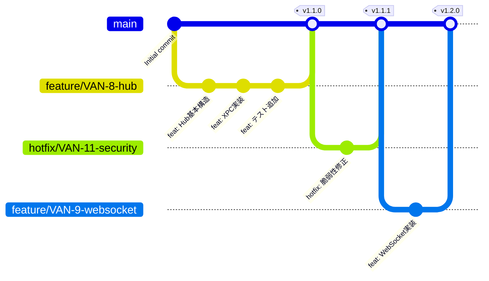

# Vantage 開発フロー - GitFlow Next

## 概要

VantageプロジェクトではGitFlow Nextを採用しています。GitFlow Nextは従来のGitFlowを簡素化し、モダンなCI/CD環境に最適化したブランチ戦略です。

## プロジェクト管理

### GitHub Projects

**デフォルトプロジェクト**: `Vantage`

すべての新規イシューは自動的に`Vantage`プロジェクトに追加されます。

#### イシュー作成時

```bash
gh issue create \
  --title "タイトル" \
  --body "本文" \
  --project "Vantage" \
  --label "enhancement"
```

#### プロジェクトフィールド

- **Status**: Todo / In Progress / Done
- **Priority**: P0 (Critical) / P1 (High) / P2 (Medium) / P3 (Low)
- **Assignee**: 担当者
- **Milestone**: Phase 1 / Phase 2 / Phase 3
- **Estimate**: 工数見積もり（日数）

#### 自動化

- イシュー作成時 → `Todo`ステータス
- PR作成時 → `In Progress`
- PR マージ時 → `Done` & イシュークローズ

## ブランチ戦略

### メインブランチ

#### `master`
- **役割**: プロダクション対応コード
- **保護**: 直接pushは禁止、PRのみ
- **デプロイ**: masterへのマージで自動デプロイ（将来）

**従来のGitFlowとの違い:**
- `develop`ブランチは不要
- `master`が唯一の長期ブランチ

### 作業ブランチ

#### `feature/*` - 新機能開発
```
命名規則: feature/VAN-{issue-number}-{short-description}
例: feature/VAN-8-hub-foundation
```

**用途:**
- 新機能の開発
- 機能追加
- リファクタリング

**ライフサイクル:**
1. masterからブランチを作成
2. 開発・コミット
3. PRを作成してレビュー
4. masterにマージ
5. ブランチを削除

**例:**
```bash
# ブランチ作成
git checkout master
git pull origin master
git checkout -b feature/VAN-8-hub-foundation

# イシューを In Progress に移動
gh project item-edit --project "Vantage" --field-id "Status" --field-value "In Progress"

# 開発
git add .
git commit -m "feat: Hub基本構造を実装 (VAN-8)"

# プッシュとPR作成
git push -u origin feature/VAN-8-hub-foundation
gh pr create --title "feat: Vantage Hub基盤実装 (VAN-8)" --body "..." --project "Vantage"
```

#### `fix/*` - バグ修正
```
命名規則: fix/VAN-{issue-number}-{short-description}
例: fix/VAN-10-session-crash
```

**用途:**
- バグ修正
- クリティカルな問題への対応

**ライフサイクル:** featureと同様

#### `hotfix/*` - 緊急修正
```
命名規則: hotfix/VAN-{issue-number}-{short-description}
例: hotfix/VAN-11-security-patch
```

**用途:**
- プロダクション環境の緊急修正
- セキュリティパッチ
- クリティカルバグの即時対応

**特徴:**
- masterから直接ブランチ
- レビュー後、即座にmasterへマージ
- 通常のfeature/fixより優先度が高い

**例:**
```bash
git checkout master
git pull origin master
git checkout -b hotfix/VAN-11-security-patch

# 修正
git add .
git commit -m "hotfix: APIキー漏洩の脆弱性を修正 (VAN-11)"

# 緊急PR
git push -u origin hotfix/VAN-11-security-patch
gh pr create \
  --title "hotfix: セキュリティパッチ (VAN-11)" \
  --body "..." \
  --label "urgent" \
  --project "Vantage"
```

### 補助ブランチ

#### `docs/*` - ドキュメント更新
```
命名規則: docs/VAN-{issue-number}-{short-description}
例: docs/VAN-12-api-reference
```

#### `chore/*` - 雑務・設定変更
```
命名規則: chore/{short-description}
例: chore/update-dependencies
```

## ブランチフロー図



## コミットメッセージ規約

### フォーマット

```
<type>(<scope>): <subject> (VAN-{issue-number})

<body>

<footer>
```

### Type（必須）

| Type | 説明 | 例 |
|------|------|-----|
| `feat` | 新機能 | `feat: Hubの基本構造を実装` |
| `fix` | バグ修正 | `fix: セッション復元の不具合を修正` |
| `docs` | ドキュメント | `docs: GitFlow Nextの説明を追加` |
| `style` | コードスタイル | `style: インデントを統一` |
| `refactor` | リファクタリング | `refactor: ServiceレイヤーをActor化` |
| `perf` | パフォーマンス改善 | `perf: メッセージキャッシュを最適化` |
| `test` | テスト追加・修正 | `test: Hub通信のE2Eテスト追加` |
| `chore` | ビルド・ツール | `chore: Xcodeプロジェクト設定更新` |
| `hotfix` | 緊急修正 | `hotfix: APIキー漏洩を修正` |

### Scope（オプション）

コンポーネント名や影響範囲を示す

例: `hub`, `client`, `api`, `ui`, `docs`

```
feat(hub): XPCサービスの実装 (VAN-8)
fix(client): 再接続ロジックの改善 (VAN-9)
docs(architecture): Hub設計書を追加 (VAN-8)
```

### Subject（必須）

- 50文字以内
- 現在形・命令形で記述
- 文末にピリオド不要
- 日本語OK

### Body（オプション）

- 詳細な説明
- 何を変更したか、なぜ変更したかを記述
- 72文字で改行

### Footer（オプション）

- `Closes #123` - イシューをクローズ
- `Related to #456` - 関連イシュー
- `Breaking Change:` - 破壊的変更の説明

### コミット例

```
feat(hub): Claude Processing Engineを実装 (VAN-8)

HubアプリケーションでClaude APIとの通信を担当する
Processing Engineを実装しました。

主な機能:
- メッセージ送信とストリーミング受信
- セッション管理との統合
- エラーハンドリングとリトライ

Related to #8
```

## プルリクエスト（PR）フロー

### 1. ブランチ作成とコミット

```bash
# Issue #8の作業を開始
git checkout master
git pull origin master
git checkout -b feature/VAN-8-hub-foundation

# 実装
# ...コード変更...

# コミット
git add .
git commit -m "feat(hub): Hub基本構造を実装 (VAN-8)"

git push -u origin feature/VAN-8-hub-foundation
```

### 2. PR作成

```bash
gh pr create \
  --title "feat: Vantage Hub基盤実装 (VAN-8)" \
  --project "Vantage" \
  --body "## 概要
Vantage Hubの基本構造を実装しました。

## 変更内容
- Hub macOSアプリの骨格
- メニューバー常駐機能
- 基本的な設定UI

## テスト
- [x] ビルド確認
- [x] 起動確認
- [ ] E2Eテスト（次のPRで対応）

## 関連イシュー
Closes #9

Related to #8
"
```

### 3. レビューと修正

**自動レビュー:**
- GitHub Copilot
- Codex
- Linear bot（イシュー連携）

**レビュー指摘への対応:**
```bash
# 修正
git add .
git commit -m "fix: レビュー指摘の修正 - セッション管理の改善"
git push
```

### 4. マージ

**マージ方法:** Squash and Merge（推奨）

理由:
- コミット履歴が整理される
- 機能単位でのrevertが容易
- masterの履歴が読みやすい

**マージ後:**
```bash
# ローカルのmasterを更新
git checkout master
git pull origin master

# 作業ブランチを削除
git branch -d feature/VAN-8-hub-foundation

# プロジェクトで自動的にDoneに移動
```

## イシュー管理

### イシュー作成

```bash
# GitHubでイシュー作成
gh issue create \
  --title "Vantage Hub macOSアプリの基本構造実装" \
  --project "Vantage" \
  --body "## 目的
Hub常駐アプリケーションの基本構造を実装

## タスク
- [ ] メニューバーアプリのセットアップ
- [ ] 設定画面の実装
- [ ] ライフサイクル管理

## 関連
Parent: #8
" \
  --label "enhancement" \
  --assignee "@me"
```

### プロジェクトフィールドの更新

```bash
# ステータスを In Progress に変更
gh project item-edit \
  --project "Vantage" \
  --id <item-id> \
  --field-name "Status" \
  --field-value "In Progress"

# 優先度を設定
gh project item-edit \
  --project "Vantage" \
  --id <item-id> \
  --field-name "Priority" \
  --field-value "P1"
```

### イシューのクローズ

**コミットメッセージでクローズ:**
```bash
git commit -m "feat: Hub基本構造を実装

Closes #9"
```

**PRでクローズ:**
PRの説明文に`Closes #9`を記載

## トピックイシューとフェーズ管理

### トピックイシューの作成

大規模な機能開発は**トピックイシュー**として管理します。

**例: イシュー#8（Vantage Hub構築）**

```markdown
## 🎯 トピックイシュー: Vantage Hub構築

### Phase 1: Hub基盤
- [ ] #9: Hub macOSアプリの基本構造
- [ ] #10: XPCサービスの実装
- [ ] #11: Claude Processing Engine

### Phase 2: マルチデバイス
- [ ] #12: WebSocketサーバー
- [ ] #13: Client SDK
...
```

トピックイシューもVantageプロジェクトに追加：

```bash
gh issue create \
  --title "🎯 Vantage Hubとアプリの連携アーキテクチャ構築" \
  --project "Vantage" \
  --label "epic" \
  --body "..."
```

### フェーズごとのブランチ管理

```bash
# Phase 1
git checkout -b feature/VAN-8-hub-foundation

# Phase 1の各サブタスクはこのブランチ上で実装
git commit -m "feat(hub): アプリ構造実装 (VAN-9)"
git commit -m "feat(hub): XPC実装 (VAN-10)"
git commit -m "feat(hub): Processing Engine実装 (VAN-11)"

# Phase 1完了後、PRしてマージ
gh pr create --title "feat: Vantage Hub Phase 1 - 基盤実装" --project "Vantage"

# Phase 2
git checkout master
git pull origin master
git checkout -b feature/VAN-8-multi-device
# ...
```

**ポイント:**
- 各フェーズは独立したfeatureブランチ
- フェーズ内のサブタスクは同じブランチで実装
- フェーズ完了ごとにPR・マージ
- すべてVantageプロジェクトで追跡

## リリースフロー

### セマンティックバージョニング

```
vMAJOR.MINOR.PATCH

例: v1.2.3
```

- **MAJOR**: 破壊的変更
- **MINOR**: 新機能追加（後方互換）
- **PATCH**: バグ修正

### リリース作成

```bash
# タグを作成
git tag -a v1.2.0 -m "Release v1.2.0 - Vantage Hub Phase 1完了"
git push origin v1.2.0

# GitHubでリリースを作成
gh release create v1.2.0 \
  --title "Vantage v1.2.0 - Hub Foundation" \
  --notes "## 新機能
- Vantage Hub基盤実装
- XPC通信サポート
- macOSクライアントの移行完了

## バグ修正
- セッション管理の改善

## 関連イシュー
Closes #8 (Phase 1)
"
```

## 実践例: Hub実装の完全フロー

### ステップ1: トピックイシュー作成

```bash
gh issue create \
  --title "🎯 Vantage Hubとアプリの連携アーキテクチャ構築" \
  --project "Vantage" \
  --body "..." \
  --label "epic"

# イシュー#8が作成される
```

### ステップ2: Phase 1のサブイシュー作成

```bash
gh issue create \
  --title "Hub macOSアプリの基本構造実装" \
  --project "Vantage" \
  --body "Parent: #8" \
  --label "enhancement"
# イシュー#9

gh issue create \
  --title "XPCサービスの実装" \
  --project "Vantage" \
  --body "Parent: #8" \
  --label "enhancement"
# イシュー#10
```

### ステップ3: Phase 1ブランチで開発

```bash
# ブランチ作成
git checkout master
git pull origin master
git checkout -b feature/VAN-8-hub-foundation

# サブタスク#9を実装
git add .
git commit -m "feat(hub): Hub基本構造を実装 (VAN-9)

メニューバー常駐アプリケーションとして
Vantage Hubの基本構造を実装。

- HubApp main
- AppDelegate
- 設定画面の骨格

Closes #9
Related to #8"

# サブタスク#10を実装
git add .
git commit -m "feat(hub): XPCサービスを実装 (VAN-10)

Hubとクライアント間のXPC通信を実装。

- XPC protocol定義
- XPC Service実装
- エラーハンドリング

Closes #10
Related to #8"

# 他のサブタスクも同様に実装...
```

### ステップ4: PR作成とマージ

```bash
git push -u origin feature/VAN-8-hub-foundation

gh pr create \
  --title "feat: Vantage Hub Phase 1 - 基盤実装 (VAN-8)" \
  --project "Vantage" \
  --body "## 概要
Vantage Hub Phase 1の実装が完了しました。

## 完了したタスク
- ✅ #9: Hub macOSアプリの基本構造
- ✅ #10: XPCサービスの実装
- ✅ #11: Claude Processing Engine
- ✅ #12: Session Manager
- ✅ #13: macOSクライアント移行

## 変更内容
- Hub常駐アプリケーション
- XPC通信レイヤー
- Claude API処理エンジン
- セッション管理システム

## テスト
- [x] ユニットテスト
- [x] 統合テスト
- [x] E2Eテスト（Hub-Client通信）

## 関連イシュー
Related to #8 (Phase 1完了)
"

# レビュー後、Squash and Mergeでマージ
# プロジェクトで自動的にDoneに移動
```

### ステップ5: Phase 2へ

```bash
# masterを更新
git checkout master
git pull origin master

# Phase 2ブランチを作成
git checkout -b feature/VAN-8-multi-device

# Phase 2の開発開始...
```

## ベストプラクティス

### コミット粒度

**良い例:**
```bash
git commit -m "feat(hub): HubApp基本構造を実装 (VAN-9)"
git commit -m "feat(hub): メニューバーUIを追加 (VAN-9)"
git commit -m "test(hub): HubApp起動テストを追加 (VAN-9)"
```

**悪い例:**
```bash
git commit -m "WIP"
git commit -m "fix"
git commit -m "いろいろ修正"
```

### PRサイズ

- **小さいPRを推奨**: 300-500行以内
- **大きな機能**: フェーズに分割して段階的にマージ
- **レビュー容易性**: 1つのPRで1つの関心事

### ブランチの寿命

- **短命を推奨**: 1-2週間以内
- **長期ブランチは避ける**: マージコンフリクトのリスク
- **定期的にmasterをマージ**: 最新の変更を取り込む

```bash
# 定期的にmasterの変更を取り込む
git checkout feature/VAN-8-hub-foundation
git fetch origin master
git merge origin/master
```

### プロジェクト管理のベストプラクティス

- **イシュー作成時に必ずVantageプロジェクトに追加**
- **ステータスを常に最新に保つ**
- **工数見積もりを記録する**
- **完了条件を明確にする**

## トラブルシューティング

### コンフリクト解決

```bash
# masterの変更を取り込む
git checkout feature/VAN-8-hub-foundation
git fetch origin master
git merge origin/master

# コンフリクト発生
# エディタで解決後...
git add .
git commit -m "merge: masterの変更をマージ"
git push
```

### 誤ったブランチでコミット

```bash
# 正しいブランチに移動してcherry-pick
git checkout feature/VAN-8-hub-foundation
git cherry-pick <commit-hash>

# 元のブランチのコミットを取り消し
git checkout wrong-branch
git reset --hard HEAD~1
```

### PRのリベース

```bash
# PRをリベースしてコミット履歴を整理
git checkout feature/VAN-8-hub-foundation
git fetch origin master
git rebase -i origin/master

# force pushが必要
git push --force-with-lease
```

## まとめ

Vantageの開発フローは以下の原則に基づいています：

1. **シンプルさ**: masterのみが長期ブランチ
2. **柔軟性**: feature/fix/hotfixで様々な状況に対応
3. **トレーサビリティ**: すべての変更がイシューに紐付く
4. **品質**: PRレビューとCI/CDでの検証
5. **効率性**: 小さなPRで素早くマージ
6. **可視化**: Vantageプロジェクトで全体進捗を追跡

この開発フローに従うことで、チームの生産性と品質を両立できます。

## クイックリファレンス

### 新規イシュー作成

```bash
gh issue create \
  --title "タイトル" \
  --project "Vantage" \
  --label "enhancement" \
  --assignee "@me" \
  --body "..."
```

### 新規featureブランチ

```bash
git checkout master
git pull origin master
git checkout -b feature/VAN-XX-description
```

### PR作成

```bash
gh pr create \
  --title "feat: タイトル (VAN-XX)" \
  --project "Vantage" \
  --body "..."
```

### イシュークローズ

コミットメッセージまたはPR本文に：
```
Closes #XX
```
