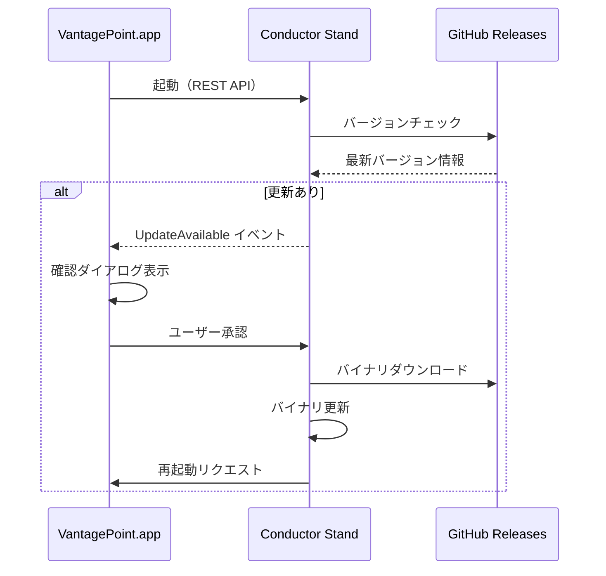

# 06 - Auto Update 要件定義

## 概要

Vantage Point エコシステム全体のオートアップデート機能。
Conductor Stand が更新を検知し、ユーザー確認後に自動更新・再起動を行う。

## 背景

- `vp` CLI と VantagePoint.app の両方を最新に保つ必要がある
- 手動更新は煩雑でユーザー体験を損なう
- アプリ起動時に自動でチェック・更新したい

## 要件

### REQ-UPDATE-001: 更新チェック

**概要**: Conductor Stand が起動時に更新を確認する

**詳細**:
- GitHub Releases API を使用して最新バージョンを取得
- 現在のバージョン（`CARGO_PKG_VERSION`）と比較
- 更新がある場合は UpdateAvailable イベントを発行

**受け入れ条件**:
- [ ] 起動時に自動チェックを実行
- [ ] バージョン比較ロジックが正しく動作
- [ ] ネットワークエラー時は警告のみでブロックしない

### REQ-UPDATE-002: ユーザー確認

**概要**: 更新前にユーザーの確認を取得する

**詳細**:
- VantagePoint.app（Swift）にダイアログを表示
- 更新内容（バージョン、変更点）を表示
- 「今すぐ更新」「後で」「スキップ」の選択肢

**受け入れ条件**:
- [ ] ダイアログがユーザーに表示される
- [ ] 選択結果が Conductor に送信される
- [ ] 「スキップ」時は次回起動まで非表示

### REQ-UPDATE-003: VP CLI 更新

**概要**: `vp` バイナリを自動更新する

**詳細**:
- GitHub Releases からバイナリをダウンロード
- 現在のバイナリを新バージョンで置換
- macOS: `~/.cargo/bin/vp` または `/usr/local/bin/vp`

**受け入れ条件**:
- [ ] 正しいプラットフォームのバイナリをダウンロード
- [ ] 既存バイナリのバックアップを作成
- [ ] 更新失敗時はロールバック

### REQ-UPDATE-004: VantagePoint.app 更新

**概要**: Swift macOS アプリを自動更新する

**詳細**:
- Sparkle フレームワークまたはカスタム実装
- DMG または ZIP からの更新
- アプリバンドル全体の置換

**受け入れ条件**:
- [ ] アプリが終了して更新される
- [ ] 署名検証を行う
- [ ] 更新後に自動再起動

### REQ-UPDATE-005: 再起動フロー

**概要**: 更新後に自動で再起動する

**詳細**:
1. Conductor Stand に停止リクエスト送信
2. 稼働中の Project Stand を graceful shutdown
3. バイナリを更新
4. Conductor Stand を再起動
5. VantagePoint.app を再起動

**受け入れ条件**:
- [ ] セッション状態が保持される（可能な限り）
- [ ] 再起動が完了したことをユーザーに通知
- [ ] 更新ログが記録される

### REQ-UPDATE-006: VantagePoint.app 起動コマンド

**概要**: `vp` CLI から VantagePoint.app を起動する

**詳細**:
- `vp app` コマンドで VantagePoint.app を起動
- 起動前に Conductor Stand が稼働していることを確認
- 稼働していなければ自動起動

**受け入れ条件**:
- [ ] `vp app` でアプリが起動する
- [ ] Conductor Stand が自動起動する
- [ ] 既に起動中の場合はフォーカスを移動

## アーキテクチャ

```
┌─────────────────┐     ┌──────────────────┐
│ VantagePoint.app│◄───►│ Conductor Stand  │
│   (Swift)       │     │  (vp conductor)  │
└────────┬────────┘     └────────┬─────────┘
         │                       │
         │  ┌────────────────────┴─────────────────────┐
         │  │                                          │
         ▼  ▼                                          ▼
┌─────────────────┐                         ┌──────────────────┐
│  GitHub Releases│                         │   Project Stand  │
│    (Updates)    │                         │  (vp start N)    │
└─────────────────┘                         └──────────────────┘
```

## 更新フロー



## 実装ステップ

1. **Phase 1**: バージョンチェック API
   - REQ-UPDATE-001 の実装
   - `/api/update/check` エンドポイント

2. **Phase 2**: VP CLI 更新
   - REQ-UPDATE-003 の実装
   - `/api/update/apply` エンドポイント

3. **Phase 3**: Swift UI 連携
   - REQ-UPDATE-002 の実装
   - 確認ダイアログの実装

4. **Phase 4**: 再起動フロー
   - REQ-UPDATE-005 の実装
   - graceful shutdown と再起動

5. **Phase 5**: VantagePoint.app 更新
   - REQ-UPDATE-004 の実装
   - Sparkle または自前実装

## 関連ドキュメント

- [05-stand-capability.md](05-stand-capability.md) - Stand Capability 仕様
- [design/04-conductor-architecture.md](../design/04-conductor-architecture.md) - Conductor 設計
